# Chapter 0 準備

(補足) 画像はすべて Windows 10 でのものになります．  


# Python のインストール

以下を参考に最新バージョンをインストールしてください．  

- Windows: https://www.python.jp/install/windows/index.html
  - フル・インストーラ版の方をインストール
  - コマンドプロンプトで `python` コマンドか `py` コマンドが実行できるところまで (片方実行できれば OK)
- MacOS: https://www.python.jp/install/macos/install_python.html
  - ターミナルで `python3` コマンドが実行できるところまで

実行環境によって Python を実行するコマンドが `python` だったり `py` だったり `python3` だったりします．  
本稿では `python` コマンドを使いますが，適宜読み替えをお願いします．  


# リポジトリのクローン / ダウンロード

Git が使える方は本リポジトリを任意のディレクトリにクローンしてください．  

```
git clone https://github.com/1izard/python-tutorial.git
```

それ以外の方は Download ZIP をクリックして zip ファイルをダウンロードし任意のディレクトリに解凍してください．  

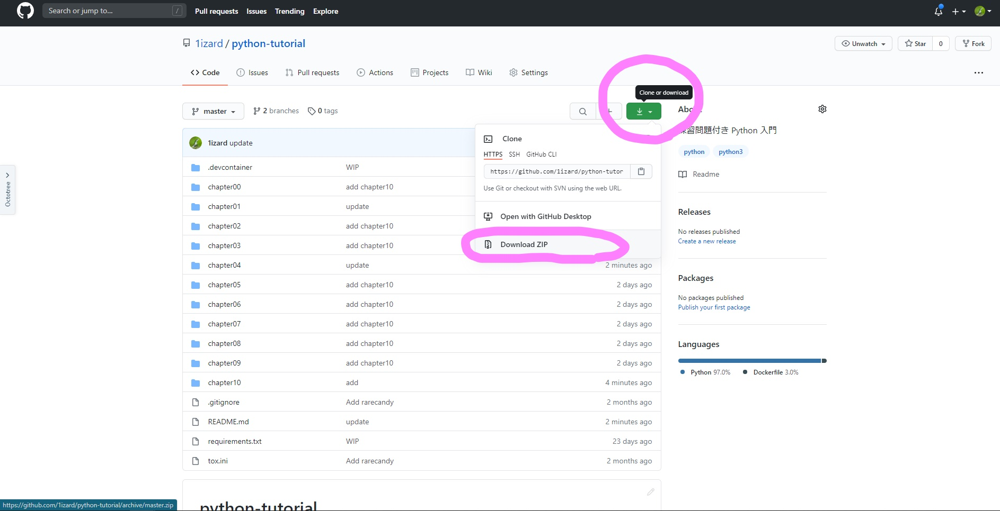

python-tutorial 内の各 chapter ディレクトリには workspaces ディレクトリという作業用ディレクトリが用意してあります．  
この中にプログラムを書いて実行するようにしましょう．  


# VSCode のインストール

こちら ( https://code.visualstudio.com/ ) から VSCode インストーラをダウンロードしてください．  

続いてダウンロードしたインストーラを実行してインストールします．  
Agreement を読んで OK だったら `I accept the agreement` を選択し，あとは基本デフォルトのままで `Next >` をクリックします．  

ここの設定はすべてチェックを入れるのをおすすめします．  

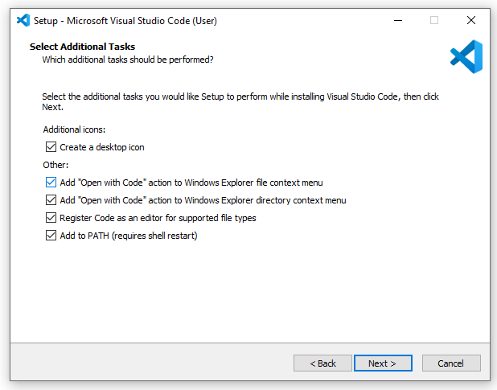

- Create a desktop icon
  - デスクトップにアイコンを作成
- Add "Open with Code" action to Windows Exploer file context menu
  - エクスプローラーでファイルを右クリックしたときのメニューに "Open with Code" (VSCode でファイルを開く) を追加
- Add "Open with Code" action to Windows Exploer directory context menu
  - エクスプローラーでディレクトリを右クリックしたときのメニューに "Open with Code" (VSCode でディレクトリを開く) を追加
- Register Code as an editor for supported file types
  - ファイルを開くアプリの候補に VSCode を追加
- Add to PATH (requires shell restart)
  - VSCode でプログラムを実行するのに必要


# 最初のプログラム


## プログラムの作成

VSCode を実行すると Welcom ページが開きます．  
Start の項目の `Open folder...` をクリックして python-tutorial ディレクトリを選択しましょう．  
zip ファイルでダウンロードした方は python-tutorial-master ディレクトリです．  
解凍方法によっては python-tutorial-master ディレクトリが二重になっているので内側のほうを選択します．  

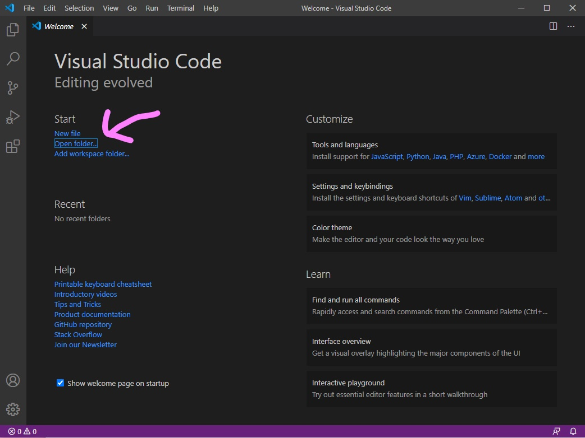

各 chapter ディレクトリには作業用 workspaces ディレクトリが作ってあります．  
この中にプログラムを作って実行するようにしましょう．  
まずは `chapter0/workspaces` ディレクトリに `hello.py` を作ってみます．  

左ペインの一番上にあるファイルマークをクリックすると，python-tutorial ディレクトリ以下のファイルの一覧を EXPLORER で見ることができます．  

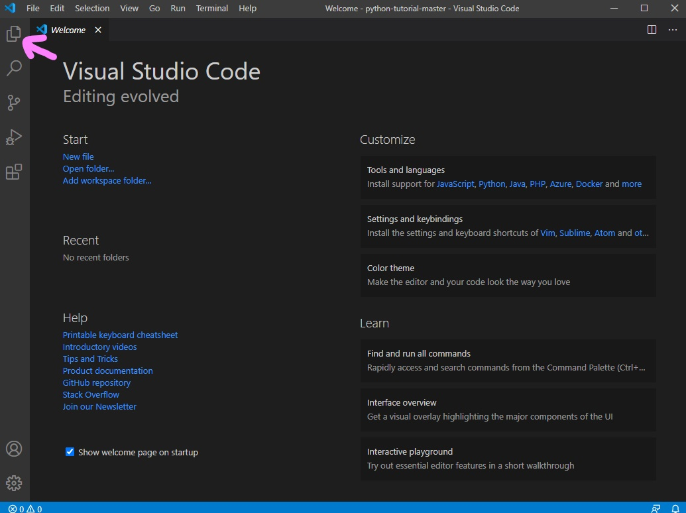

EXPLORER 上で work ディレクトリを右クリックし，`New File` を選択して新規ファイルを作ります．  
ファイル名は hello.py にします．  

EXPLORER 上で hello.py をクリックすると hello.py を開くことができます．  
中身は `print("Hello, World!")` にしておきましょう．  

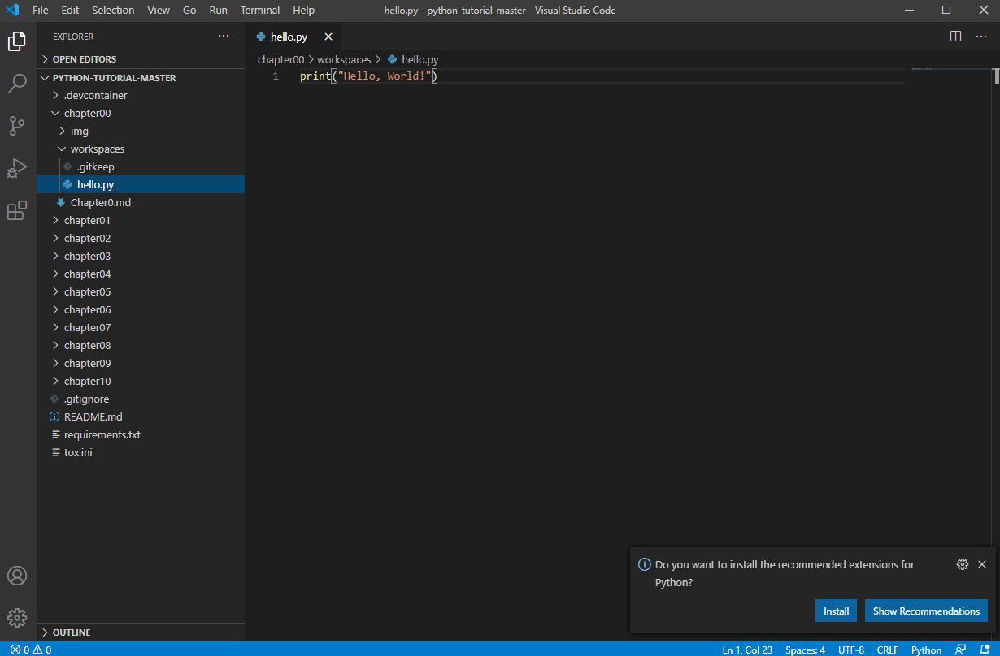


## プログラムの実行

プログラムの実行にはコンソール (Terminal) を使います．  

EXPLORER 上で workspaces ディレクトリを右クリックし，`Open in Integrated Terminal` を選択するとエディタ下部でコンソールが開きます．  

組込み関数 print はプログラムの実行結果を標準出力 (standard output; コンソールに出力すること) に出力します．  
コンソール上で `python hello.py` (あるいは `py hello.py`, `python3 hello.py`) を入力してエンターキーを押すと hello.py が実行され，`Hello, World!` と表示されます．  

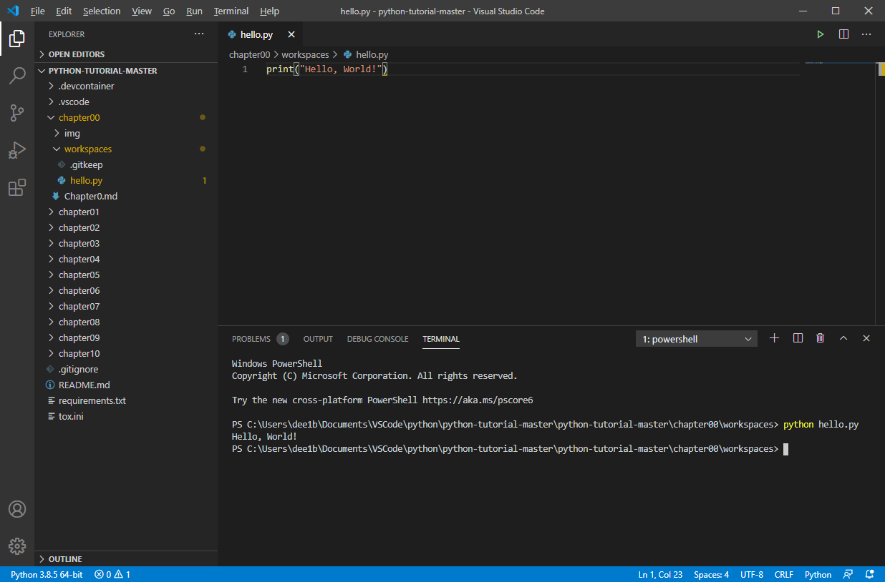

こんな感じでプログラムを実行し，実行結果を表示することができます．  


# Python Extension のインストール

hello.py を作るかクリックすると画像のように右下あたりに `Do you want to install the recommended extensions for Python?` (Python Extension をインストールしますか？) というモーダルが出てきます．  

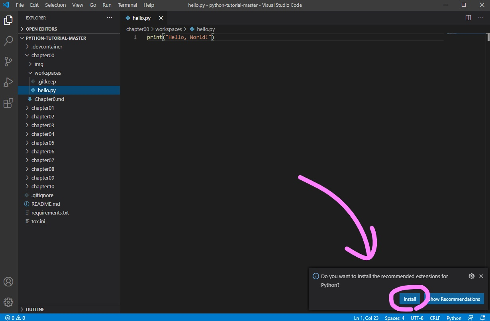

Extension とは VSCode の拡張機能のことです．  
Google 拡張機能みたいにどんどん VSCode に機能を追加していくことができます．  
Python Extension は Python をコーディングするときに関数名などを補完してくれる便利な拡張機能です．  
`Install` をクリックしてインストールしましょう．  

拡張機能は左ペインの EXTENSIONS を開いてインストールすることができます．  
モーダルを消してしまった方はここからインストールしましょう．  

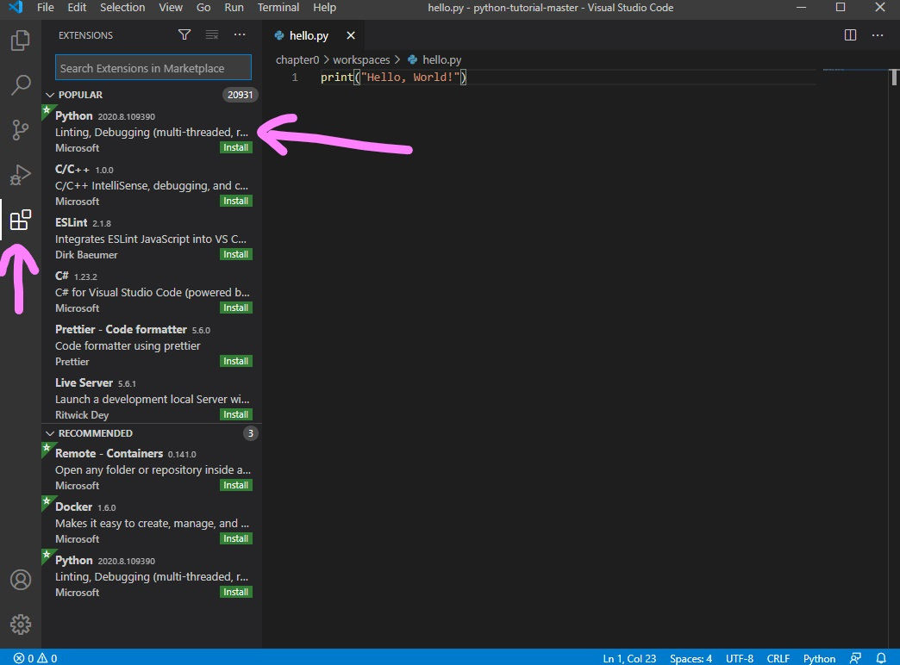


# Linter, Formatter の設定

Linter とはコードを書いているときにアドバイスをくれるツール，Formatter はコードを自動整形してくれるツールです．  

本稿では Linter として flake8，Formatter として autopep8 を使い，コード中の 1 行の長さを 110 文字に設定しています (デフォルトは 80 文字)．  
`python-tutorial/tox.ini` で文字数を指定しているので自動的に反映されます．  
変更したい方は tox.ini の `110` のところを変更してください．  


Linter と Formatter をインストールします．  
python-tutorial ディレクトリでコンソールを開き， `pip install -r requirements.txt` を実行します (`python3` コマンドを使っている方は `pip3 install -r requirements.txt`)．  
`python-tutorial/requirements.txt` に書いてある flake8 と autpep8 を使うのに必要なファイルをインストールしています．  

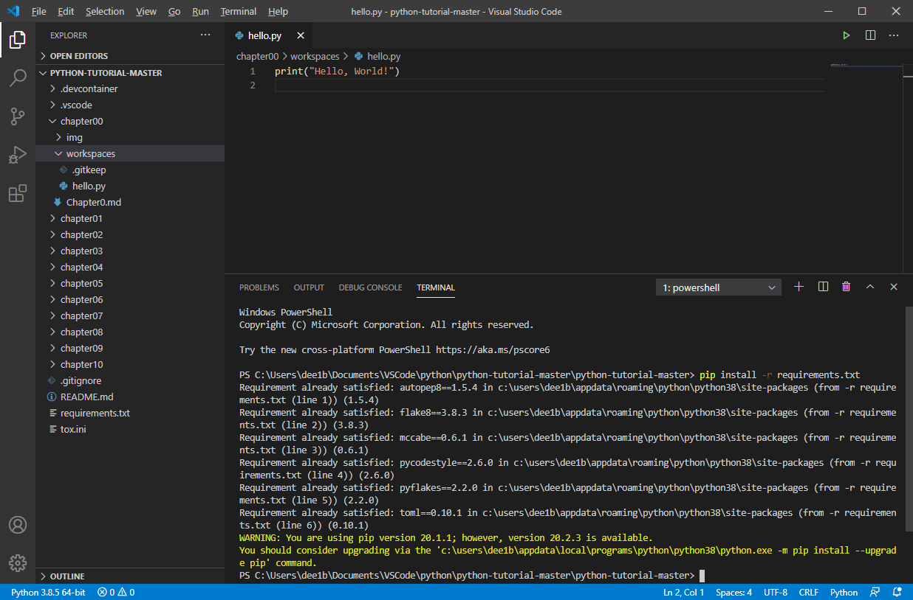


Linter と Formatter を設定するため `File -> Preferences -> Settings` を選択して VSCode の設定を開きます．  

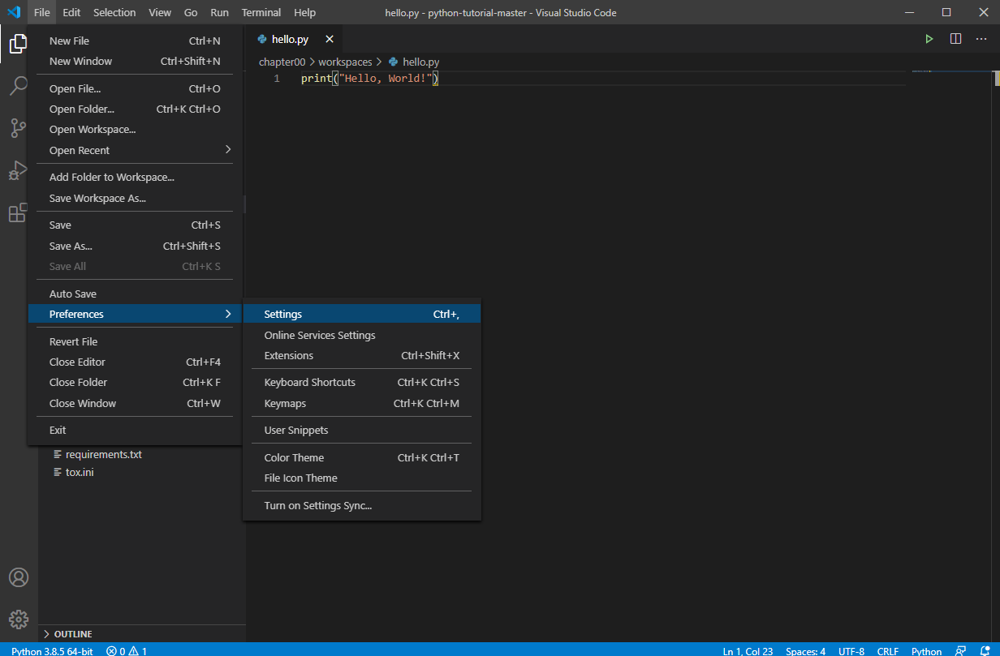

はじめに Linter の設定をしていきます．  
検索ボックスに `python lint` と入力し，`Python > Linting: Enabled` と `Python > Linting: flake8 Enabled` にチェックを入れてください．  

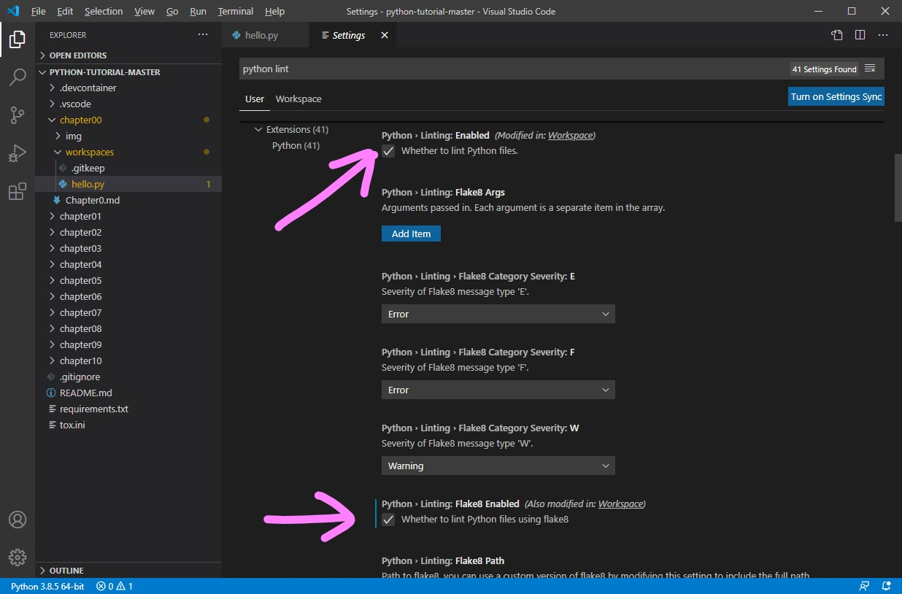

また，`Python > Linting: Pylint Enabled` のチェックを外してください．  

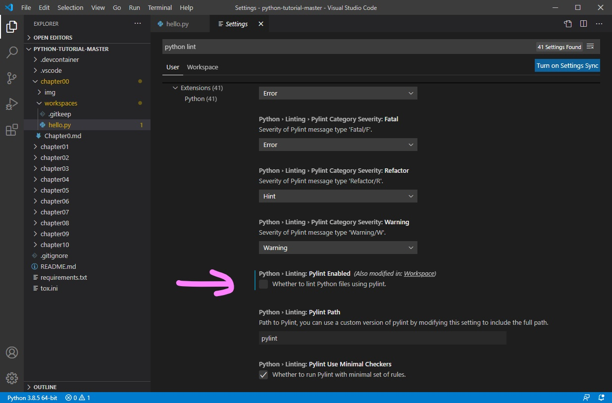


次に Formatter の設定をします．  
検索ボックスに `python format` と入力し `Python > Formatting: Provider` が autopep8 になっているか確認してください．  

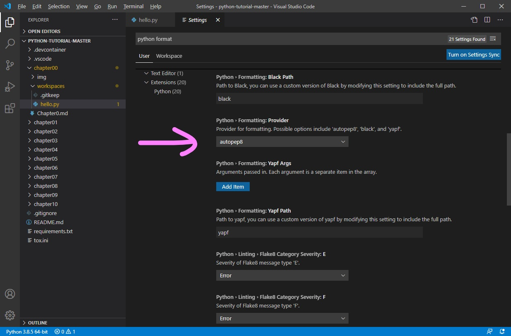

続いて `editor format` と入力し `Editor: Format On Save` をチェックしてください．  
ファイルを保存したとき自動的にコードがフォーマットされるようになります．  

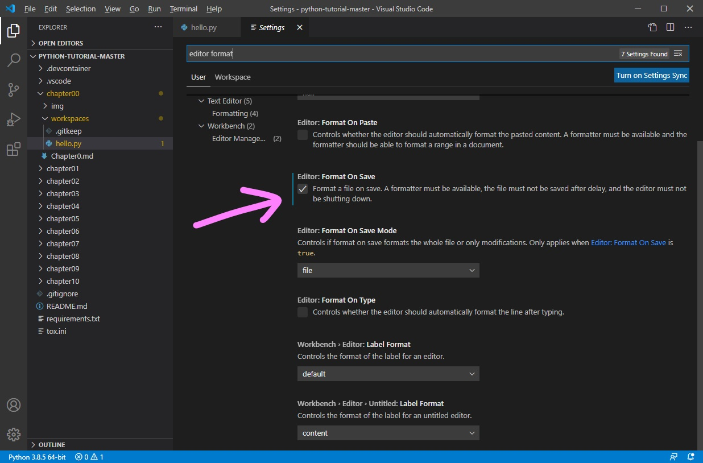


準備完了です！
