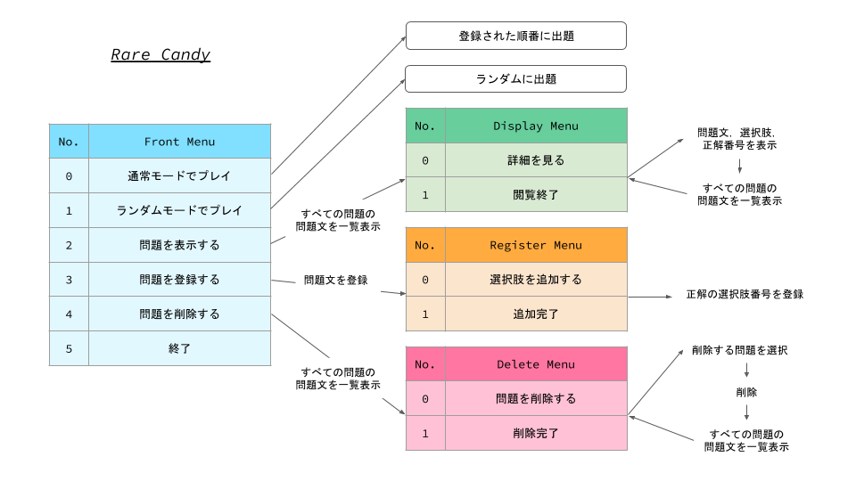

# Chapter 10 コマンドラインツールを作ってみよう

この章では今まで学習してきたことを使ってオリジナルのコマンドラインツール `Rare Candy` を作ります．  
Rare Candy は問題の登録や出題，一覧表示，削除といった機能を持つ勉強用ツールです．  
コンソール上にメニューを表示し，ユーザの選択したものを実行するインタラクティブなコマンドラインツールになります．  
問題を登録するときは自動的にプログラムと同じディレクトリ内に problems.csv を作成して問題を保存し，管理します．  

Rare Candy の機能の全体像はこんな感じです．  



`chapter10/rarecandy_org/rarecandy.py` に実装済みプログラムがあるので，`python rarecandy.py` で実行して機能を確かめてみましょう．  


(補足)  
全角入力の場合バックスペースキーを押したりコンソールのサイズを変えたりすると (自分が入力したものでない) コンソールの文字が消えてしまうかもしれませんが，これは仕様です...  
入力は問題なく受け付けてくれるので大目に見てください...  
一般に日本語の入出力を考慮してプログラムを作るのは手間がかかることが多いので，自作するときはなるべくアルファベットのみを使うのをおすすめします．  
(ここまで補足)  


# Rare Candy チュートリアル

`chapter10/rarecandy_org` ディレクトリでコンソールを開き，`python rarecandy.py` で実行します．  
すると `Rare Candy` というツールの名称とフロントメニューが表示されます．  
ユーザからの入力を待機している状態なので，`> ` の右側にメニュー番号を半角数字で入力してエンターキーを押すことでメニューを選択することができます．  
(python rarecandy.py の前のユーザ名やファイルパスの部分は実行環境によって変わります)  

```
root@45a372fb919c:/workspaces/python-tutorial/chapter10/rarecandy_org# python rarecandy.py 
-*--*--*--*--*--*--*--*--*--*--*--*--*--*--*- Rare Candy -*--*--*--*--*--*--*--*--*--*--*--*--*--*--*-
0)通常モードでプレイ 1)ランダムモードでプレイ 2)問題を表示する 3)問題を登録する 4)問題を削除する 5)終了 
> 
```

## 問題の登録

はじめは何も出題する問題がありません．  
ためしに `2` を入力して問題を表示しようとすると，`登録されている問題がありません` と返ってきます．  

```
-*--*--*--*--*--*--*--*--*--*--*--*--*--*--*- Rare Candy -*--*--*--*--*--*--*--*--*--*--*--*--*--*--*-
0)通常モードでプレイ 1)ランダムモードでプレイ 2)問題を表示する 3)問題を登録する 4)問題を削除する 5)終了 
> 2
登録されている問題がありません
```

まずは問題を登録してみましょう．  
`3` を入力して `問題を登録する` を選択します．  

問題は `問題文`，`選択肢`，`正解番号` から構成されます．  
最初に問題文を入力します．  
`> ` に続いて問題文を入力しましょう．  

```
0)通常モードでプレイ 1)ランダムモードでプレイ 2)問題を表示する 3)問題を登録する 4)問題を削除する 5)終了 
> 3
問題文を入力してください
> Pythonの整数の型は？
```

次に，選択肢を追加していきます．  
1 つの問題に最低 1 つは選択肢を追加する必要があります．  
選択肢が 0 個のまま `1)追加完了` を選択すると `"最低1つ選択肢を追加してください"` と選択肢の追加を促してきます．  

```
問題文を入力してください
> Pythonの整数の型は？
0)選択肢を追加する 1)追加完了 
> 1
最低1つ選択肢を登録してください
```

`0` を入力して選択肢を追加しましょう．  
1 つ目 (選択肢0) の選択肢は `int` にします．  

```
最低1つ選択肢を登録してください
0)選択肢を追加する 1)追加完了 
> 0
選択肢0 > int
```

同様にして 選択肢1 と 選択肢2 を追加しましょう．  
選択肢1 は `float`，選択肢2 は `str` にします．  

```
選択肢0 > int
0)選択肢を追加する 1)追加完了 
> 0
選択肢1 > float
0)選択肢を追加する 1)追加完了 
> 0
選択肢2 > str
```

選択肢が追加できたら `1)追加完了` を選びます．  
最後に正解の選択肢番号を入力します．  
この問題の正解は 選択肢0 の `int` なので `0` を入力します．  

```
選択肢2 > str
0)選択肢を追加する 1)追加完了 
1
正解の選択肢番号を入力してください
> 0
```

これで最初の問題が登録できました．  

同じようにして，あと 2 つ問題を登録しましょう．  

|問題文|選択肢0|選択肢1|選択肢2|正解番号|
|:---:|:---:|:---:|:---:|:---:|
|標準出力するための組込み関数は？|input|print|open|1|
|分岐のための構文は？|while文|for文|with文|if文|3|

Rare Candy の問題は problems.csv で管理するようになっています (problems.csv は問題登録時に自動的に作られます)．  
間違った問題文や選択肢を登録してしまったり登録が面倒な方は `rarecandy_org/problems.csv` の中身を消して以下をコピペしてください．  
プログラムはフロントメニューの `5)終了` を選んで終了できますが，コンソール上で `Ctrl + c` を押して強制終了させることもできます．  

```
Pythonの整数の型は？,0,int,double,str
標準出力するための組込み関数は？,1,input,print,open
分岐のための構文は？,3,while文,for文,with文,if文
```


## 問題の表示

問題の登録が完了したら，登録されている問題を見てみましょう．  
フロントメニューで `2)問題を表示する` を選択します．  
すると，登録されている全問題の問題文が一覧表示されます．  

```
0)通常モードでプレイ 1)ランダムモードでプレイ 2)問題を表示する 3)問題を登録する 4)問題を削除する 5)終了 
> 2
[0] Pythonの整数の型は？
[1] 標準出力するための組込み関数は？
[2] 分岐のための構文は？

0) 詳細を見る 1) 閲覧終了 > 
```

`0) 詳細を見る` を選択して問題番号を入力すると，その問題の問題文と選択肢，正解番号を見ることができます．  

```
0)通常モードでプレイ 1)ランダムモードでプレイ 2)問題を表示する 3)問題を登録する 4)問題を削除する 5)終了 
> 2
[0] Pythonの整数の型は？
[1] 標準出力するための組込み関数は？
[2] 分岐のための構文は？

0) 詳細を見る 1) 閲覧終了 > 0
詳細を見たい問題の番号を入力してください
> 0
問題文) Pythonの整数の型は？
正解番号) 0
選択肢0) int
選択肢1) float
選択肢2) str

[0] Pythonの整数の型は？
[1] 標準出力するための組込み関数は？
[2] 分岐のための構文は？

0) 詳細を見る 1) 閲覧終了 > 
```

`1) 閲覧終了` を選択してフロントメニューに戻ります．  


## 出題

さて，登録した問題を解いてみましょう．  
`0)通常モードでプレイ` を選びます．  

通常モードは登録されている問題を登録された順に出題します．  
最初は `Pythonの整数の型は？` が出題されると思います．  
問題には選択肢の番号を入力して回答します．  

```
0)通常モードでプレイ 1)ランダムモードでプレイ 2)問題を表示する 3)問題を登録する 4)問題を削除する 5)終了 
> 0
[問題0] Pythonの整数の型は？
0) int
1) float
2) str
> 
```

ここで，`1) float` を選んでみます．  
すると，誤った回答だったので `X` が表示され，同じ問題が再度出題されます．  

```
[問題0] Pythonの整数の型は？
0) int
1) float
2) str
> 1
X
[問題0] Pythonの整数の型は？
0) int
1) float
2) str
> 
```

`0) int` を選んで正解すると，`O` が表示されて次の問題が出題されます．  

```
[問題0] Pythonの整数の型は？
0) int
1) float
2) str
> 0
O
[問題1] 標準出力するための組込み関数は？
0) input
1) print
2) open
> 
```

これを繰り返して全問正解を目指します．  
すべての問題に正解するとフロントメニューに戻ります．  

今度は `1)ランダムモードでプレイ` を選んでみます．  
このモードでは登録されている問題がランダムに出題されます．  

```
0)通常モードでプレイ 1)ランダムモードでプレイ 2)問題を表示する 3)問題を登録する 4)問題を削除する 5)終了 
> 1
[問題0] 標準出力するための組込み関数は？
0) input
1) print
2) open
> 
```

## 問題の削除

最後に登録されている問題を削除する機能を使ってみましょう．  
フロントメニューで `4)問題を削除する` を選択します．  
登録されているすべての問題の問題文が一覧で表示され，その下に削除メニューが表示されます．  

```
0)通常モードでプレイ 1)ランダムモードでプレイ 2)問題を表示する 3)問題を登録する 4)問題を削除する 5)終了 
> 4
[0] Pythonの整数の型は？
[1] 標準出力するための組込み関数は？
[2] 分岐のための構文は？

0)問題を削除する 1)削除完了 
> 
```

`0)問題を削除する` を選ぶと削除する問題番号の入力を促されます．  
`[0] Pythonの整数の型は？` を削除してみます．  
0 を入力しましょう．  

再び問題文の一覧が表示されますが，選んだ問題はなくなっており削除されていることがわかります．  

`0)問題を削除する` を選択するとさらに問題を削除することができ，`1)削除完了` を選択するとフロントメニューに戻ることができます．  

```
0)問題を削除する 1)削除完了 
> 0
削除する問題番号を入力してください
> 0
[0] 標準出力するための組込み関数は？
[1] 分岐のための構文は？

0)問題を削除する 1)削除完了 
> 
```


## 終了

フロントメニューに戻って `5)終了` を選択し，いったんプログラムを終了します．  
そして再度 `python rarecandy.py` を実行して `2)問題を表示する` を選びます．  

すると，先ほど登録した問題の問題文一覧が表示されます．  
このように，実行の前後で登録した問題を維持できるようになっています．  

```
0)通常モードでプレイ 1)ランダムモードでプレイ 2)問題を表示する 3)問題を登録する 4)問題を削除する 5)終了 
> 5
-*--*--*--*--*--*--*--*--*--*--*--*--*--*--*- See you -*--*--*--*--*--*--*--*--*--*--*--*--*--*--*-
root@45a372fb919c:/workspaces/python-tutorial/chapter10/rarecandy_org# python rarecandy.py 
-*--*--*--*--*--*--*--*--*--*--*--*--*--*--*- Rare Candy -*--*--*--*--*--*--*--*--*--*--*--*--*--*--*-
0)通常モードでプレイ 1)ランダムモードでプレイ 2)問題を表示する 3)問題を登録する 4)問題を削除する 5)終了 
> 2
[0] 標準出力するための組込み関数は？
[1] 分岐のための構文は？

0) 詳細を見る 1) 閲覧終了 > 
```

以上が Rare Candy の使い方の説明になります．  


# 実装

具体的な使い方を紹介したところで，Rare Candy を実装していきます．  
`chapter10/rarecandy` に rarecandy.py を新しく作ります．  
また，`chapter10/rarecandy` からコンソールを開いておきます．  

自分でアプリを設計して実装をするときは，あらかじめしっかりと設定が練ってあればいいんですが実際にコードを書きながら試行錯誤することも多いです．  
ここでは，実装の仕方を考えながら少しずつ改善を繰り返して完成を目指します．  
ちょっと面倒かもしれませんが，ここで苦労して実装した経験はきっとこれからの実装にいきてくると思います．  


## フロントメニューの実装

まずはプログラムを実行してフロントメニューを表示するところから始めましょう．  
フロントメニューで表示する文字列を格納する list `front_menus` を用意し，これを走査して 1 つずつコンソールに表示していきます．  
配列のインデックスをメニュー番号にするので，組込み関数 enumerate で 配列のインデックスと要素をいっしょに取り出しながら f-string を使って表示を整形します．  
すべてのメニューを 1 行で表示するため，print 関数の引数 end に `""` (空文字) を指定します．  
for 文のあとの print 関数は改行するため設けています．  

(補足)  
より良い実装方法の説明のため，ここではわざとフロントメニューの数と各メニューの名前を変えています．  
(ここまで補足)  

```python
front_menus = [
    "通常モードでプレイ",
    "ランダムモードでプレイ",
    "問題の登録",
    "問題の削除",
    "終了",
]


def main():
    for i, menu in enumerate(front_menus):
        print(f"{i}) {menu} ", end="")
    print()


if __name__ == "__main__":
    main()

```

実行して表示を確認します．  

```
root@45a372fb919c:/workspaces/python-tutorial/chapter10/rarecandy_org# python rarecandy.py 
0)通常モードでプレイ 1)ランダムモードでプレイ 2) 問題の登録 3) 問題の削除 4) 終了 
```

うまく表示できていたら，メニュー番号を入力できるようにしていきましょう．  
標準入力は組込み関数 input で読み込むことができます．  
input 関数の前の `print("> ", end="")` で `>` を表示し，ユーザに入力を促します．  
input 関数の返り値は str 型なので組込み関数 int で int 型に直します．  
if 文で入力されたメニュー番号 menu_no ごとの処理を実装します．  
今はどのメニューが選択されたかが確かめられるよう，print 関数で各機能について端的に表示するようにしておきましょう．  


```python
front_menus = [
    "通常モードでプレイ",
    "ランダムモードでプレイ",
    "問題の登録",
    "問題の削除",
    "終了",
]


def main():
    for i, menu in enumerate(front_menus):
        print(f"{i}) {menu} ", end="")
    print()
    print("> ", end="")
    menu_no = int(input())
    if menu_no == 0:
        print("通常モード")
    elif menu_no == 1:
        print("ランダムモード")
    elif menu_no == 2:
        print("登録")
    elif menu_no == 3:
        print("削除")
    elif menu_no == 4:
        print("終了")


if __name__ == "__main__":
    main()

```

入力されたメニュー番号によって正しく分岐できているか確かめてみましょう．  

```
root@45a372fb919c:/workspaces/python-tutorial/chapter10/rarecandy_org# python rarecandy.py 
0)通常モードでプレイ 1)ランダムモードでプレイ 2) 問題の登録 3) 問題の削除 4) 終了 
> 0
通常モード
root@45a372fb919c:/workspaces/python-tutorial/chapter10/rarecandy_org# python rarecandy.py 
0)通常モードでプレイ 1)ランダムモードでプレイ 2) 問題の登録 3) 問題の削除 4) 終了 
> 1
ランダムモード
root@45a372fb919c:/workspaces/python-tutorial/chapter10/rarecandy_org# python rarecandy.py 
0)通常モードでプレイ 1)ランダムモードでプレイ 2) 問題の登録 3) 問題の削除 4) 終了 
> 2
登録
root@45a372fb919c:/workspaces/python-tutorial/chapter10/rarecandy_org# python rarecandy.py 
0)通常モードでプレイ 1)ランダムモードでプレイ 2) 問題の登録 3) 問題の削除 4) 終了 
> 3
削除
root@45a372fb919c:/workspaces/python-tutorial/chapter10/rarecandy_org# python rarecandy.py 
0)通常モードでプレイ 1)ランダムモードでプレイ 2) 問題の登録 3) 問題の削除 4) 終了 
> 4
終了
```

次は，任意の回数，つまり終了が選択されるまでメニューを選択できるようにします．  
全体を while 文で囲い，選択されたメニュー番号 menu_no が `4` (終了) になるまでメニューの表示とメニュー番号の入力が繰り返されるようにします．  

```python
front_menus = [
    "通常モードでプレイ",
    "ランダムモードでプレイ",
    "問題の登録",
    "問題の削除",
    "終了",
]


def main():
    menu_no = 0
    while menu_no != 4:
        for i, menu in enumerate(front_menus):
            print(f"{i}) {menu} ", end="")
        print()
        print("> ", end="")
        menu_no = int(input())
        if menu_no == 0:
            print("通常モード")
        elif menu_no == 1:
            print("ランダムモード")
        elif menu_no == 2:
            print("登録")
        elif menu_no == 3:
            print("削除")
    print("終了")


if __name__ == "__main__":
    main()

```

1 回の実行で複数のメニューが選択できることと，終了を選択するとプログラムを終了できることを確かめてください．  

```
root@45a372fb919c:/workspaces/python-tutorial/chapter10/rarecandy_org# python rarecandy.py 
0)通常モードでプレイ 1)ランダムモードでプレイ 2) 問題の登録 3) 問題の削除 4) 終了 
> 0
通常モード
0)通常モードでプレイ 1)ランダムモードでプレイ 2) 問題の登録 3) 問題の削除 4) 終了 
> 1
ランダムモード
0)通常モードでプレイ 1)ランダムモードでプレイ 2) 問題の登録 3) 問題の削除 4) 終了 
> 2
登録
0)通常モードでプレイ 1)ランダムモードでプレイ 2) 問題の登録 3) 問題の削除 4) 終了 
> 3
削除
0)通常モードでプレイ 1)ランダムモードでプレイ 2) 問題の登録 3) 問題の削除 4) 終了 
> 4
終了
```

さて，今の実装では `-1` や `5` などのメニュー番号にない数を入力されたとき，あるいは数字以外の文字列などを入力されたときに何も対処することができません．  
有効でない値が入力されたとき，有効な値を入力するよう促す処理を追加しましょう．  

(1) input 関数のまわりを while 文で囲み，menu_no が有効な値になるまで繰り返し入力させるようにしています．  

(2) はじめに while 文の中に入るため，while 文の手前で `menu_no = -1` にしておきます．  

(3) 入力が int 型に変換できない文字列だった場合は ValueError が送出されます．  
try-except 文で例外処理をしましょう．  
ValueError が起きた場合 menu_no に -1 を代入して (4) でメッセージを促すようにし，while 文でループするようにします．  

(4) 入力が有効な値でなかったときは有効な値を入力するようメッセージを出力します．  


```python
front_menus = [
    "通常モードでプレイ",
    "ランダムモードでプレイ",
    "問題の登録",
    "問題の削除",
    "終了",
]


def main():
    menu_no = 0
    while menu_no != 4:
        for i, menu in enumerate(front_menus):
            print(f"{i}) {menu} ", end="")
        print()

        menu_no = -1  # (2)
        while not (0 <= menu_no <= len(front_menus) - 1): # (1)
            print("> ", end="")
            menu_no_str = input()
            try:  # (3)
                menu_no = int(menu_no_str)
            except ValueError:
                menu_no = -1
            if not (0 <= menu_no <= len(front_menus) - 1):  # (4)
                print(f"0から{len(front_menus) - 1}までの数を入力してください")
        if menu_no == 0:
            print("通常モード")
        elif menu_no == 1:
            print("ランダムモード")
        elif menu_no == 2:
            print("登録")
        elif menu_no == 3:
            print("削除")
    print("終了")


if __name__ == "__main__":
    main()

```

不正な値を入力してみて，有効な値が入力されるまで入力が繰り返されることを確認してください．  

```
root@45a372fb919c:/workspaces/python-tutorial/chapter10/rarecandy_org# python rarecandy.py 
0)通常モードでプレイ 1)ランダムモードでプレイ 2) 問題の登録 3) 問題の削除 4) 終了 
> -1
0から3までの数を入力してください
> 4
0から3までの数を入力してください
> 0
通常モード
0)通常モードでプレイ 1)ランダムモードでプレイ 2) 問題の登録 3) 問題の削除 4) 終了 
> 
```

ここで，問題を表示する機能があったほうが便利なので実装することにしたとします．  
となれば，front_menus に `問題の表示` を追加し，それに対応する分岐も増やす必要があります．  
front_menus の末尾に追加すれば実装は楽ですが，次のように `終了` のあとに `問題の表示` がくるのはかっこ悪いです．  

```
0)通常モードでプレイ 1)ランダムモードでプレイ 2) 問題の登録 3) 問題の削除 4) 終了  5) 問題の表示
```

そこで，次のようにフロントメニューが並ぶように `問題の表示` を追加します．  

```
0)通常モードでプレイ 1)ランダムモードでプレイ 2) 問題の表示 3) 問題の登録 4) 問題の削除 5) 終了
```

(1) front_menus の 2 番目の要素に `問題の表示` を追加し，フロントメニューで `1)問題の表示` と表示されるようにします．  

(2) `終了` のメニュー番号が 4 から 5 にずれたので `while menu_no != 5` に直します．  

(3) if 分岐の条件をフロントメニューの番号に合うように調整します．  


```python
front_menus = [
    "通常モードでプレイ",
    "ランダムモードでプレイ",
    "問題の表示",
    "問題の登録",
    "問題の削除",
    "終了",
]


def main():
    menu_no = 0
    while menu_no != 5: # (2)
        for i, menu in enumerate(front_menus):
            print(f"{i}) {menu} ", end="")
        print()

        menu_no = -1
        while not (0 <= menu_no <= len(front_menus) - 1):
            print("> ", end="")
            menu_no_str = input()
            try:
                menu_no = int(menu_no_str)
            except ValueError:
                menu_no = -1
            if not (0 <= menu_no <= len(front_menus) - 1):
                print(f"0から{len(front_menus) - 1}までの数を入力してください")

        if menu_no == 0:
            print("通常モードでプレイ")
        elif menu_no == 1:
            print("ランダムモードでプレイ")
        elif menu_no == 2:  # (3)
            print("表示")
        elif menu_no == 3:
            print("登録")
        elif menu_no == 3:
            print("削除")
    print("終了")


if __name__ == "__main__":
    main()

```

フロントメニューへの `問題の表示` の追加によって while 文の条件や if 分岐の処理を調整する作業が生じてしまいました．  
今後もっと機能を追加したい，あるいは減らしたくなったとき毎回この作業をしなければいけないのは面倒ですし，ミスする可能性が高まります．  
フロントメニューを追加したとき if 文の変更を最小限にするにはどのような方法があるでしょうか．  

1 つは menu_no と front_menus のインデックスを比較するのではなく，front_menus の menu_no 番目の要素が何であるかを比較するようにすることです．  

(1) `front_menus[menu_no]` が `終了` に一致するかという条件に変更しました．  

(2) if 文の分岐の条件を `front_menus[menu_no]` がどの文字列に一致するかという条件に変更しました．  
これにより，フロントメニューのインデックスによって if 文の条件を調整する必要がなくなりました．  


```python
front_menus = [
    "通常モードでプレイ",
    "ランダムモードでプレイ",
    "問題の表示",
    "問題の登録",
    "問題の削除",
    "終了",
]


def main():
    menu_no = 0
    while front_menus[menu_no] != "終了": # (1)
        for i, menu in enumerate(front_menus):
            print(f"{i}) {menu} ", end="")
        print()

        menu_no = -1
        while not (0 <= menu_no <= len(front_menus) - 1):
            print("> ", end="")
            menu_no_str = input()
            try:
                menu_no = int(menu_no_str)
            except ValueError:
                menu_no = -1
            if not (0 <= menu_no <= len(front_menus) - 1):
                print(f"0から{len(front_menus) - 1}までの数を入力してください")

        if front_menus[menu_no] == "通常モードでプレイ":  # (2)
            print("通常モード")
        elif front_menus[menu_no] == "ランダムモードでプレイ":
            print("ランダムモード")
        elif front_menus[menu_no] == "問題の表示":
            print("表示")
        elif front_menus[menu_no] == "問題の登録":
            print("登録")
        elif front_menus[menu_no] == "問題の削除":
            print("削除")
    print("終了")


if __name__ == "__main__":
    main()

```

しかし，この方法にはデメリットがあります．  
いま，フロントメニューのメニュー名を次のように変更したくなったとします．  

|before|after|
|:---:|:---:|
|問題の表示|問題を表示する|
|問題の登録|問題を登録する|
|問題の削除|問題を削除する|

このとき，次のように (1) front_menus の要素の値を変更すると (2) if 文の条件まで変更しなければいけません．  

```python
front_menus = [
    "通常モードでプレイ", 
    "ランダムモードでプレイ", 
    "問題を表示する", # (1)
    "問題を登録する",
    "問題を削除する",
    "終了",
]


def main():
    menu_no = 0
    while front_menus[menu_no] != "終了":
        for i, menu in enumerate(front_menus):
            print(f"{i}) {menu} ", end="")
        print()

        menu_no = -1
        while not (0 <= menu_no <= len(front_menus) - 1):
            print("> ", end="")
            menu_no_str = input()
            try:
                menu_no = int(menu_no_str)
            except ValueError:
                menu_no = -1
            if not (0 <= menu_no <= len(front_menus) - 1):
                print(f"0から{len(front_menus) - 1}までの数を入力してください")

        if front_menus[menu_no] == "通常モードでプレイ":
            print("通常モード")
        elif front_menus[menu_no] == "ランダムモードでプレイ":
            print("ランダムモード")
        elif front_menus[menu_no] == "問題を表示する":  # (2)
            print("表示")
        elif front_menus[menu_no] == "問題を登録する":
            print("登録")
        elif front_menus[menu_no] == "問題を削除する":
            print("削除")
    print("終了")


if __name__ == "__main__":
    main()

```

インデックスと要素どちらの変更にも強くするには Enum クラスを使うのが良いです．  

(1) list `front_menus` を Enum クラス `FrontMenu` に変更しました  

(2) Enum クラスは `[n]` を使って n 番目のメンバーを取得することはできませんが，iterable なので list 関数で list にすることができます．  
`list(FrontMenu)` で一度 list にしたあと，`list(FrontMenu)[menu_no]` で menu_no 番目のメンバーにアクセスしています．  
これと `FrontMenu.EXIT` を比較することで，`終了` が選択されたかどうかを確かめることができます．  

(3) (2) と同様にして if 文の条件を変更します．  

if 文の条件を見ると，`問題を表示する` や `問題を登録する` といったフロントメニューの具体的な値が FrontMenu の member というもう少し抽象的なものに置き換わっていることがわかります．  
機能を維持しながら抽象具合を大きくできたというのは，それだけ自由度が上がり変更に強くなったといえます．  

Enum クラスを使うほかの利点として，中身を変更されるおそれがないのと変数を上書きされにくいということがあります．  
list はミュータブルなのでプログラムのどこかで中身を変更されてしまう可能性があります．  
また，list や tuple は変数に代入したあと，どこかで何かしらの値が再代入されるおそれがあります．  
これらのリスクを低減させることができるので，プログラムの全体で使う変更されない値のグループは Enum クラスを使うことを考えるようにしましょう．  


```python
from enum import Enum


class FrontMenu(Enum):  # (1)
    PLAY_NORMAL = "通常モードでプレイ"
    PLAY_RANDOM = "ランダムモードでプレイ"
    DISPLAY = "問題を表示する"
    REGISTER = "問題を登録する"
    DELETE = "問題を削除する"
    EXIT = "終了"


def main():
    menu_no = 0
    while list(FrontMenu)[menu_no] is not FrontMenu.EXIT: # (2)
        for i, menu in enumerate(FrontMenu):
            print(f"{i}) {menu.value} ", end="")
        print()

        menu_no = -1
        while not (0 <= menu_no <= len(FrontMenu) - 1):
            print("> ", end="")
            menu_no_str = input()
            try:
                menu_no = int(menu_no_str)
            except ValueError:
                menu_no = -1
            if not (0 <= menu_no <= len(FrontMenu) - 1):
                print(f"0から{len(FrontMenu) - 1}までの数を入力してください")

        if list(FrontMenu)[menu_no] is FrontMenu.PLAY_NORMAL:  # (3)
            print("通常モード")
        elif list(FrontMenu)[menu_no] is FrontMenu.PLAY_RANDOM:
            print("ランダムモード")
        elif list(FrontMenu)[menu_no] is FrontMenu.DISPLAY:
            print("表示")
        elif list(FrontMenu)[menu_no] is FrontMenu.REGISTER:
            print("登録")
        elif list(FrontMenu)[menu_no] is FrontMenu.DELETE:
            print("削除")
    print("終了")


if __name__ == "__main__":
    main()

```


フロントメニューの入力が実装できたので，機能の実装に着手しましょう．  
まずは問題の登録からです．  


```python
from enum import Enum


class FrontMenu(Enum):
    PLAY_NORMAL = "通常モードでプレイ"
    PLAY_RANDOM = "ランダムモードでプレイ"
    DISPLAY = "問題を表示する"
    REGISTER = "問題を登録する"
    DELETE = "問題を削除する"
    EXIT = "終了"


class Problem:  # (1)
    def __init__(self, sentence, ans_no, choices):
        self.sentence = sentence
        self.ans_no = ans_no
        self.choices = choices


def main():
    menu_no = 0
    while list(FrontMenu)[menu_no] is not FrontMenu.EXIT:
        for i, menu in enumerate(FrontMenu):
            print(f"{i}) {menu.value} ", end="")
        print()

        menu_no = -1
        while not (0 <= menu_no <= len(FrontMenu) - 1):
            print("> ", end="")
            menu_no_str = input()
            try:
                menu_no = int(menu_no_str)
            except ValueError:
                menu_no = -1
            if not (0 <= menu_no <= len(FrontMenu) - 1):
                print(f"0から{len(FrontMenu) - 1}までの数を入力してください")

        if list(FrontMenu)[menu_no] is FrontMenu.PLAY_NORMAL:  # (3)
            print("通常モード")
        elif list(FrontMenu)[menu_no] is FrontMenu.PLAY_RANDOM:
            print("ランダムモード")
        elif list(FrontMenu)[menu_no] is FrontMenu.DISPLAY:
            print("表示")
        elif list(FrontMenu)[menu_no] is FrontMenu.REGISTER:
            print("登録")
        elif list(FrontMenu)[menu_no] is FrontMenu.DELETE:
            print("削除")
    print("終了")


if __name__ == "__main__":
    main()

```

問題を登録するための関数 register を実装していきます．  
この関数の役割は，ユーザに問題文，選択肢，正解番号の入力を促し，入力された値を problem.csv に保存することです．  

Rare Candy の機能の全体像を再掲します．  


register 関数の機能のうち，まずは問題文の入力ができるようにしましょう．  

(1) 日本語の入力を正しく読み込めるように readline モジュールをインポートします．  
インポートするだけで日本語の入力を良しなにしてくれるみたいです．  

(2) input 関数で問題文の入力を読み込み，strip メソッドで前後の空白や改行コードを除去します．  

(3) 問題文は必ず 1 文字以上とし，0 文字の場合は再度入力させるようにします．  

(4) while 文に入るため問題文を代入する変数 input_sentence を `""` (空文字) で初期化しておきます．  

(5) `3)問題を登録する` が選択されたとき register 関数を呼び出します．  

```python
from enum import Enum
import readline     # (1)


class FrontMenu(Enum):
    PLAY_NORMAL = "通常モードでプレイ"
    PLAY_RANDOM = "ランダムモードでプレイ"
    DISPLAY = "問題を表示する"
    REGISTER = "問題を登録する"
    DELETE = "問題を削除する"
    EXIT = "終了"


def register():
    print("問題文を入力してください")
    input_sentence = ""  # (4)
    while len(input_sentence) == 0:  # (3)
        print("> ", end="")
        input_sentence = input().strip()    # (2)
    print(f"input_sentence={input_sentence}")


def main():
    menu_no = 0
    while list(FrontMenu)[menu_no] is not FrontMenu.EXIT:
        for i, menu in enumerate(FrontMenu):
            print(f"{i}) {menu.value} ", end="")
        print()

        menu_no = -1
        while not (0 <= menu_no <= len(FrontMenu) - 1):
            print("> ", end="")
            menu_no_str = input()
            try:
                menu_no = int(menu_no_str)
            except ValueError:
                menu_no = -1
            if not (0 <= menu_no <= len(FrontMenu) - 1):
                print(f"0から{len(FrontMenu) - 1}までの数を入力してください")

        if list(FrontMenu)[menu_no] is FrontMenu.PLAY_NORMAL:
            print("通常モード")
        elif list(FrontMenu)[menu_no] is FrontMenu.PLAY_RANDOM:
            print("ランダムモード")
        elif list(FrontMenu)[menu_no] is FrontMenu.DISPLAY:
            print("表示")
        elif list(FrontMenu)[menu_no] is FrontMenu.REGISTER:
            register()  # (5)
        elif list(FrontMenu)[menu_no] is FrontMenu.DELETE:
            print("削除")
    print("終了")


if __name__ == "__main__":
    main()

```

フロントメニューで `3) 問題を登録する` を選択し，問題文を入力して正しく読み込まれるかを確認しましょう．  

```
root@45a372fb919c:/workspaces/python-tutorial/chapter10/rarecandy_org# python rarecandy.py 
0)通常モードでプレイ 1)ランダムモードでプレイ 2)問題を表示する 3)問題を登録する 4)問題を削除する 5)終了 
> 3
問題文を入力してください
> Pythonの整数の型は？
input_sentence=Pythonの整数の型は？
```

続いて，選択肢を追加する機能を実装します．  

(1) 選択肢を格納する list `input_choices` を用意します．  

(2) 登録機能用メニューで `2)追加完了` が選択されていない，あるいは追加された選択肢が 0 個の間ループするようにします．  

(3) 登録機能用メニューを表示します．  

(4) 登録機能用メニューが正しく選択されるまでループするようにします．  

(5) 登録機能用メニューで `1)選択肢を追加` が選択されたとき，選択肢の入力を受け付けます．  
入力された選択肢を代入するため変数 input_choice を用意し，1 文字以上が正しく入力されるまで `while len(input_choice) == 0` で入力させるようにします．  
`print(f"選択肢{len(input_choices)} > ", end="")` で選択肢の入力を促します．  
その際 `len(input_choices)` で何番目の選択肢の入力であるかを表示します．  
1 文字以上が正しく入力されたら `input_choices.append(input_choice)` で選択肢を追加します．  

(6) 選択肢が 1 つも追加されていないときに選択肢を追加するようメッセージを表示するようにします．  

(7) 動作確認用に一時的に書いておきます  

(8) (4) とほとんど同じ処理です．  
今後も同様の処理が必要な場面がありそうなので，今度はこれらを関数にまとめます．  

```python
from enum import Enum
import readline


class FrontMenu(Enum):
    PLAY_NORMAL = "通常モードでプレイ"
    PLAY_RANDOM = "ランダムモードでプレイ"
    DISPLAY = "問題を表示する"
    REGISTER = "問題を登録する"
    DELETE = "問題を削除する"
    EXIT = "終了"


class RegisterMenu(Enum):
    REGISTER = "選択肢を追加する"
    EXIT = "追加完了"


def register():
    print("問題文を入力してください")
    input_sentence = ""
    while len(input_sentence) == 0:
        print("> ", end="")
        input_sentence = input().strip()

    input_choices = []  # (1)
    menu_no = 0
    while list(RegisterMenu)[menu_no] is not RegisterMenu.EXIT or len(input_choices) == 0:  # (2)
        for i, menu in enumerate(RegisterMenu):  # (3)
            print(f"{i}){menu.value} ", end="")
        print()

        menu_no = -1
        while not (0 <= menu_no <= len(RegisterMenu) - 1):  # (4)
            print("> ", end="")
            menu_no_str = input()
            try:
                menu_no = int(menu_no_str)
            except ValueError:
                menu_no = -1
            if not (0 <= menu_no <= len(RegisterMenu) - 1):
                print(f"0から{len(RegisterMenu) - 1}までの数を入力してください")

        if list(RegisterMenu)[menu_no] is RegisterMenu.REGISTER:    # (5)
            input_choice = ""
            while len(input_choice) == 0:
                print(f"選択肢{len(input_choices)} > ", end="")
                input_choice = input().strip()
            input_choices.append(input_choice)

        if len(input_choices) == 0:  # (6)
            print("最低1つ選択肢を追加してください")

        print(f"input_sentence={input_sentence}")   # (7)
        print(f"input_choices={input_choices}")


def main():
    menu_no = 0
    while list(FrontMenu)[menu_no] is not FrontMenu.EXIT:
        for i, menu in enumerate(FrontMenu):
            print(f"{i}){menu.value} ", end="")
        print()

        menu_no = -1
        while not (0 <= menu_no <= len(FrontMenu) - 1): # (8)
            print("> ", end="")
            menu_no_str = input()
            try:
                menu_no = int(menu_no_str)
            except ValueError:
                menu_no = -1
            if not (0 <= menu_no <= len(FrontMenu) - 1):
                print(f"0から{len(FrontMenu) - 1}までの数を入力してください")

        if list(FrontMenu)[menu_no] is FrontMenu.PLAY_NORMAL:
            print("通常モード")
        elif list(FrontMenu)[menu_no] is FrontMenu.PLAY_RANDOM:
            print("ランダムモード")
        elif list(FrontMenu)[menu_no] is FrontMenu.DISPLAY:
            print("表示")
        elif list(FrontMenu)[menu_no] is FrontMenu.REGISTER:
            register()
        elif list(FrontMenu)[menu_no] is FrontMenu.DELETE:
            print("削除")
    print("終了")


if __name__ == "__main__":
    main()

```

選択肢を追加する機能の動作確認をしていきます．  
問題文を入力したあと，問題登録用メニュー `0)選択肢を追加する 1)追加完了` が表示されることを確認してください．  
また，選択肢を 1 つも追加していないときに `最低1つ選択肢を追加してください` というメッセージが表示されることと，選択肢が正しく入力できていて `input_choices` に追加されていることを確認してください．  

```
root@45a372fb919c:/workspaces/python-tutorial/chapter10/rarecandy_org# python rarecandy.py 
0)通常モードでプレイ 1)ランダムモードでプレイ 2)問題を表示する 3)問題を登録する 4)問題を削除する 5)終了 
> 3
問題文を入力してください
> Pythonの整数の型は？
0)選択肢を追加する 1)追加完了 
> 1
最低1つ選択肢を追加してください
input_sentence=Pythonの整数の型は？
input_choices=[]
0)選択肢を追加する 1)追加完了 
> 0
選択肢0 > int
input_sentence=Pythonの整数の型は？
input_choices=['int']
0)選択肢を追加する 1)追加完了 
> 0
選択肢1 > float
input_sentence=Pythonの整数の型は？
input_choices=['int', 'float']
0)選択肢を追加する 1)追加完了 
> 0
選択肢2 > str
input_sentence=Pythonの整数の型は？
input_choices=['int', 'float', 'str']
0)選択肢を追加する 1)追加完了 
> 1
input_sentence=Pythonの整数の型は？
input_choices=['int', 'float', 'str']
0)通常モードでプレイ 1)ランダムモードでプレイ 2)問題を表示
```

同じ処理をいろいろな場所で実装する必要がある場合は，関数にまとめておくと便利です．  

(1) 先ほど実装したコードの (4) と (8) をまとめて関数 input_int にしています．  
引数は入力の有効な値の最小値 min_no と最大値 max_no をとり，様々な範囲の有効値に対応できるようにしています．  

(2)，(3) メニュー選択の処理を input_int 関数の呼び出しに置き換えています．  

```python
from enum import Enum
import readline


class FrontMenu(Enum):
    PLAY_NORMAL = "通常モードでプレイ"
    PLAY_RANDOM = "ランダムモードでプレイ"
    DISPLAY = "問題を表示する"
    REGISTER = "問題を登録する"
    DELETE = "問題を削除する"
    EXIT = "終了"


class RegisterMenu(Enum):
    REGISTER = "選択肢を追加する"
    EXIT = "追加完了"


def input_int(min_no, max_no):  # (1)
    no = min_no - 1
    while not (min_no <= no <= max_no):
        print("> ", end="")
        input_no_str = input()
        try:
            no = int(input_no_str)
        except ValueError:
            no = min_no - 1
        if not (min_no <= no <= max_no):
            print(f"{min_no}から{max_no}までの数を入力してください")
    return no


def register():
    print("問題文を入力してください")
    input_sentence = ""
    while len(input_sentence) == 0:
        print("> ", end="")
        input_sentence = input().strip()

    input_choices = []
    menu_no = 0
    while list(RegisterMenu)[menu_no] is not RegisterMenu.EXIT or len(input_choices) == 0:
        for i, menu in enumerate(RegisterMenu):
            print(f"{i}){menu.value} ", end="")
        print()

        menu_no = input_int(0, len(RegisterMenu) - 1)   # (2)
        if list(RegisterMenu)[menu_no] is RegisterMenu.REGISTER:
            input_choice = ""
            while len(input_choice) == 0:
                print(f"選択肢{len(input_choices)} > ", end="")
                input_choice = input().strip()
            input_choices.append(input_choice)

        if len(input_choices) == 0:
            print("最低1つ選択肢を追加してください")

        print(f"input_sentence={input_sentence}")
        print(f"input_choices={input_choices}")


def main():
    menu_no = 0
    while list(FrontMenu)[menu_no] is not FrontMenu.EXIT:
        for i, menu in enumerate(FrontMenu):
            print(f"{i}){menu.value} ", end="")
        print()

        menu_no = input_int(0, len(FrontMenu) - 1)  # (3)
        if list(FrontMenu)[menu_no] is FrontMenu.PLAY_NORMAL:
            print("通常モード")
        elif list(FrontMenu)[menu_no] is FrontMenu.PLAY_RANDOM:
            print("ランダムモード")
        elif list(FrontMenu)[menu_no] is FrontMenu.DISPLAY:
            print("表示")
        elif list(FrontMenu)[menu_no] is FrontMenu.REGISTER:
            register()
        elif list(FrontMenu)[menu_no] is FrontMenu.DELETE:
            print("削除")
    print("終了")


if __name__ == "__main__":
    main()

```

最後に，正解の選択肢番号の入力と問題を problems.csv に保存する処理を実装します．  

(1) 正解番号を input_int 関数を使って読み込み，変数 input_ans_no に代入します．  

(2) problems.csv には `<問題文>,<正解番号>,<選択肢0>,<選択肢1>,...\n` のように書き込みます．  
この書式に input_sentence，input_ans_no，input_choices を文字列としてパースする必要があるんですが，処理がごちゃつきそうなのと今後問題の情報を保持する Problem クラスがあったほうが便利そうなので，Proble クラスにパースを補助するメソッドを定義し，それを呼び出すことにします．  

インスタンス属性は次のようなものを定義します．  

|インスタンス属性|説明|
|:---:|:---:|
|`sentence: str`|問題文|
|`ans_no: int`|正解番号|
|`choices: List[str]`|選択肢の list|

インスタンスメソッドとして tolist() を定義します．  
`__init__` メソッドの実装はインスタンスの作りやすさを考慮して少し凝っています．  
問題の表示機能の実装のときに役に立ちます．  

|インスタンスメソッド|説明|
|:---:|:---:|
|`__init__(self, sentence: str, ans_no: int or str, *choices: str)`|コンストラクタ．属性 sentence，ans_no，choices を引数の値で初期化する|
|`tolist(self) -> List[str]`|sentence, ans_no, choices 格納する 1 次元 list を返す|

(3) problems.csv のファイルパスを定義するため pathlib モジュールの Path クラスをインポートします．  

(4) problems.csv のファイルパスを定数 `PROBLEMS_FILEPATH` として定義しておきます．  
保存先は rarecandy.py と同じディレクトリにします．  

(5) input_sentence，input_ans_no，input_choices から Problem クラスのインスタンス `problem` を作ります．  
`with open(PROBLEM_FILEPATH, "a") as f` で problems.csv を追記モードで開きます．  
`problem.tolist()` で sentence，ans_no，choices を格納した 1 次元 list を作り，それを `,` (カンマ) で連結して末尾に改行コード `\n` をつけた文字列をファイルに書き込みます．  

```python
from pathlib import Path  # (3)
from enum import Enum
import readline


PROBLEMS_FILEPATH = Path(__file__).parent / "problems.csv"  # (4)


class FrontMenu(Enum):
    PLAY_NORMAL = "通常モードでプレイ"
    PLAY_RANDOM = "ランダムモードでプレイ"
    DISPLAY = "問題を表示する"
    REGISTER = "問題を登録する"
    DELETE = "問題を削除する"
    EXIT = "終了"


class RegisterMenu(Enum):
    REGISTER = "選択肢を追加する"
    EXIT = "追加完了"


class Problem:  # (2)
    def __init__(self, sentence, ans_no, *choices):
        self.sentence = sentence
        self.ans_no = int(ans_no)
        self.choices = list(choices)

    def tolist(self):
        return [self.sentence, str(self.ans_no)] + self.choices


def input_int(min_no, max_no):
    no = min_no - 1
    while not (min_no <= no <= max_no):
        print("> ", end="")
        input_no_str = input()
        try:
            no = int(input_no_str)
        except ValueError:
            no = min_no - 1
        if not (min_no <= no <= max_no):
            print(f"{min_no}から{max_no}までの数を入力してください")
    return no


def register():
    print("問題文を入力してください")
    input_sentence = ""
    while len(input_sentence) == 0:
        print("> ", end="")
        input_sentence = input().strip()

    input_choices = []
    menu_no = 0
    while list(RegisterMenu)[menu_no] is not RegisterMenu.EXIT or len(input_choices) == 0:
        for i, menu in enumerate(RegisterMenu):
            print(f"{i}){menu.value} ", end="")
        print()

        menu_no = input_int(0, len(RegisterMenu) - 1)
        if list(RegisterMenu)[menu_no] is RegisterMenu.REGISTER:
            input_choice = ""
            while len(input_choice) == 0:
                print(f"選択肢{len(input_choices)} > ", end="")
                input_choice = input().strip()
            input_choices.append(input_choice)

        if len(input_choices) == 0:
            print("最低1つ選択肢を追加してください")

    print("正解の選択肢番号を入力してください")  # (1)
    input_ans_no = input_int(0, len(input_choices) - 1)

    problem = Problem(input_sentence, input_ans_no, *input_choices)    # (5)
    with open(PROBLEMS_FILEPATH, "a") as f:
        f.write(",".join(problem.tolist()) + "\n")


def main():
    menu_no = 0
    while list(FrontMenu)[menu_no] is not FrontMenu.EXIT:
        for i, menu in enumerate(FrontMenu):
            print(f"{i}){menu.value} ", end="")
        print()

        menu_no = input_int(0, len(FrontMenu) - 1)
        if list(FrontMenu)[menu_no] is FrontMenu.PLAY_NORMAL:
            print("通常モード")
        elif list(FrontMenu)[menu_no] is FrontMenu.PLAY_RANDOM:
            print("ランダムモード")
        elif list(FrontMenu)[menu_no] is FrontMenu.DISPLAY:
            print("表示")
        elif list(FrontMenu)[menu_no] is FrontMenu.REGISTER:
            register()
        elif list(FrontMenu)[menu_no] is FrontMenu.DELETE:
            print("削除")
    print("終了")


if __name__ == "__main__":
    main()

```

以下の 3 つの問題を登録してみましょう．  

|問題文|選択肢0|選択肢1|選択肢2|正解番号|
|:---:|:---:|:---:|:---:|:---:|
|Pythonの整数の型は？|int|float|str|0|
|標準出力するための組込み関数は？|input|print|open|1|
|分岐のための構文は？|while文|for文|with文|if文|3|

problems.csv を開き，中身が次のようになっていることを確認してください．  

```
Pythonの整数の型は？,0,int,float,str
標準出力するための組込み関数は？,1,input,print,open
分岐のための構文は？,3,while文,for文,with文,if文

```

これで問題登録機能の実装が完了しました．  


次は問題を表示する機能を実装しましょう．  
表示機能のための関数 display を書いていきます．  

まずは problems.csv から問題を読み出せるようにしましょう．  

(1) デバッグ時インスタンスの情報をわかりやすくするため `__repr__` メソッドを定義します．  

(2) デバッグ用に一時的に pprint 関数をインポートします．  

(3) display 関数を定義します．  
problems.csv から読み出した問題を格納する list `problems` を用意します．  
`for line in f` で 1 行ずつ読み出し，`list.strip().split(",")` で改行コードを除去してカンマで分割したあと，Problem クラスのインスタンスを作って problems に格納します．  
Problem クラスのコンストラクタの引数を `sentence, ans_no, *choices` としておいたので `Problem(*line.strip().split(","))` のアンパックがうまく働き，簡単にインスタンスを作ることができています．  

(4) デバッグ用に一時的に書いておきます．  

(5) display 関数を呼び出します．  

```python
from pathlib import Path
from enum import Enum
import readline

from pprint import pprint   # (2)


PROBLEMS_FILEPATH = Path(__file__).parent / "problems.csv"


class FrontMenu(Enum):
    PLAY_NORMAL = "通常モードでプレイ"
    PLAY_RANDOM = "ランダムモードでプレイ"
    DISPLAY = "問題を表示する"
    REGISTER = "問題を登録する"
    DELETE = "問題を削除する"
    EXIT = "終了"


class RegisterMenu(Enum):
    REGISTER = "選択肢を追加する"
    EXIT = "追加完了"


class Problem:  # (2)
    def __init__(self, sentence, ans_no, *choices):
        self.sentence = sentence
        self.ans_no = int(ans_no)
        self.choices = list(choices)

    def __repr__(self): # (1)
        return f"Problem(sentence={self.sentence}, ans_no={self.ans_no}, choices={self.choices})"

    def tolist(self):
        return [self.sentence, str(self.ans_no)] + self.choices


def input_int(min_no, max_no):
    no = min_no - 1
    while not (min_no <= no <= max_no):
        print("> ", end="")
        input_no_str = input()
        try:
            no = int(input_no_str)
        except ValueError:
            no = min_no - 1
        if not (min_no <= no <= max_no):
            print(f"{min_no}から{max_no}までの数を入力してください")
    return no


def display():  # (3)
    problems = []
    with open(PROBLEMS_FILEPATH, "r") as f:
        for line in f:
            problems.append(Problem(*line.strip().split(",")))

    pprint(problems)  # (4)


def register():
    print("問題文を入力してください")
    input_sentence = ""
    while len(input_sentence) == 0:
        print("> ", end="")
        input_sentence = input().strip()

    input_choices = []
    menu_no = 0
    while list(RegisterMenu)[menu_no] is not RegisterMenu.EXIT or len(input_choices) == 0:
        for i, menu in enumerate(RegisterMenu):
            print(f"{i}){menu.value} ", end="")
        print()

        menu_no = input_int(0, len(RegisterMenu) - 1)
        if list(RegisterMenu)[menu_no] is RegisterMenu.REGISTER:
            input_choice = ""
            while len(input_choice) == 0:
                print(f"選択肢{len(input_choices)} > ", end="")
                input_choice = input().strip()
            input_choices.append(input_choice)

        if len(input_choices) == 0:
            print("最低1つ選択肢を追加してください")

    print("正解の選択肢番号を入力してください")
    input_ans_no = input_int(0, len(input_choices) - 1)

    problem = Problem(input_sentence, input_ans_no, *input_choices)
    with open(PROBLEMS_FILEPATH, "a") as f:
        f.write(",".join(problem.tolist()) + "\n")


def main():
    menu_no = 0
    while list(FrontMenu)[menu_no] is not FrontMenu.EXIT:
        for i, menu in enumerate(FrontMenu):
            print(f"{i}){menu.value} ", end="")
        print()

        menu_no = input_int(0, len(FrontMenu) - 1)
        if list(FrontMenu)[menu_no] is FrontMenu.PLAY_NORMAL:
            print("通常モード")
        elif list(FrontMenu)[menu_no] is FrontMenu.PLAY_RANDOM:
            print("ランダムモード")
        elif list(FrontMenu)[menu_no] is FrontMenu.DISPLAY:
            display()   # (5)
        elif list(FrontMenu)[menu_no] is FrontMenu.REGISTER:
            register()
        elif list(FrontMenu)[menu_no] is FrontMenu.DELETE:
            print("削除")
    print("終了")


if __name__ == "__main__":
    main()

```

フロントメニューの `2)問題を表示する` を選択し，problems.csv に保存されている問題がちゃんと読み出されるか確かめてみましょう．  

```
root@45a372fb919c:/workspaces/python-tutorial/chapter10/rarecandy_org# python rarecandy.py 
0)通常モードでプレイ 1)ランダムモードでプレイ 2)問題を表示する 3)問題を登録する 4)問題を削除する 5)終了 
> 2
[Problem(sentence=Pythonの整数の型は？, ans_no=0, choices=['int', 'float', 'str']),
 Problem(sentence=標準出力するための組込み関数は？, ans_no=1, choices=['input', 'print', 'open']),
 Problem(sentence=分岐のための構文は？, ans_no=3, choices=['while文', 'for文', 'whth文', 'if文'])]
```

問題表示機能は，まずすべての問題の問題文を一覧表示したあと，問題の番号を選択して詳細を表示するようにします．  

(1) 読み出した問題の数が 0 だったときは `"登録されている問題がありません"` と表示してすぐに返します．  

(2) 読み出した問題の問題文を 1 行ずつ表示します．  

(3) 問題表示用メニューの Enum クラス `DisplayMenu` を定義します．  

(4) 問題表示用メニューで `1)閲覧終了` が選択されるまでループするようにします．  

(5) 問題表示用メニューを選択させます．  

(6) 問題表示用メニューで `0)詳細を見る` が選択されたとき，詳細を表示する問題の番号を入力するよう促します．  
そのあと，`no = input_int(0, len(problems) - 1)` で問題の番号の入力を読み取ります．  

(7) 入力された番号の問題を取り出し，問題文，正解番号，選択肢を表示します．  

(8) 次回問題番号が選択しやすいようもう一度問題文一覧を表示します．  


```python
from pathlib import Path
from enum import Enum
import readline


PROBLEMS_FILEPATH = Path(__file__).parent / "problems.csv"


class FrontMenu(Enum):
    PLAY_NORMAL = "通常モードでプレイ"
    PLAY_RANDOM = "ランダムモードでプレイ"
    DISPLAY = "問題を表示する"
    REGISTER = "問題を登録する"
    DELETE = "問題を削除する"
    EXIT = "終了"


class DisplayMenu(Enum):    # (3)
    DETAIL = "詳細を見る"
    EXIT = "閲覧終了"


class RegisterMenu(Enum):
    REGISTER = "選択肢を追加する"
    EXIT = "追加完了"


class Problem:
    def __init__(self, sentence, ans_no, *choices):
        self.sentence = sentence
        self.ans_no = int(ans_no)
        self.choices = list(choices)

    def __repr__(self):
        return f"Problem(sentence={self.sentence}, ans_no={self.ans_no}, choices={self.choices})"

    def tolist(self):
        return [self.sentence, str(self.ans_no)] + self.choices


def input_int(min_no, max_no):
    no = min_no - 1
    while not (min_no <= no <= max_no):
        print("> ", end="")
        input_no_str = input()
        try:
            no = int(input_no_str)
        except ValueError:
            no = min_no - 1
        if not (min_no <= no <= max_no):
            print(f"{min_no}から{max_no}までの数を入力してください")
    return no


def display():
    problems = []
    with open(PROBLEMS_FILEPATH, "r") as f:
        for line in f:
            problems.append(Problem(*line.strip().split(",")))

    if len(problems) == 0:  # (1)
        print("登録されている問題がありません")
        return

    for i, problem in enumerate(problems):  # (2)
        print(f"[{i}] {problem.sentence}")
    print()

    menu_no = 0
    while list(DisplayMenu)[menu_no] is not DisplayMenu.EXIT:   # (4)
        for i, menu in enumerate(DisplayMenu):
            print(f"{i}) {menu.value} ", end="")

        menu_no = input_int(0, len(DisplayMenu) - 1)    # (5)

        if list(DisplayMenu)[menu_no] is DisplayMenu.DETAIL:    # (6)
            print("詳細を見たい問題の番号を入力してください")

            no = input_int(0, len(problems) - 1)

            problem = problems[no]  # (7)
            print(f"問題文) {problem.sentence}")
            print(f"正解番号) {problem.ans_no}")
            for i, choice in enumerate(problem.choices):
                print(f"選択肢{i}) {choice}")
            print()

            for i, problem in enumerate(problems):  # (8)
                print(f"[{i}] {problem.sentence}")
            print()


def register():
    print("問題文を入力してください")
    input_sentence = ""
    while len(input_sentence) == 0:
        print("> ", end="")
        input_sentence = input().strip()

    input_choices = []
    menu_no = 0
    while list(RegisterMenu)[menu_no] is not RegisterMenu.EXIT or len(input_choices) == 0:
        for i, menu in enumerate(RegisterMenu):
            print(f"{i}){menu.value} ", end="")
        print()

        menu_no = input_int(0, len(RegisterMenu) - 1)
        if list(RegisterMenu)[menu_no] is RegisterMenu.REGISTER:
            input_choice = ""
            while len(input_choice) == 0:
                print(f"選択肢{len(input_choices)} > ", end="")
                input_choice = input().strip()
            input_choices.append(input_choice)

        if len(input_choices) == 0:
            print("最低1つ選択肢を追加してください")

    print("正解の選択肢番号を入力してください")
    input_ans_no = input_int(0, len(input_choices) - 1)

    problem = Problem(input_sentence, input_ans_no, *input_choices)
    with open(PROBLEMS_FILEPATH, "a") as f:
        f.write(",".join(problem.tolist()) + "\n")


def main():
    menu_no = 0
    while list(FrontMenu)[menu_no] is not FrontMenu.EXIT:
        for i, menu in enumerate(FrontMenu):
            print(f"{i}){menu.value} ", end="")
        print()

        menu_no = input_int(0, len(FrontMenu) - 1)
        if list(FrontMenu)[menu_no] is FrontMenu.PLAY_NORMAL:
            print("通常モード")
        elif list(FrontMenu)[menu_no] is FrontMenu.PLAY_RANDOM:
            print("ランダムモード")
        elif list(FrontMenu)[menu_no] is FrontMenu.DISPLAY:
            display()
        elif list(FrontMenu)[menu_no] is FrontMenu.REGISTER:
            register()
        elif list(FrontMenu)[menu_no] is FrontMenu.DELETE:
            print("削除")
    print("終了")


if __name__ == "__main__":
    main()

```

問題表示機能が正しく動作するか確認しましょう．  
フロントメニューで `2)問題を表示する` を選択し，問題文一覧が表示されるでしょうか．  
また，問題表示用メニューで `0)詳細を見る` を選択したあと，問題番号を入力して問題文，正解番号，選択肢が表示されることを確認してください．  

```
root@45a372fb919c:/workspaces/python-tutorial/chapter10/rarecandy_org# python rarecandy.py 
0)通常モードでプレイ 1)ランダムモードでプレイ 2)問題を表示する 3)問題を登録する 4)問題を削除する 5)終了 
> 2
[0] Pythonの整数の型は？
[1] 標準出力するための組込み関数は？
[2] 分岐のための構文は？

0) 詳細を見る 1) 閲覧終了 > 0
詳細を見たい問題の番号を入力してください
> 2
問題文) 分岐のための構文は？
正解番号) 3
選択肢0) while文
選択肢1) for文
選択肢2) whth文
選択肢3) if文

[0] Pythonの整数の型は？
[1] 標準出力するための組込み関数は？
[2] 分岐のための構文は？

0) 詳細を見る 1) 閲覧終了 > 
```

問題表示機能が実装できたので，今度は出題機能の実装に取りかかりましょう．  

(1) problems.csv から問題を読み出す処理は問題表示機能でも実装していて，これから実装する問題削除機能と出題機能でも必要になるので，関数 load_problems に切り出しておきます．  

(2) 問題を読み出す処理を load_problems 関数の呼び出しに置き換えます．  

```python
from pathlib import Path
from enum import Enum
import readline


PROBLEMS_FILEPATH = Path(__file__).parent / "problems.csv"


class FrontMenu(Enum):
    PLAY_NORMAL = "通常モードでプレイ"
    PLAY_RANDOM = "ランダムモードでプレイ"
    DISPLAY = "問題を表示する"
    REGISTER = "問題を登録する"
    DELETE = "問題を削除する"
    EXIT = "終了"


class DisplayMenu(Enum):
    DETAIL = "詳細を見る"
    EXIT = "閲覧終了"


class RegisterMenu(Enum):
    REGISTER = "選択肢を追加する"
    EXIT = "追加完了"


class Problem:
    def __init__(self, sentence, ans_no, *choices):
        self.sentence = sentence
        self.ans_no = int(ans_no)
        self.choices = list(choices)

    def __repr__(self):
        return f"Problem(sentence={self.sentence}, ans_no={self.ans_no}, choices={self.choices})"

    def tolist(self):
        return [self.sentence, str(self.ans_no)] + self.choices


def input_int(min_no, max_no):
    no = min_no - 1
    while not (min_no <= no <= max_no):
        print("> ", end="")
        input_no_str = input()
        try:
            no = int(input_no_str)
        except ValueError:
            no = min_no - 1
        if not (min_no <= no <= max_no):
            print(f"{min_no}から{max_no}までの数を入力してください")
    return no


def load_problems():    # (1)
    problems = []
    with open(PROBLEMS_FILEPATH, "r") as f:
        for line in f:
            problems.append(Problem(*line.strip().split(",")))
    return problems


def display():
    problems = load_problems()  # (2)

    if len(problems) == 0:
        print("登録されている問題がありません")
        return

    for i, problem in enumerate(problems):
        print(f"[{i}] {problem.sentence}")
    print()

    menu_no = 0
    while list(DisplayMenu)[menu_no] is not DisplayMenu.EXIT:
        for i, menu in enumerate(DisplayMenu):
            print(f"{i}) {menu.value} ", end="")

        menu_no = input_int(0, len(DisplayMenu) - 1)

        if list(DisplayMenu)[menu_no] is DisplayMenu.DETAIL:
            print("詳細を見たい問題の番号を入力してください")

            no = input_int(0, len(problems) - 1)

            problem = problems[no]
            print(f"問題文) {problem.sentence}")
            print(f"正解番号) {problem.ans_no}")
            for i, choice in enumerate(problem.choices):
                print(f"選択肢{i}) {choice}")
            print()

            for i, problem in enumerate(problems):
                print(f"[{i}] {problem.sentence}")
            print()


def register():
    print("問題文を入力してください")
    input_sentence = ""
    while len(input_sentence) == 0:
        print("> ", end="")
        input_sentence = input().strip()

    input_choices = []
    menu_no = 0
    while list(RegisterMenu)[menu_no] is not RegisterMenu.EXIT or len(input_choices) == 0:
        for i, menu in enumerate(RegisterMenu):
            print(f"{i}){menu.value} ", end="")
        print()

        menu_no = input_int(0, len(RegisterMenu) - 1)
        if list(RegisterMenu)[menu_no] is RegisterMenu.REGISTER:
            input_choice = ""
            while len(input_choice) == 0:
                print(f"選択肢{len(input_choices)} > ", end="")
                input_choice = input().strip()
            input_choices.append(input_choice)

        if len(input_choices) == 0:
            print("最低1つ選択肢を追加してください")

    print("正解の選択肢番号を入力してください")
    input_ans_no = input_int(0, len(input_choices) - 1)

    problem = Problem(input_sentence, input_ans_no, *input_choices)
    with open(PROBLEMS_FILEPATH, "a") as f:
        f.write(",".join(problem.tolist()) + "\n")


def main():
    menu_no = 0
    while list(FrontMenu)[menu_no] is not FrontMenu.EXIT:
        for i, menu in enumerate(FrontMenu):
            print(f"{i}){menu.value} ", end="")
        print()

        menu_no = input_int(0, len(FrontMenu) - 1)
        if list(FrontMenu)[menu_no] is FrontMenu.PLAY_NORMAL:
            print("通常モード")
        elif list(FrontMenu)[menu_no] is FrontMenu.PLAY_RANDOM:
            print("ランダムモード")
        elif list(FrontMenu)[menu_no] is FrontMenu.DISPLAY:
            display()
        elif list(FrontMenu)[menu_no] is FrontMenu.REGISTER:
            register()
        elif list(FrontMenu)[menu_no] is FrontMenu.DELETE:
            print("削除")
    print("終了")


if __name__ == "__main__":
    main()

```

出題機能では problem.csv から問題を読み出し，1 問ずつ出題します．  
入力された選択肢の番号を読み取り，正解番号と等しければ `O` を出力して次の問題を，そうでなければ `X` を出力して再度同じ問題を出力します．  
ノーマルモードは登録された順番に出題し，ランダムモードはランダムに出題します．  

ノーマルモードから実装し，そのあとランダムモードを実装します．  

(1) ノーマルモード用に play_normal 関数を定義します．  

(2) 登録されている問題の数が 0 の場合，`"登録されている問題がありません"` と表示してすぐに返します．  

(3) すべての問題を走査します．  

(4) 正解したかどうかを表す bool `correct` を定義します．  
初期値は `False` にしておきます．  

(5) correct が `False` の場合，すなわち不正解の場合ループして同じ問題を出題するようにします．  

(6) 問題文と選択肢を表示します．  

(7) 入力された選択肢の番号を読み取り input_ans に代入します．  

(8) input_ans と正解番号 problem.ans_no を比較し，等しいか等しくないかを correct に代入します．  
correct が `True` であれば正解したということなので `O` を出力し，`False` であれば不正解なので `X` を出力します．  

(9) フロントメニューで `0)通常モードでプレイ` が選択されたら play_normal 関数を呼び出すようにする．  


```python
from pathlib import Path
from enum import Enum
import readline


PROBLEMS_FILEPATH = Path(__file__).parent / "problems.csv"


class FrontMenu(Enum):
    PLAY_NORMAL = "通常モードでプレイ"
    PLAY_RANDOM = "ランダムモードでプレイ"
    DISPLAY = "問題を表示する"
    REGISTER = "問題を登録する"
    DELETE = "問題を削除する"
    EXIT = "終了"


class DisplayMenu(Enum):
    DETAIL = "詳細を見る"
    EXIT = "閲覧終了"


class RegisterMenu(Enum):
    REGISTER = "選択肢を追加する"
    EXIT = "追加完了"


class Problem:
    def __init__(self, sentence, ans_no, *choices):
        self.sentence = sentence
        self.ans_no = int(ans_no)
        self.choices = list(choices)

    def __repr__(self):
        return f"Problem(sentence={self.sentence}, ans_no={self.ans_no}, choices={self.choices})"

    def tolist(self):
        return [self.sentence, str(self.ans_no)] + self.choices


def input_int(min_no, max_no):
    no = min_no - 1
    while not (min_no <= no <= max_no):
        print("> ", end="")
        input_no_str = input()
        try:
            no = int(input_no_str)
        except ValueError:
            no = min_no - 1
        if not (min_no <= no <= max_no):
            print(f"{min_no}から{max_no}までの数を入力してください")
    return no


def load_problems():
    problems = []
    with open(PROBLEMS_FILEPATH, "r") as f:
        for line in f:
            problems.append(Problem(*line.strip().split(",")))
    return problems


def play_normal():  # (1)
    problems = load_problems()

    if len(problems) == 0:  # (2)
        print("登録されている問題がありません")
        return

    for i, problem in enumerate(problems):  # (3)
        correct = False     # (4)
        while not correct:  # (5)
            print(f"[問題{i}] {problem.sentence}")  # (6)
            for j, choice in enumerate(problem.choices):
                print(f"{j}) {choice}")

            input_ans = input_int(0, len(problem.choices) - 1)  # (7)

            correct = input_ans == problem.ans_no   # (8)
            if correct:
                print("O")
            else:
                print("X")


def display():
    problems = load_problems()

    if len(problems) == 0:
        print("登録されている問題がありません")
        return

    for i, problem in enumerate(problems):
        print(f"[{i}] {problem.sentence}")
    print()

    menu_no = 0
    while list(DisplayMenu)[menu_no] is not DisplayMenu.EXIT:
        for i, menu in enumerate(DisplayMenu):
            print(f"{i}) {menu.value} ", end="")

        menu_no = input_int(0, len(DisplayMenu) - 1)

        if list(DisplayMenu)[menu_no] is DisplayMenu.DETAIL:
            print("詳細を見たい問題の番号を入力してください")

            no = input_int(0, len(problems) - 1)

            problem = problems[no]
            print(f"問題文) {problem.sentence}")
            print(f"正解番号) {problem.ans_no}")
            for i, choice in enumerate(problem.choices):
                print(f"選択肢{i}) {choice}")
            print()

            for i, problem in enumerate(problems):
                print(f"[{i}] {problem.sentence}")
            print()


def register():
    print("問題文を入力してください")
    input_sentence = ""
    while len(input_sentence) == 0:
        print("> ", end="")
        input_sentence = input().strip()

    input_choices = []
    menu_no = 0
    while list(RegisterMenu)[menu_no] is not RegisterMenu.EXIT or len(input_choices) == 0:
        for i, menu in enumerate(RegisterMenu):
            print(f"{i}){menu.value} ", end="")
        print()

        menu_no = input_int(0, len(RegisterMenu) - 1)
        if list(RegisterMenu)[menu_no] is RegisterMenu.REGISTER:
            input_choice = ""
            while len(input_choice) == 0:
                print(f"選択肢{len(input_choices)} > ", end="")
                input_choice = input().strip()
            input_choices.append(input_choice)

        if len(input_choices) == 0:
            print("最低1つ選択肢を追加してください")

    print("正解の選択肢番号を入力してください")
    input_ans_no = input_int(0, len(input_choices) - 1)

    problem = Problem(input_sentence, input_ans_no, *input_choices)
    with open(PROBLEMS_FILEPATH, "a") as f:
        f.write(",".join(problem.tolist()) + "\n")


def main():
    menu_no = 0
    while list(FrontMenu)[menu_no] is not FrontMenu.EXIT:
        for i, menu in enumerate(FrontMenu):
            print(f"{i}){menu.value} ", end="")
        print()

        menu_no = input_int(0, len(FrontMenu) - 1)
        if list(FrontMenu)[menu_no] is FrontMenu.PLAY_NORMAL:
            play_normal()   # (9)
        elif list(FrontMenu)[menu_no] is FrontMenu.PLAY_RANDOM:
            print("ランダムモード")
        elif list(FrontMenu)[menu_no] is FrontMenu.DISPLAY:
            display()
        elif list(FrontMenu)[menu_no] is FrontMenu.REGISTER:
            register()
        elif list(FrontMenu)[menu_no] is FrontMenu.DELETE:
            print("削除")
    print("終了")


if __name__ == "__main__":
    main()

```

フロントメニューで `0)通常モードでプレイ` を選択し，実際に問題を解いてみましょう．  
誤った回答をすると `X` が表示され再度同じ問題が表示されることと，正解すると `O` が表示されて次の問題が出題されることを確認してください．  
また，出題の順番が登録した順番になっていることを確認してください．  

```
root@45a372fb919c:/workspaces/python-tutorial/chapter10/rarecandy_org# python rarecandy.py 
0)通常モードでプレイ 1)ランダムモードでプレイ 2)問題を表示する 3)問題を登録する 4)問題を削除する 5)終了 
> 0
[問題0] Pythonの整数の型は？
0) int
1) float
2) str
> 1
X
[問題0] Pythonの整数の型は？
0) int
1) float
2) str
> 0
O
[問題1] 標準出力するための組込み関数は？
0) input
1) print
2) open
> 1
O
[問題2] 分岐のための構文は？
0) while文
1) for文
2) whth文
3) if文
> 3
O
0)通常モードでプレイ 1)ランダムモードでプレイ 2)問題を表示する 3)問題を登録する 4)問題を削除する 5)終了 
>
```

次にランダムモードを実装します．  
通常モードとランダムモードの違いは出題する順番だけなので，処理の大半は同じです．  
そこで，通常モードとランダムモードで共通している部分を play 関数として切り出し，main 関数からの呼び出し口として play_normal 関数と play_random 関数を定義します．  

(1) 共通している出題部分の処理をそのまま抜き出し play 関数としてまとめます．  

(2) 登録されている問題を list `problems` に格納し，play 関数に引数として problems を渡して呼び出します．  

(3) ランダムモード用の関数 play_random を定義します．  

(4) random モジュールの shuffle メソッドは iterable オブジェクトを引数として与えると要素の順番を in-place でシャッフルします．  
`random.shuffle(problems)` で問題の順番をシャッフルして play 関数を呼び出します．  

```python
from pathlib import Path
from enum import Enum
import readline
import random


PROBLEMS_FILEPATH = Path(__file__).parent / "problems.csv"


class FrontMenu(Enum):
    PLAY_NORMAL = "通常モードでプレイ"
    PLAY_RANDOM = "ランダムモードでプレイ"
    DISPLAY = "問題を表示する"
    REGISTER = "問題を登録する"
    DELETE = "問題を削除する"
    EXIT = "終了"


class DisplayMenu(Enum):
    DETAIL = "詳細を見る"
    EXIT = "閲覧終了"


class RegisterMenu(Enum):
    REGISTER = "選択肢を追加する"
    EXIT = "追加完了"


class Problem:
    def __init__(self, sentence, ans_no, *choices):
        self.sentence = sentence
        self.ans_no = int(ans_no)
        self.choices = list(choices)

    def __repr__(self):
        return f"Problem(sentence={self.sentence}, ans_no={self.ans_no}, choices={self.choices})"

    def tolist(self):
        return [self.sentence, str(self.ans_no)] + self.choices


def input_int(min_no, max_no):
    no = min_no - 1
    while not (min_no <= no <= max_no):
        print("> ", end="")
        input_no_str = input()
        try:
            no = int(input_no_str)
        except ValueError:
            no = min_no - 1
        if not (min_no <= no <= max_no):
            print(f"{min_no}から{max_no}までの数を入力してください")
    return no


def load_problems():
    problems = []
    with open(PROBLEMS_FILEPATH, "r") as f:
        for line in f:
            problems.append(Problem(*line.strip().split(",")))
    return problems


def play(problems):  # (1)
    if len(problems) == 0:
        print("登録されている問題がありません")
        return

    for i, problem in enumerate(problems):
        correct = False
        while not correct:
            print(f"[問題{i}] {problem.sentence}")
            for j, choice in enumerate(problem.choices):
                print(f"{j}) {choice}")

            input_ans = input_int(0, len(problem.choices) - 1)

            correct = input_ans == problem.ans_no
            if correct:
                print("O")
            else:
                print("X")


def play_normal():
    problems = load_problems()
    play(problems)  # (2)


def play_random():  # (3)
    problems = load_problems()
    random.shuffle(problems)    # (4)
    play(problems)


def display():
    problems = load_problems()

    if len(problems) == 0:
        print("登録されている問題がありません")
        return

    for i, problem in enumerate(problems):
        print(f"[{i}] {problem.sentence}")
    print()

    menu_no = 0
    while list(DisplayMenu)[menu_no] is not DisplayMenu.EXIT:
        for i, menu in enumerate(DisplayMenu):
            print(f"{i}) {menu.value} ", end="")

        menu_no = input_int(0, len(DisplayMenu) - 1)

        if list(DisplayMenu)[menu_no] is DisplayMenu.DETAIL:
            print("詳細を見たい問題の番号を入力してください")

            no = input_int(0, len(problems) - 1)

            problem = problems[no]
            print(f"問題文) {problem.sentence}")
            print(f"正解番号) {problem.ans_no}")
            for i, choice in enumerate(problem.choices):
                print(f"選択肢{i}) {choice}")
            print()

            for i, problem in enumerate(problems):
                print(f"[{i}] {problem.sentence}")
            print()


def register():
    print("問題文を入力してください")
    input_sentence = ""
    while len(input_sentence) == 0:
        print("> ", end="")
        input_sentence = input().strip()

    input_choices = []
    menu_no = 0
    while list(RegisterMenu)[menu_no] is not RegisterMenu.EXIT or len(input_choices) == 0:
        for i, menu in enumerate(RegisterMenu):
            print(f"{i}){menu.value} ", end="")
        print()

        menu_no = input_int(0, len(RegisterMenu) - 1)
        if list(RegisterMenu)[menu_no] is RegisterMenu.REGISTER:
            input_choice = ""
            while len(input_choice) == 0:
                print(f"選択肢{len(input_choices)} > ", end="")
                input_choice = input().strip()
            input_choices.append(input_choice)

        if len(input_choices) == 0:
            print("最低1つ選択肢を追加してください")

    print("正解の選択肢番号を入力してください")
    input_ans_no = input_int(0, len(input_choices) - 1)

    problem = Problem(input_sentence, input_ans_no, *input_choices)
    with open(PROBLEMS_FILEPATH, "a") as f:
        f.write(",".join(problem.tolist()) + "\n")


def main():
    menu_no = 0
    while list(FrontMenu)[menu_no] is not FrontMenu.EXIT:
        for i, menu in enumerate(FrontMenu):
            print(f"{i}){menu.value} ", end="")
        print()

        menu_no = input_int(0, len(FrontMenu) - 1)
        if list(FrontMenu)[menu_no] is FrontMenu.PLAY_NORMAL:
            play_normal()
        elif list(FrontMenu)[menu_no] is FrontMenu.PLAY_RANDOM:
            play_random()   # (5)
        elif list(FrontMenu)[menu_no] is FrontMenu.DISPLAY:
            display()
        elif list(FrontMenu)[menu_no] is FrontMenu.REGISTER:
            register()
        elif list(FrontMenu)[menu_no] is FrontMenu.DELETE:
            print("削除")
    print("終了")


if __name__ == "__main__":
    main()

```

フロントメニューで `1)ランダムモードでプレイ` を選択し，ランダムに出題されることを確認してください．  

```
root@45a372fb919c:/workspaces/python-tutorial/chapter10/rarecandy_org# python rarecandy.py 
0)通常モードでプレイ 1)ランダムモードでプレイ 2)問題を表示する 3)問題を登録する 4)問題を削除する 5)終了 
> 1
[問題0] 分岐のための構文は？
0) while文
1) for文
2) whth文
3) if文
> 3
O
[問題1] Pythonの整数の型は？
0) int
1) float
2) str
> 0
O
[問題2] 標準出力するための組込み関数は？
0) input
1) print
2) open
> 1
O
0)通常モードでプレイ 1)ランダムモードでプレイ 2)問題を表示する 3)問題を登録する 4)問題を削除する 5)終了 
>
```

最後に問題削除機能を実装します．  

問題削除機能は，まず問題表示機能と同じように問題文の一覧を表示して，入力された番号の問題を削除するようにします．  

問題削除用メニューの Enum クラス `DeleteMenu` と delete 関数を定義し，問題の削除処理を実装していきましょう．  

(1) 問題削除用メニューの Enum クラス `DeleteMenu` を定義します．  

(2) load_problems 関数で problems.csv から問題を読み出して list `problems` に格納します．  

(3) 問題削除用メニューで `1)削除完了` 以外が選択されている間ループするようにします．  

(4) 問題文一覧を表示します．  

(5) 問題削除用メニューを表示します．  

(6) input_int 関数で入力された問題削除用メニューの番号を読み取ります．  

(7) 問題削除用メニューで `0)問題を削除する` が選択されたとき，削除する問題番号の入力を促すメッセージを表示して input_int で入力された問題番号を読み取ります．  

(8) 入力された問題番号の問題を problems から除去します．  

(9) 1 つ 1 つの問題から problems.csv の書式にフォーマットした文字列を作り，list `lines` に格納します．  

(10) problems.csv を更新された問題で上書きします．  

(11) フロントメニューで `4)問題を削除する` を選択したとき delete 関数を呼び出すようにします．  


```python
from pathlib import Path
from enum import Enum
import readline
import random


PROBLEMS_FILEPATH = Path(__file__).parent / "problems.csv"


class FrontMenu(Enum):
    PLAY_NORMAL = "通常モードでプレイ"
    PLAY_RANDOM = "ランダムモードでプレイ"
    DISPLAY = "問題を表示する"
    REGISTER = "問題を登録する"
    DELETE = "問題を削除する"
    EXIT = "終了"


class DisplayMenu(Enum):
    DETAIL = "詳細を見る"
    EXIT = "閲覧終了"


class RegisterMenu(Enum):
    REGISTER = "選択肢を追加する"
    EXIT = "追加完了"


class DeleteMenu(Enum):  # (1)
    DELETE = "問題を削除する"
    EXIT = "削除完了"


class Problem:
    def __init__(self, sentence, ans_no, *choices):
        self.sentence = sentence
        self.ans_no = int(ans_no)
        self.choices = list(choices)

    def __repr__(self):
        return f"Problem(sentence={self.sentence}, ans_no={self.ans_no}, choices={self.choices})"

    def tolist(self):
        return [self.sentence, str(self.ans_no)] + self.choices


def input_int(min_no, max_no):
    no = min_no - 1
    while not (min_no <= no <= max_no):
        print("> ", end="")
        input_no_str = input()
        try:
            no = int(input_no_str)
        except ValueError:
            no = min_no - 1
        if not (min_no <= no <= max_no):
            print(f"{min_no}から{max_no}までの数を入力してください")
    return no


def load_problems():
    problems = []
    with open(PROBLEMS_FILEPATH, "r") as f:
        for line in f:
            problems.append(Problem(*line.strip().split(",")))
    return problems


def play(problems):
    if len(problems) == 0:
        print("登録されている問題がありません")
        return

    for i, problem in enumerate(problems):
        correct = False
        while not correct:
            print(f"[問題{i}] {problem.sentence}")
            for j, choice in enumerate(problem.choices):
                print(f"{j}) {choice}")

            input_ans = input_int(0, len(problem.choices) - 1)

            correct = input_ans == problem.ans_no
            if correct:
                print("O")
            else:
                print("X")


def play_normal():
    problems = load_problems()
    play(problems)


def play_random():
    problems = load_problems()
    random.shuffle(problems)
    play(problems)


def display():
    problems = load_problems()

    if len(problems) == 0:
        print("登録されている問題がありません")
        return

    for i, problem in enumerate(problems):
        print(f"[{i}] {problem.sentence}")
    print()

    menu_no = 0
    while list(DisplayMenu)[menu_no] is not DisplayMenu.EXIT:
        for i, menu in enumerate(DisplayMenu):
            print(f"{i}) {menu.value} ", end="")

        menu_no = input_int(0, len(DisplayMenu) - 1)

        if list(DisplayMenu)[menu_no] is DisplayMenu.DETAIL:
            print("詳細を見たい問題の番号を入力してください")

            no = input_int(0, len(problems) - 1)

            problem = problems[no]
            print(f"問題文) {problem.sentence}")
            print(f"正解番号) {problem.ans_no}")
            for i, choice in enumerate(problem.choices):
                print(f"選択肢{i}) {choice}")
            print()

            for i, problem in enumerate(problems):
                print(f"[{i}] {problem.sentence}")
            print()


def register():
    print("問題文を入力してください")
    input_sentence = ""
    while len(input_sentence) == 0:
        print("> ", end="")
        input_sentence = input().strip()

    input_choices = []
    menu_no = 0
    while list(RegisterMenu)[menu_no] is not RegisterMenu.EXIT or len(input_choices) == 0:
        for i, menu in enumerate(RegisterMenu):
            print(f"{i}){menu.value} ", end="")
        print()

        menu_no = input_int(0, len(RegisterMenu) - 1)
        if list(RegisterMenu)[menu_no] is RegisterMenu.REGISTER:
            input_choice = ""
            while len(input_choice) == 0:
                print(f"選択肢{len(input_choices)} > ", end="")
                input_choice = input().strip()
            input_choices.append(input_choice)

        if len(input_choices) == 0:
            print("最低1つ選択肢を追加してください")

    print("正解の選択肢番号を入力してください")
    input_ans_no = input_int(0, len(input_choices) - 1)

    problem = Problem(input_sentence, input_ans_no, *input_choices)
    with open(PROBLEMS_FILEPATH, "a") as f:
        f.write(",".join(problem.tolist()) + "\n")


def delete():
    problems = load_problems()  # (2)

    menu_no = 0
    while list(DeleteMenu)[menu_no] is not DeleteMenu.EXIT:  # (3)
        for i, problem in enumerate(problems):  # (4)
            print(f"[{i}] {problem.sentence}")
        print()

        for i, menu in enumerate(DeleteMenu):   # (5)
            print(f"{i}){menu.value} ", end="")
        print()

        menu_no = input_int(0, len(DeleteMenu) - 1)  # (6)

        if list(DeleteMenu)[menu_no] is DeleteMenu.DELETE:  # (7)
            if len(problems) > 0:
                print("削除する問題番号を入力してください")

                no = input_int(0, len(problems) - 1)

                problems.pop(no)    # (8)
                lines = []
                for problem in problems:    # (9)
                    line = ",".join(problem.tolist()) + "\n"
                    lines.append(line)

                with open(PROBLEMS_FILEPATH, "w") as f:  # (10)
                    f.writelines(lines)
            else:
                print("登録されている問題がありません")


def main():
    menu_no = 0
    while list(FrontMenu)[menu_no] is not FrontMenu.EXIT:
        for i, menu in enumerate(FrontMenu):
            print(f"{i}){menu.value} ", end="")
        print()

        menu_no = input_int(0, len(FrontMenu) - 1)
        if list(FrontMenu)[menu_no] is FrontMenu.PLAY_NORMAL:
            play_normal()
        elif list(FrontMenu)[menu_no] is FrontMenu.PLAY_RANDOM:
            play_random()
        elif list(FrontMenu)[menu_no] is FrontMenu.DISPLAY:
            display()
        elif list(FrontMenu)[menu_no] is FrontMenu.REGISTER:
            register()
        elif list(FrontMenu)[menu_no] is FrontMenu.DELETE:
            delete()    # (11)
    print("終了")


if __name__ == "__main__":
    main()

```

フロントメニューで `4)問題を削除する` を選択すると，問題文一覧とともに削除機能用メニューが表示されることを確認してください．  
また，削除機能用メニューで `0)問題を削除する` を選択し，問題番号を入力して実際に問題がが削除できることを確認しましょう．  

```
root@45a372fb919c:/workspaces/python-tutorial/chapter10/rarecandy_org# python rarecandy.py 
0)通常モードでプレイ 1)ランダムモードでプレイ 2)問題を表示する 3)問題を登録する 4)問題を削除する 5)終了 
> 4
[0] Pythonの整数の型は？
[1] 標準出力するための組込み関数は？
[2] 分岐のための構文は？

0)問題を削除する 1)削除完了 
> 0
削除する問題番号を入力してください
> 0
[0] 標準出力するための組込み関数は？
[1] 分岐のための構文は？

0)問題を削除する 1)削除完了 
> 0
削除する問題番号を入力してください
> 1
[0] 標準出力するための組込み関数は？

0)問題を削除する 1)削除完了 
> 1
0)通常モードでプレイ 1)ランダムモードでプレイ 2)問題を表示する 3)問題を登録する 4)問題を削除する 5)終了 
> 
```

お疲れ様でした，Rare Candy の完成です！
ぜひ日々の学習にお役立てくださいませ
