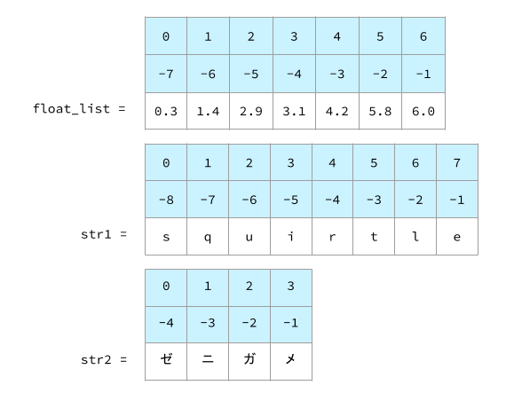
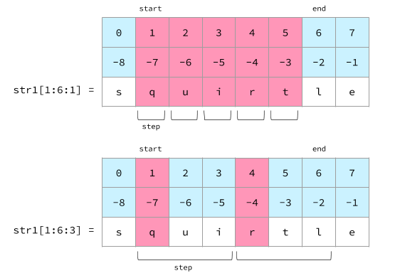
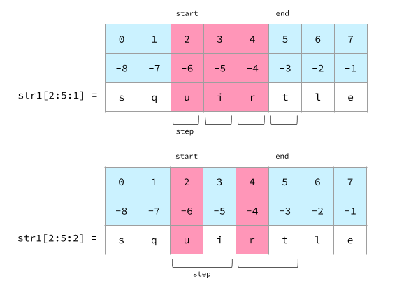
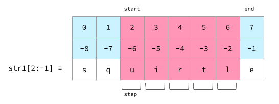
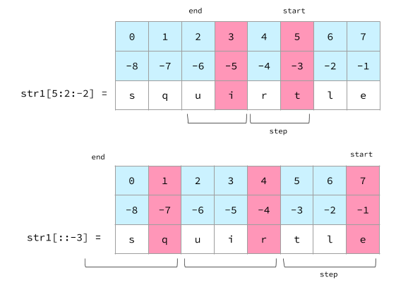

# Chapter2 文字列

この章では文字列(str型)について掘り下げます．  
Pythonでは文字列をとても柔軟に扱えます．  
最初は難しく感じるかもしれませんが，どんどん使っていきましょう．  

<br>

# 定義

文字列は `"`(ダブルクオート) あるいは `'`(シングルクオート)で書くことができます．  

```python
sentence1 = "ダブルクオートで書いた文字列"
sentence2 = 'シングルクオートで書いた文字列'
```

ダブルクオートの中ではシングルクオートは文字列として扱われます．  
同様に，シングルクオートの中ではダブルクオートは文字列として扱われます．  

```python
sentence3 = "Let's get started!"
sentence4 = 'She said "I wanna eat a Black Thunder."'
```

ダブルクオートの中でダブルクオートを，あるいはシングルクオートの中でシングルクオートを使用する場合は `\` か `¥` (エスケープシーケンス) を使用します．  

```python
s1 = "\""
s2 = '\''
```

ほかにエスケープシーケンスを使用するケースとして，改行とタブ空白があります．  

```python
s3 = "次の行に\n行きましょう"
# 次の行に
# 行きましょう

s4 = "Pythonのインデントが\t肌に合わない人もいます"
# Pythonのインデントが    肌に合わない人もいます
```

また，`"""` (ダブルクオート3つ) `'''` (シングルクオート3つ) で囲むと，改行や空白を含めそのまま文字列になります．  

```python
doc = """Form a complex number.

Keyword arguments:
real -- the real part (default 0.0)
imag -- the imaginary part (default 0.0)
"""
```

# インデックス

プログラミング言語では，配列(PythonではList．そのうち紹介します)や文字列の"n番目"の要素を0から数えます．  
以下の例では，
- float_listの0番目の要素は "0.3"，3番目の要素は "3.1"
- str1の1番目の文字は "q"，7番目の文字は "e"
- str2の2番目の文字は "ガ"

```python
float_list = [0.3, 1.4, 2.9, 3.1, 4.2, 5.8, 6.0]
str1 = "squirtle"
str2 = "ゼニガメ"
```



<br>

# 文字列長

文字列の長さは組込み関数`len()`(length=長さ)で計算できます．  
また，`文字列sの最後のインデックス = len(s) - 1`です．  
空文字の長さは0です．  

```python
str1 = "squirtle"
str2 = "ゼニガメ"
str3 = ""

str1_length = len(str1)   # 8
str2_length = len(str2)   # 4
str3_length = len(str3)   # 0

str1_last_idx = str1[len(str1) - 1]   # str1[8 - 1] = str1[7] = e
str2_last_idx = str2[len(str2) - 1]   # str2[4 - 1] = str2[3] = メ
```

# オフセット

Pythonでは`[]`を使用して文字列から部分文字列の抽出を行うことができます．  

以下の例は，文字列のx番目を`[x]`で抽出しています．  

```python
str1 = "squirtle"

str1_0 = str1[0]  # s
str1_3 = str1[3]  # i
str1_7 = str1[7]  # e
```

`[-1]`は最後の文字，`[-2]`は最後から1番目の文字，というように，負数を指定すると後ろからx番目の文字を抽出できます．  
後ろから数える場合は-1番目，-2番目，...，-(文字列長)番目になります．  

```python
str1 = "squirtle"

str1_m1 = str1[-1]  # e
str1_m5 = str1[-5]  # i
str1_m8 = str1[-8]  # s
```

最後の文字のインデックスより大きい値を指定した場合はエラーになります．  
`最後の文字のインデックス = 文字列長` では**ない**ことに注意しましょう．  
例えば，str1の文字列長は8文字ですが，インデックスは0から始まるので最後の文字のインデックスは7です．  
8番目の文字を指定するとエラーになります．  
`[-1]`を使えば，どんな文字列でも最後の文字を安全に抽出できます．  

```python
str1 = "squirtle"

str1_7 = str1[7]  # e
str1_m1 = str1[-1]  # e
str1_8 = str1[8]  # IndexError: string index out of range
```

また，`[]`はあくまで文字列の抽出(正確には抽出される文字列と同じ文字列を新規作成する．もとの文字列は破壊されない．後述するスライスも同様)をするものです．  
例えば，文字列str1の2文字目に "a" を代入しようとして `str1[2] = "a"` とすることはできません．  
Pythonのstr型は**イミュータブル**(immutable)(=値を変更できない)です．  

```python
str1 = "squirtle"

str1[2] = "a"   # TypeError: 'str' object does not support item assignment
```

<br>

# スライス

`[start:end:step]`といった書式を用いると，`start`番目の文字から`end-1`番目の文字までの文字列をステップ数`step`で抽出できます．  
ほかの言語だと`substring()`や`substr()`のような関数を使わなければいけませんが，Pythonではこのスライスによって簡易的かつ直感的に文字列の抽出を行えます．  

(`step`が正の数の場合，)  
`start`を省略すると`start`=0となり，  
`end`を省略すると`end`=文字列長(=最後の文字のインデックス+1)となり，  
`step`を省略すると`step`=1(=普通通り1文字ずつ抽出)となります．  

なお，**`end`番目の文字は抽出されない**ことに注意してください．  
数学の区間で表すと `[start, end)` です．  

具体例を見ながらじっくり見ていきます．  

```python
str1 = "squirtle"

str1_1_6_1 = str1[1:6:1]  # 1文字目から(6-1=5)文字目までステップ数1で = quirt
str1_1_6_3 = str1[1:6:3]  # 1文字目から(6-1=5)文字目までステップ数3で = qr

str1_2_5_1 = str1[2:5:1]  # 2文字目から(5-1=4)文字目までステップ数1で = uir
str1_2_5_2 = str1[2:5:2]  # 2文字目から(5-1=4)文字目までステップ数2で = ur
```




以下の例では`step`を省略しています．  
この場合は`step`=1をしているのと同じ結果になります．  
`start <= end` の場合は空文字になります．  

```python
str1 = "squirtle"

str1_1_6 = str1[1:6]    # 1文字目から(6-1=5)文字目まで = quirt
str1_2_5 = str1[2:5]    # 2文字目から(5-1=4)文字目まで = uir
str1_2_m1 = str1[2:-1]  # 2文字目から(-1-1=-2)文字目まで = uirtl
str1_4_2 = str1[4:2]    # 4文字目から(2-1=1)文字目まで = ""(空文字)
```



`step`=1のときは，`抽出される文字列長 = end - start`であることを覚えておきましょう．  
例えば，`str1[1:6]`の場合1文字目から(6 - 1 = 5)文字を抽出します．  

このことを利用すれば，x文字目からn文字抽出したいといったときは`end`となるインデックスを調べなくても`end = start + n`と計算できます．  
例えば，str1の2文字目から3文字抽出したい場合は`end = 2 + 3 = 5`だから`str1[2:5]`とすればよいとわかります．  

<br>

さらに`start`を省略すると，0文字目から`end-1`文字目までを抽出します．  

```python
str1 = "squirtle"

str1_3 = str1[:3]   # squ
str1_5 = str1[:5]   # squir
```

`end`を省略すると，`start`文字目から文字列の最後までを抽出します．  

```python
str1 = "squirtle"

str1_2 = str1[2:]   # uirtle
str1_6 = str1[6:]   # le
```

以下の例では，`start`と`end`を省略して`step`だけ指定しています．  

```python
str1 = "squirtle"

str1_2 = str1[::2]   # surl
str1_3 = str1[::3]   # sil
```

`step`に負数を指定すると，逆順に文字列を抽出します．
つまり`end`文字目から`start + 1`文字目までをステップ数`step`で抽出します．  
このことを利用すると，`step`と`end`を省略(すなわち`step`=0，`end`=文字列長)，`step`=-1とすることで反転した文字列を簡単に作れます．  
あんま使う機会はないです．  

```python
str1 = "squirtle"

str1_5_2_m2 = str1[5:2:-2]  # ti
str1_2_5_m2 = str1[2:5:-2]  # ""(空文字)

str1_m3 = str1[::-3]   # erq
str1_m1 = str1[::-1]   # eltriuqs
```



<br>

# str型で使用できる主なメソッド


**関数** あるいは **メソッド** とは，ここでは "便利な機能" とだけ考えてもらえばいいです．  
関数やメソッドに渡す値のことを **引数** といいます．   
機能を使うのに必要な "パラメータ" だとイメージしてください．  
(Pythonでは関数とメソッドは区別されて呼ばれていますが，使う側としてはどちらでも意味は通じるのであまり気にしなくていいです．)  

ここでは，str型で使用できる主なメソッドを紹介します．  

|   メソッド   |                             説明                             |
| :----------: | :----------------------------------------------------------: |
|   lower()    |         もとの文字列を小文字にした新しい文字列を返す         |
|   upper()    |         もとの文字列を大文字にした新しい文字列を返す         |
| capitalize() |         文字列の先頭を大文字にした新しい文字列を返す         |
|   split()    |                 引数の文字で文字列を分割する                 |
|    join()    |                指定した文字で文字列を連結する                |
|   strip()    |             引数の文字を文字列の前後から除去する             |
|   format()   | 引数の変数の値を文字列中の`{}`に代入した，新しい文字列を返す |

<br>

## lower()

もとの文字列をすべて小文字にした新しい文字列を生成します．  
`<str型変数 or 文字列>.lower()` の書式で使用できます．  
もとの文字列はそのままです．  

```python
str1 = "APPLE"
str1_lower = str1.lower()
print(str1)         # "APPLE"
print(str1_lower)   # "apple"
```

使用例として，ある文字列`str_a` とある文字列 `str_b`が一致するか調べる際，小文字と大文字を区別しない場合に`lower()` を使ってどちらの文字列も小文字(あるいは大文字)にしてしまってから比較することが挙げられます．  

```python
str_a = "Apple"
str_b = "APPLE"
is_same = str_a.lower() == str_b.lower()  # True
```

ちょっと不思議に見えますが，以下のようにも書けます．  

```python
str1_lower = "APPLE".lower()    # "apple"
```

これは，Pythonでは値，文字列，データ構造，関数といったあらゆるものが **オブジェクト** として実装されているからです．  
そして，Pythonでの変数とは単なるラベルであり，オブジェクト自身ではないことによります．  
このことはいずれ掘り下げていくつもりなので，今のうちはこういうふうにも書けるとだけ覚えておいてください．  


## upper()

もとの文字列をすべて大文字にした新しい文字列を生成します．  
もとの文字列はそのままです．  

```python
str1 = "apple"
str1_upper = str1.upper()
print(str1)         # "apple"
print(str1_upper)   # "APPLE"
```

## capitalize()

もとの文字列の先頭の文字を大文字にした文字列を生成します．  
もとの文字列はそのままです．  

```python
str1 = "apple"
str1_cap = str1.capitalize()
print(str1)       # "apple"
print(str1_cap)   # "Apple"
```


## split()

引数に与えた文字で文字列を分割してListを返します(Listについては他の章で説明しますが，配列にあたるものです)．  
例えば，以下では `,` (カンマ) を区切り文字として分割しています．  

```python
line1 = "1,2,3,4,5"
numbers = line1.split(",")
# ['1', '2', '3', '4', '5']
```

引数を省略した場合は " "(空白)になります．  

```python
line2 = "I love cry of Fearow."
words = line2.split()
# ['I', 'love', "Fearow's", 'cry']
```

以下のようにも書けます．  

```python
words = "I love Fearow's cry".split()
# ['I', 'love', "Fearow's", 'cry']
```


## join()

`split()` とは反対に，引数に与えた文字で文字列を連結します．  
初めは(見た目的に)理解しづらいですが，便利なのでよく使われるメソッドです．  

```python
numbers = ['1', '2', '3', '4', '5']
line1 = ",".join(numbers)   # "1,2,3,4,5"
```

```python
words = ["I", "love", "Fearow's", "cry."]
line2 = " ".join(words)   # "I love Fearow's cry."
```

## strip()

引数で与えた文字を，文字列の前後から除去するメソッドです．  
引数なしの場合は " "(空白)，`\t`，`\n` をすべて除去します．  
一番わかりやすい利用例としては，入力された文字列の前後の余分な空白を取り除いて，ちゃんと入力文字列と比較文字列を比較したいときです．  

```python
input_str = " 0文字目と最後の文字が空白    "
comp_str = "0文字目と最後の文字が空白"

is_same = input_str == comp_str   # False


input_str_after = input_str.strip()   # "0文字目と最後の文字が空白"

is_same = input_str_after == comp_str   # True
```

文字列中の空白は除去されません．  

```python
str1 = "2文 字目が空白".strip()   # "2文 字目が空白"
```

## fotmat()

引数に与えた値を，文字列中の `{}` に代入して新しい文字列を作ります．  
説明だとわかりにくいので例を見てみましょう．  

```python
sudowoodo_type = "Rock"
str1 = "The type of Sudowoodo is {}.".format(sudowoodo_type)
# The type of Sudowoodo is Rock.

a = 3.0
b = 4.0
str2 = "長さa={}，b={}の2辺をもつ直角三角形の残り1辺の長さ={}".format(a, b, (a * a + b * b) ** 0.5)
# 底辺の長さ=3.0，高さ=4.0の直角三角形の斜辺の長さ=5.0

line1 = "1,2,3,4,5"
str3 = "line1.split(',')={}".format(line1.split(','))
# line1.split(',')=['1', '2', '3', '4', '5']
```

`{}`に入れられる値はintでもListでもたいてい何でもOKです．  
イメージとしては，変数nを `str(n)` でstr型に変換して `{}` に入れている感じです．  
`print()`を使ってコンソールに出力するための文字列を整形(=format)するときにもよく使われます．  
計算の途中経過を見るときも変数名とその値がわかって便利です．  

```python
res1 = 0
res2 = 0
x = 10
y = 32
z = 61

print("res1={}".format(res1))   # res1=0

res1 += x % 3

print("res1={}".format(res1))   # res1=1

res1 += y % 3

print("res1={}".format(res1))   # res1=3

res1 += z % 3

print("res1={}".format(res1))   # res1=4

res1 %= 3

print("res1={}".format(res1))   # res1=1


res2 = (x + y + z) % 3

print("res2={}".format(res2))   # res2=1
```

また，Python3.6から `format()` と同等の機能として `f文字列` (f-strings) が使えるようになりました．  
ダブルクオート，あるいはシングルクオートの前に `f` をつけることで，文字列中の `{}` に直接変数を入れることができます．  
先に`format()`を紹介しておいてあれですが，f文字列の方が楽に書けるのでこちらの方がおすすめです．  

```python
sudowoodo_type = "Rock"
str1 = f"The type of Sudowoodo is {sudowoodo_type}."
# The type of Sudowoodo is Rock.

a = 3.0
b = 4.0
str2 = f"長さa={a}，b={b}の2辺をもつ直角三角形の残り1辺の長さ={(a * a + b * b) ** 0.5}"
# 底辺の長さ=3.0，高さ=4.0の直角三角形の斜辺の長さ=5.0

line1 = "1,2,3,4,5"
str3 = f"line1.split(',')={line1.split(',')}"
# line1.split(',')=['1', '2', '3', '4', '5']
```

```python
res1 = 0
res2 = 0
x = 10
y = 32
z = 61

print(f"res1={res1}")   # res1=0

res1 += x % 3

print(f"res1={res1}")   # res1=1

res1 += y % 3

print(f"res1={res1}")   # res1=3

res1 += z % 3

print(f"res1={res1}")   # res1=4

res1 %= 3

print(f"res1={res1}")   # res1=1


res2 = (x + y + z) % 3

print(f"res2={res2}")   # res2=1
```

<br>

# 練習問題

## Q1

`s = "Bulbasaur"` の最初の文字と最後の文字を連結した文字列を作って出力してみましょう．  

```python
s = "Bulbasaur"
```


## Q2

`a = 954256109364964217539864` は何桁の数字でしょうか．  

```python
a = 954256109364964217539864
```

## Q3

`a = 954256109364964217539864` の， `n = 1_000_000_000`の位の数字を出力してください．  
なお，1の位は4，10の位は6，100の位は8，...，です．

```python
a = 954256109364964217539864
n = 1_000_000_000
```

## Q4

`alp = "abcdefghijklmnopqrstuvwxyz"` の5文字目から15文字目まで(5文字目，15文字目を含む)を使ってできる文字列は何になるでしょうか．  

```python
alp = "abcdefghijklmnopqrstuvwxyz"
a = 5
b = 15
```


## Q5

`alp = "abcdefghijklmnopqrstuvwxyz"` の11文字目から6文字(11文字目を含む)を使ってできる文字列は何になるでしょうか．  

```python
alp = "abcdefghijklmnopqrstuvwxyz"
a = 11
b = 6
```

## Q6

`alp = "abcdefghijklmnopqrstuvwxyz"` の奇数番目の文字を全て抽出してください．  

<details>
  <summary>ヒント</summary>
  <p><code>alp[start::step]</code> の <code>start</code> と <code>step</code> に適切な値を設定しましょう</p>
</details>

```python
alp = "abcdefghijklmnopqrstuvwxyz"
```

## Q7

次の文章を，行ごとに区切ってListにしてみましょう．  
なお，空文字はListに入れないようにしてください．  

<details>
  <summary>ヒント</summary>
  <p>区切り文字は <code>\n</code> です</p>
</details>

```python
recipe = """(1) フタをあける
(2) 粉末スープを入れる
(3) お湯を注ぐ
(4) 3分待つ
(5) できあがり
"""
```

## Q8

次のListから，文字列`123456789` を作って出力してください．  

```python
numbers = ["123", "456", "789"]
```


## Q9

文字列`Mr.Mime` を使って回文を1つ作ってください．  
回文とは，始めから読んでも終わりから読んでも同じ文のことをいいます．  
意味は通ってなくてもよく，始めから読んでも終わりから読んでも同じ文字列であればよいです．  
例) しんぶんし，level  

<details>
  <summary>ヒント</summary>
  <p>単純に，もとの文字列に，もとの文字列を反転した文字列を連結させれば回文になります</p>
</details>

```python
s = "Mr.Mime"
```


## Q10

`t = 7529`秒は何時間何分何秒でしょうか．  
コンソールに `x時間x分x秒`の形式で出力してください．  

```python
t = 7529
```

<hr>


# 練習問題解答例

## Q1

```python
s = "Bulbasaur"

ans = s[0] + s[-1]
print(ans)    # Br
```


## Q2

文字列にしたときの長さが桁数になります．  

```python
a = 954256109364964217539864

a_str = str(a)
ans = len(a_str)
print(ans)    # 24
```

## Q3

`1の位の数 = 4 = a[-1]`，`10の位の数 = 6 = a[-2]`，`100の位の数 = 8 = a[-3]`，...，なので，`nの位の数 = a[-(nの桁数)]` になります．  
`n = 1_000_000_000` の桁数は10なので，答えは `a[-10] = 4` になります．  

```python
a = 954256109364964217539864
n = 1_000_000_000

d = len(str(n)) # nの桁数を求める
a_str = str(a)
ans = a_str[-d]
print(ans)      # 4
```

## Q4

スライス `[start:end]` を使います．  
end文字目は抽出されないことに注意しましょう．  

```python
alp = "abcdefghijklmnopqrstuvwxyz"
a = 5
b = 15

print(alp[a:b+1])   # fghijklmnop
```

## Q5

`start`文字目から `n`文字抽出する場合，`end = start + n`となります．  

```python
alp = "abcdefghijklmnopqrstuvwxyz"
a = 11
b = 6

print(alp[a:a+b])   # lmnopq
```

## Q6

奇数番目は 1, 3, 5, 7, ...，です．  
これは1文字目からステップ数2でスライスを使うと抽出できます．  

```python
alp = "abcdefghijklmnopqrstuvwxyz"

print(alp[1::2])    # bdfhjlnprtvxz
```

## Q7

recipeを区切り文字を表示して書くと，次のようになります．  
`(1) フタをあける\n(2) 粉末スープを入れる\n(3) お湯を注ぐ\n(4) 3分待つ\n(5) できあがり\n`  
このまま `split("\n")` を使用すると，最後の `\n` での区切りによって空文字が生じます．  

```python
recipe = """(1) フタをあける
(2) 粉末スープを入れる
(3) お湯を注ぐ
(4) 3分待つ
(5) できあがり
"""

ans = recipe.split("\n")
# ['(1) フタをあける', '(2) 粉末スープを入れる', '(3) お湯を注ぐ', '(4) 3分待つ', '(5) できあがり', '']
```

`split("\n")` を使用する前に `strip()` で最後の `\n` を除去することで，Listに空文字を入れないようにすることができます．  
なお，`strip()` は新しい文字列を返すので，`recipe.strip().split("\n")` というように続けて書くことができます．  

```python
recipe = """(1) フタをあける
(2) 粉末スープを入れる
(3) お湯を注ぐ
(4) 3分待つ
(5) できあがり
"""

ans = recipe.strip().split("\n")
print(ans)
# ['(1) フタをあける', '(2) 粉末スープを入れる', '(3) お湯を注ぐ', '(4) 3分待つ', '(5) できあがり']
```

## Q8

""(空文字)で `join()` を使うことで作れます．  

```python
numbers = ["123", "456", "789"]

ans = "".join(numbers)
print(ans)      # 123456789
```

## Q9

```python
s = "Mr.Mime"

ans = s + s[::-1]
print(ans)      # Mr.MimeemiM.rM
```

## Q10

1時間は `(60 * 60)` 秒なので，`t // (60 * 60)` で時間が求まります．  
また，1分は60秒なので，t秒は `(t // 60)`分です．  
60分ごとに1時間としてカウントされて0分となるので，結局 `(t // 60)` を60で割ったときの余りが求める分数になります．  
同様に，60秒ごとに1分としてカウントされて0秒となるので，求める秒数は `t % 60` です．  
最後にf文字列を使って文字列を整形して出力します．  

```python
t = 7529

h = t // (60 * 60)  # 時間
m = t // 60 % 60    # 分
s = t % 60          # 秒
print(f'{h}時間{m}分{s}秒')     # 2時間5分29秒 (マラソン男子日本記録)
```
