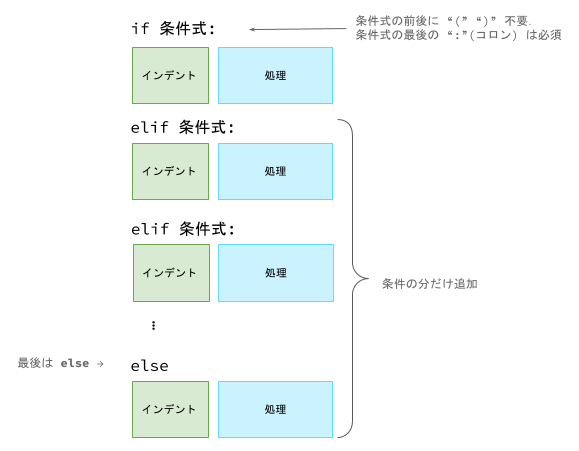
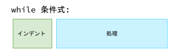
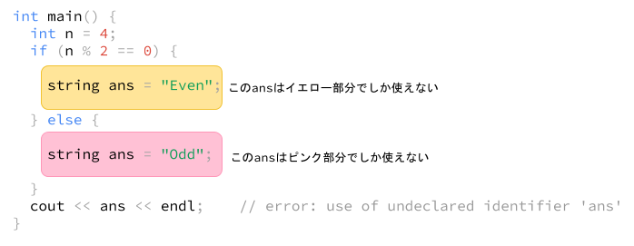

# Chapter3 基本構文

プログラムの流れを制御するために必要な構文を導入します．  
この章ではif文とwhile文について説明し，for文については第4章で取り上げます．  
なお，Pythonにはcase文，do-while文はありません．  

| 文(Statement) |   説明   |
| :-----------: | :------: |
|     if文      |   分岐   |
|     for文     | 繰り返し |
|    while文    | 繰り返し |

<br>

# if文

条件によってプログラムの処理を分岐させます．  
書式は以下のようになります．  



else節はすべての条件に当てはまらなかった場合に実行されます．  

if文の内側の処理のインデント(文頭の空白)は **必須** です．  
キーボードのtabキーを押して入力しましょう．  
(2でも8でも空白があればいいっぽいですが)インデントは基本(半角)4文字分です．  

条件文には比較演算子を使います．  

| 比較演算子 | 説明(以下の場合`True`となる) |
| :--------: | :--------------------------: |
| op1 == op2 |   op1とop2が等しい (同値)    |
| op1 != op2 |     op1とop2が等しくない     |
| op1 < op2  |      op1がop2より小さい      |
| op1 <= op2 |         op1がop2以下         |
| op1 > op2  |      op1がop2より大きい      |
| op1 >= op2 |         op1がop2以上         |
| op1 in op2 |     op1はop2の要素である     |
| op1 is op2 |    op1はop2である (同一)     |


いくつか例を見ていきましょう．  

例1-1. 変数aの値が偶数ならば `Even`，奇数ならば `Odd` とコンソールに表示するプログラム  

```python
a = 4

if a % 2 == 0:    # aを2で割った余りが0なら偶数
    print("Even")
else:             # そうでないなら奇数
    print("Odd")

# 出力: Even
```

`a = 4`で偶数なので，if文の最初の条件式 `a % 2 == 0` は `True` となります．  
内側の処理に入り，`print("Even")` で "Even" と出力します．  
1つの条件式が `True` となった場合ほかの処理(この例ではelse節)を行わずすぐに抜けます．  


例1-2. 変数`you`と変数`cpu`について，`you`の値が`cpu`より大きければ`You Win !!`，同じであれば`Tie`，小さければ`You Lose...`と表示するプログラム

```python
you = 9
cpu = 9

if you > cpu:
    print("You Win !!")   # section 1
elif you == cpu:
    print("Tie")          # section 2
else:
    print("You Lose...")  # section 3

# 出力: Tie
```

`you = 9`，`cpu = 9`なので，最初の条件式`you > cpu`は`False`となり，section1には入りません．  
2番目の条件式 `you == cpu`では`True`となるので，`print("Tie")`を実行してif文を抜けます．  


例1-3. 変数`score`が90以上であれば`A`，80以上90未満であれば`B`，50以上80未満であれば`C`，30以上50未満であれば`D`，30未満であれば`E`と表示するプログラム

```python
score = 10

if score >= 90:
    print("A")
elif 80 <= score and score < 90:
    print("B")
elif 50 <= score and score < 80:
    print("C")
elif 30 <= score and score < 50:
    print("D")
else:
    print("E")

# 出力: E
```

始めからelse節までのすべての条件式は`False`になります．  
最後にelse節に入り，`print("E")`を実行して終了します．  

多くのプログラムではブール演算のANDの記号として `&&`，ORに `||`，NOTに `!` を用いますが，ブール値の項目で見たようにPythonではANDに `and`，ORに `or`，NOTに `not`を用います．  
ほかの言語に慣れている方は注意してください．  

また，Pythonでは `<=`，`<`，`>=`，`>` を連続させて条件式を書くことができます．  
例えば例3は次のようにも書けます．  

```python
score = 10

if score >= 90:
    print("A")
elif 80 <= score < 90:  # ここと
    print("B")
elif 50 <= score < 80:  # ここと
    print("C")
elif 30 <= score < 50:  # ここが変わった
    print("D")
else:
    print("E")

# 出力: E
```

例1-4. 文字列aと文字列bを辞書順で出力するプログラム

```python
a = "abra"
b = "Ekans"

if a < b:
    print(a, b)
else:
    print(b, a)

# 出力: Ekans abra
```

文字列の比較は辞書順で行われます．  
辞書順では大文字の方が小文字より先です．  


## Falseと評価される値

条件式に値を置くだけでも評価されます．  
次の表は，`False`と評価される値をまとめたものです．  
これ以外の値は`True`になります．  

|  Falseとなる値   |
| :--------------: |
|   False (bool)   |
|       None       |
|        0         |
|       0.0        |
|   "" (空文字)    |
| `[]` (空リスト)  |
| `()` (空タプル)  |
|  `{}` (空辞書)   |
| `set()` (空集合) |


例1-5.  

```python
n = 1

if n:
    print("True")
else:
    print("False")

# 出力: True
```

例1-6.  

負の数も`True`になります．  

```python
n = -1

if n:
    print("True")
else:
    print("False")

# 出力: True
```

例1-7.  

```python
n = 0

if n:
    print("True")
else:
    print("False")

# 出力: False
```


例1-8.  

```python
s = "False"

if s:
    print("True")
else:
    print("False")

# 出力: True
```

例1-9.  

空白も`True`になります．  

```python
s = " "   # 空白

if s:
    print("True")
else:
    print("False")

# 出力: True
```

変数を置くだけで評価されるとはいうものの，Pythonは変数にint型でもstr型でも何でも代入できるので，変数だけではどんな条件を評価しているのかわかりづらいです．  
なので，数が0でないか，あるいは文字列が空文字でないかといった評価は，以下のように比較対象を明示することをおすすめします．  

例1-10. 整数nが0でないなら "Not zero"，0なら "Zero" と出力

```python
n = 1

if n != 0:
    print("Not zero")
else:
    print("Zero")

# 出力: Not zero
```

例1-11. 文字列sが空文字でないなら "Not empty"，空文字なら "Empty" と出力

```python
s = ""

if len(s) > 0:
    print("Not empty")
else:
    print("Empty")

# 出力: "Empty"
```

## None

`None`は値がないことを表す値で，ほかのどの値とも等しくありません．  
`None`は少し特殊で，比較には`is`演算子を使用します．  

```python
a = None

if a is None:
    print("a is None.")
else:
    print("a is not None.")

# 出力: a is None
```

次の例では，文字列sの長さをコンソールに出力するプログラムです．  
変数sは自分の書いているプログラムではなくほかのプログラムから渡される文字列だと思ってください．  
このプログラムはsが`None`の場合エラーになります．  

```python
s = ?

print(len(s))   # Noneの場合 TypeError: object of type 'NoneType' has no len()
```

理由は`len()`が`None`をサポートしていないからです．  
Pythonは変数に様々な型の値を代入することができます(`None`もよく入ります)が，`None`に適用できない関数やメソッドが多くあるので，変数の中身が不明瞭の場合は以下のようにNoneチェックすることが多いです．  

```python
s = ?

if s is not None:
    print(len(s))
```

## 条件式の評価順序

1つの条件式は左から順に評価(=計算)されます．  
そして，`and`演算は左辺が`False`であったとき，右辺を評価せず直ちに`False`を返します．  
また，`or`演算は左辺が`True`であったとき，右辺を評価せず直ちに`True`を返します．  

次のプログラムは，入力された文字列sが有効かどうか(ここでは`None`あるいは空文字でないか(=文字列長が0でないか))判定するプログラムです．  
条件式は左から評価されるため，`len(s) > 0 and s is not None` の部分は `len(s) > 0` から評価されます．  
したがって，このプログラムはsが`None`のときエラーになります．  

```python
s = ?

if len(s) > 0 and s is not None:    # sがNoneの場合ここでエラー
    print("OK")
else:
    print("NG")

# sがNoneの場合: TypeError: object of type 'NoneType' has no len()
```

`and`は左辺が`False`になった場合右辺を評価せずに`False`を返すので，`len(s) > 0`より先に`s is not None`を評価すれば正しく動きます，  


```python
s = ?

if s is not None and len(s) > 0:
    print("OK")
else:
    print("NG")
```

以下は，同じプログラムを`and`ではなく`or`で書いたものです．  
左辺`s is None`が`True`となった場合右辺は評価されず，この条件式はすぐに`True`となるので，このプログラムも期待通りに動きます．  

```python
s = ?

if s is None or len(s) == 0:
    print("NG")
else:
    print("OK")
```


## ネスト

複雑な条件は，if文はネストさせることで表現できます．  

例1-10. 整数a(>= 0) が整数b(>= 0) の倍数であるか判定するプログラム

```python
a = 5
b = 2


if b > 0:
    if a % b == 0:
        print("aはbの倍数です")
    elif:
        print("aはbの倍数じゃないです")
else:
    print("0で割ることはできません")

# 出力: aはbの倍数じゃないです
```

例1-11. プレイヤーAの出した手aとプレイヤーBの出した手bをもとにジャンケンの結果を表示するプログラム (このプログラムはもっと簡潔に書けます → 練習問題)

| a, b  |   手   |
| :---: | :----: |
|   0   |  グー  |
|   1   | チョキ |
|   2   |  パー  |

```python
a = 1
b = 2

if a == 0:
    if b == 0:
        print("Tie")
    elif b == 1:
        print("A win")
    else:
        print("B win")
elif a == 1:
    if b == 0:
        print("B win")
    elif b == 1:
        print("Tie")
    else:
        print("A win")
else:
    if b == 0:
        print("A win")
    elif b == 1:
        print("B win")
    else:
        print("Tie")

# 出力: A win
```

(Extra)

## 三項演算子

多くのプログラミング言語にあるように，Pythonも三項演算子が使えます(ちょっとほかの言語と書式が違いますが)．  
三項演算子を使うと，簡単なif文を1行にまとめて値の代入まで行えるのでコードを簡潔に書くことができます．  

次のプログラムは，整数nが偶数の場合変数sに"Even"，奇数の場合"Odd"を代入します．  

```python
n = 4

if n % 2 == 0:
    s = "Even"
else:
    s = "Odd"
```

このプログラムは，三項演算子を用いると次のように書けます．  

```python
n = 4

s = "Even" if n % 2 == 0 else "Odd"
```

(ここまでExtra)

<br>

# while文

繰り返し同じ処理を行うときは，while文とfor文を使います．  

while文の書式は次の通りです．  
条件式が`False`になるまで処理を繰り返します．  



これも例を順に見ていきましょう．  

例2-1. 1から3までの整数を出力するプログラム

```python
i = 1

while i <= 3:
    print(i)
    i += 1

# 1
# 2
# 3
```

`i`を1ずつ増やし，各`i`の値を`print()`で出力します．  
`i`が4になったときwhile文を抜けます．  

### 0ループ目

始め，`n = 0`，`i = 1`です．  
`i = 1`なので条件式`i <= 3`は`True`となり，while文の中に入ります．  
`i += 1`で`i`を **インクリメント** (+1する)して `i = 2` になります．  

### 1ループ目

`i = 2`なので条件式`i <= 3`は`True`となり，while文の中に入ります．  
`i += 1`で`i`をインクリメントして `i = 3` になります．  

### 2ループ目

`i = 3`なので条件式`i <= 3`は`True`となり，while文の中に入ります．  
`i += 1`で`i`をインクリメントして `i = 4` になります．  

### 3ループ目

`i = 4`なので条件式`i <= 3`は`False`となり，while文から抜けます．  


例2-2. 文字列sの中のアルファベット`e`の数を数えるプログラム

```python
s = "eevee"
i = 0
n = len(s)  # 5

cnt = 0
while i < n:
    if s[i] == "e":
        cnt += 1
    i += 1

print(cnt)    # 4
```

文字列`s`の最後のインデックスまで`i`をインクリメントし，`s`の`i`番目が`e`の場合 `cnt`をインクリメントすることで`s`中のアルファベット`e`の数を数えられます．  

### 0ループ目

始め，`i = 0`です．  
`i = 0`なので条件式`i < n(=5)`は`True`となり，while文の中に入ります．  
`s[0](="e") == "e"`が`True`となるので，`cnt += 1`でカウントして`cnt = 1`になります．  
`i += 1`で`i`をインクリメントして `i = 1`になります．  

### 1ループ目

`i = 1`なので条件式`i < n(=5)`は`True`となり，while文の中に入ります．  
`s[1](="e") == "e"`が`True`となるので，`cnt += 1`でカウントして`cnt = 1`になります．  
`i += 1`で`i`をインクリメントして `i = 2`になります．  

### 2ループ目

`i = 2`なので条件式`i < n(=5)`は`True`となり，while文の中に入ります．  
`s[2](="v") == "e"`が`False`となるので，if文の中には入りません．  
`i += 1`で`i`をインクリメントして `i = 3`になります．  

### 3ループ目

`i = 3`なので条件式`i < n(=5)`は`True`となり，while文の中に入ります．  
`s[3](="e") == "e"`が`True`となるので，`cnt += 1`でカウントして`cnt = 3`になります．  
`i += 1`で`i`をインクリメントして `i = 4`になります．  

### 4ループ目

`i = 1`なので条件式`i < n(=5)`は`True`となり，while文の中に入ります．  
`s[4](="e") == "e"`が`True`となるので，`cnt += 1`でカウントして`cnt = 4`になります．  
`i += 1`で`i`をインクリメントして `i = 5`になります．  

### 5ループ目

`i = 5`なので条件式`i < n(=5)`は`False`となり，while文を抜けます．  
結果，`cnt = 4`です．  


例2-3. 自然数n(> 0)を素因数分解したときの2の個数

```python
n = 40    # 2 * 2 * 2 * 5
cnt = 0

while n % 2 == 0:
    n //= 2
    cnt += 1

print(cnt)    # 3
```

自然数nが2で割れなくなるまで割り続け，その数を数えます．  

### 0ループ目

始め，`n = 40`です．  
条件式`n % 2 == 0`が`True`となるのでwhile文の中に入ります．  
`cnt += 1`で`cnt = 1`，`n //= 2`で`n = 20`になります．  

### 1ループ目

`n = 20`なので条件式`n % 2 == 0`が`True`となり，while文の中に入ります．  
`cnt += 1`で`cnt = 2`，`n //= 2`で`n = 10`になります．  

### 2ループ目

`n = 10`なので条件式`n % 2 == 0`が`True`となり，while文の中に入ります．  
`cnt += 1`で`cnt = 3`，`n //= 2`で`n = 5`になります．  

### 3ループ目

`n = 5`なので条件式`n % 2 == 0`が`False`となり，while文から抜けます．  
結果，`cnt = 3`です．  

## break文

break文を使うと，条件式の結果に関わらずwhile文やfor文の中から直ぐに抜けることができます．  
次のプログラムは，文字列中にアルファベット"o"があるかどうかを判定するプログラムです．  
文字列`s = Slowpoke`には"o"が2個含まれますが，1個目が見つかれば文字列の最後まで見る必要はないので，"o"が見つかり次第break文でwhile文を抜けるようになっています．  

```python
s = "Slowpoke"

i = 0
n = len(s)
found = False
while i < n:
    print(i)
    if s[i] == "o":
        found = True
        break
    i += 1

if found:
    print("Found")
else:
    print("Not found")

'''
出力: 
0
1
2
Found
'''
```

## else節

while文の末尾にもelse節を設けることができます．  
while文でbreak文が使用されなかった場合にelse節に入ります．  

以下の2つのプログラムのうち，上のプログラムはbreak文が使用されるケース，下のプログラムはbreak文が使用されないケースになります

```python
s = "Slowpoke"

i = 0
n = len(s)
while i < n:
    if s[i] == "o":
        print("Found")
        break
    i += 1
else:
    print("Not found")

# Found
```

```python
s = "Shelldero"

i = 0
n = len(s)
while i < n:
    if s[i] == "o":
        print("Found")
        break
    i += 1
else:
    print("Not found")

# Not found
```


## 無限ループ

条件式を`True`とすると，break文で抜けない限り(あるいはエラーが起きてプログラムが停止するまで)ループし続けます．  
使いどころとしては，while文の終了条件が定まらなかったり，while文を抜けるタイミングや条件がいまいちまとまらなくてbreak文で好きなタイミングで抜けたかったりするときとかがあります．  

次のプログラムは，終了文字 "q" が入力されるまでユーザからの入力をストックします．  

```python
input_lines = []

while True:
    s = input("[q: quit] > ")
    if s == "q":
        break
    input_lines.append(s)
```

組込み関数`input()`については本章の練習問題で，Listについては次の章で取り上げます．  


## continue文


## ネスト

while文もネストすることができます．  
次のプログラムは，文字列s中でアルファベット"e"が連続している部分の個数をカウントします．  

```python
s = "eevee"

i = 0
n = len(s)
cnt = 0
while i < n:
    while i < n and s[i] != "e":  # "e"じゃない部分を飛ばす
        i += 1
    if i >= n:  # iがn以上なら抜ける
        break
    while i < n and s[i] == "e":  # "e"が続くだけ文字列を読む
        i += 1
    cnt += 1    # "e"が途切れたのでカウント

print(cnt)    # 2
```


# スコープ

変数の有効範囲をスコープといいます．  
ほかのいくつかの言語と違い，Pythonのif文，while文，for文ではスコープが後ろに漏れます(ちなみに同じインタプリタ言語であるJavaScriptもPythonと同じようにスコープが後ろに伸びます)．  

例えば，C++の場合次のコードはエラーになります．  
このコードは，変数nが偶数の場合変数ansに"Even"，奇数の場合"Odd"を代入し，最後に`ans`の文字列を出力しようとしています．  
ここでの`ans`のように，C/C++やJavaなどの多くの言語ではif文内で定義された変数のスコープはif文内となります．  

```c++
#include <iostream>
#include <string>

using namespace std;

int main() {
  int n = 4;
  if (n % 2 == 0) {
    string ans = "Even";
  } else {
    string ans = "Odd";
  }
  cout << ans << endl;    // error: use of undeclared identifier 'ans'
}
```

図解するとこんな感じです．  



Pythonだと，if文内でansを定義しているにも関わらず次のコードは正しく動作します．  

例3-1. 

```python
n = 4

if n % 2 == 0:
    ans = "Even"
else:
    ans = "Odd"

print(ans)    # Even
```

これは，ansのスコープがif文の後にも伸びているからです．  

では，次の2つのコードはどうなるでしょうか．  

```python
n = 4

if n % 2 == 0:
    ans = "Even"

print(ans)  # Even
```

```python
n = 3

if n % 2 == 0:
    ans = "Even"

print(ans)  # NameError: name 'ans' is not defined
```

2つのうち，上は正常に動きますが，下はエラーになります．  
上の場合，`n = 4`なので`n % 2 == 0`が`True`となりif文内に入り，`ans`に"Even"が代入されてif文を抜けます．  
一方，下の場合は`n = 3`なので`n % 2 == 0`が`False`となり，if文内に入りません．  
その結果，`ans`に何も代入されないまま`print(ans)`が実行されてエラーになります．  

例3-1くらいの小さな分岐程度であれば，以下のようにif文の前で予め変数を用意しておく必要はないと思います．  

```python
n = 4

ans = ""    # めんどい
if n % 2 == 0:
    ans = "Even"
else:
    ans = "Odd"

print(ans)
```

しかし，分岐が多かったり処理が長かったりするif文，while文，for文の場合は，処理が追いづらくなり，これらの文を抜けた後にどの変数が使えるのかわからなくなるので，これらの文に入る前に予め変数を置いておくことをおすすめします．  

<br>


# 練習問題

## 準備

この章の練習問題からコンソールの入力(標準入力)を使用します．  
Pythonでは，標準入力用に組込み関数`input()`があります．  
この関数が実行されると，ユーザの入力が完了するまでプログラムが待機し，完了(エンターキーを押す)するとユーザの入力を文字列(str型)として返します．  

例1.  
次のプログラムを実行すると，コンソール上に`> `が出力されると思います．  
試しに"Pikachu"と入力してエンターキーを押してみてください．  
すると，プログラムが入力された文字を読み取って，コンソール上に"You typed Pikachu"と表示します．  

```python
print("> ")   # input()とはまったく関係なく，">"を表示して入力を促すために書いてる
s = input()

print("You typed", s)   # You typed Pikachu
```

例2.  
連続して入力を受け付けることもできます．  

```python
print("> ")
s1 = input()
print("> ")
s2 = input()
print("> ")
s3 = input()

print(f"You typed {s1}, {s2}, and {s3}")
```

例3.  
`input()`が返すのはstr型なので，int型にしたい場合は`int()`を，float型にしたい場合は`float()`を使います．  
次の例は，入力された2つの整数の和を計算して表示するプログラムです．  
int型に変換できない文字列を入力した場合はエラーになります．  

```python
print("a > ")
a = int(input())
print("b > ")
b = int(input())

print(f"a + b = {a + b}")
```


## Q

入力された自然数(> 0)について，3の倍数である場合 "OK"，それ以外の場合は "NG" と出力するプログラムを実装してみましょう．  

次の3通りの入力で正しい結果が出るようにしてください．  

```python
3
```

```python
13
```

```python
2019
```

## Q

入力された自然数(n > 0)について，7の倍数であり，かつ偶数の場合 "OK"，それ以外の場合は "NG" と出力するプログラムを実装してみましょう．  

次の3通りの入力で正しい結果が出るようにしてください．  

```python
21
```

```python
28
```

```python
7826
```


## Q

入力された自然数n(> 0)について，以下のように動作するプログラムを実装してみましょう(FizzBuzz問題)．
- 3で割り切れる場合 "Fizz" と表示
- 5で割り切れる場合 "Buzz" と表示
- 3と5で割り切れる場合 "FizzBuzz" と表示
- それ以外の場合数字をそのまま表示

次の4通りの入力で正しい結果が出るようにしてください．  

```python
9
```

```python
13
```

```python
25
```

```python
15
```


## Q

1から10までの数字を1行ずつ出力してみましょう．  

## Q

1から100までの整数の和を求めて出力してみましょう．  

```python
total = 0
i = 1
```

## Q

次の機能をもつプログラムを実装してみましょう．  
- 入力された文字列sについて，`s`中に含まれるアルファベット "e" のうち先頭から1個目のインデックスを出力する
- `s`中に1つも "e" がない場合は `-1` と出力する

例えば，文字列 "ninetales" の場合は`3`，文字列 "vulpix" の場合は`-1`となります．  

次の3通りの入力で正しい結果が出力されるようにしてください．  

```python

```


## Q

次の機能をもつプログラムを実装してみましょう．  
- 入力された文字列sについて，`s`中に含まれるアルファベット "a" のうち **末尾から2個目** のインデックスを出力する
- `s`中に2個目の"a"がない，あるいは1つも "a" がない場合は `-1` と出力する

例えば，文字列 "omastar" の場合は`2`，文字列 "omanyte" の場合は`-1`となります．  

```python
chansey
```

```python
tangela
```

```python
kangaskhan
```

## Q

プレイヤーAの出した手aとプレイヤーBの出した手bをもとにジャンケンの結果を表示するプログラムを，if文をネストさせずに実装してみましょう．  
プレイヤーAが勝った場合は "A win"，プレイヤーBが勝った場合は "B win"，引き分けの場合は "Tie" と出力してください．  

| a, b  |   手   |
| :---: | :----: |
|   0   |  グー  |
|   1   | チョキ |
|   2   |  パー  |

<details>
  <summary>ヒント</summary>
  <p>aとbの組合せを，Aが勝つ場合，Aが負ける場合，引き分けの場合の3通りに分けてみましょう</p>
</details>


# 練習問題解答例