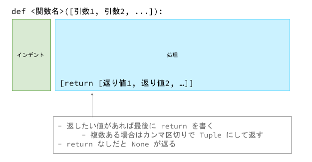
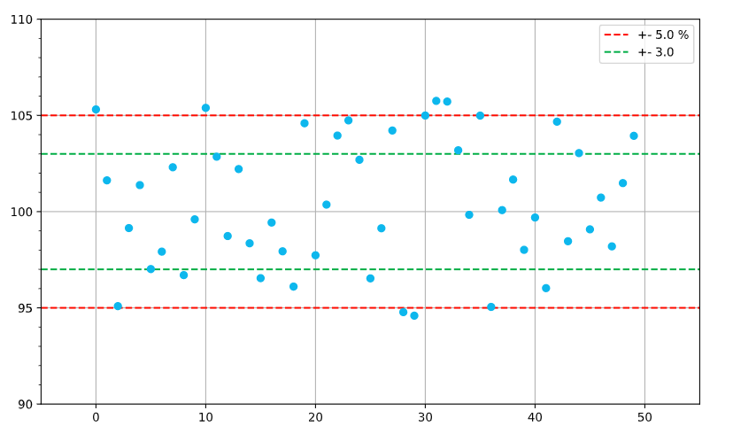

# Chapter5 関数

# 定義

同じ数値をあとから何度も使用できるようにするために変数を用いました．  
同様に，同じ処理をあとから何度も使用できるようにできると，コードを書く量が減って便利です．
また，ほかの人が，自分が書いた処理を簡単に使用することも期待できます．  

例えば，Chapter4 の練習問題の Q6 で使用した `nCk` を求めるプログラムは，`n` と `k` を可変にしていろいろな組合せの総数を求められるようにできると便利そうです．  

処理をまとめ，あとから使用する(=呼び出す)には **関数 (function)** を用います．  
関数の **定義**は次のようになっています．  



関数名の命名規則は変数名と同じで，英字小文字と数字， `_` (アンダーバー) を使用したスネークケースになります．  
関数に与えるパラメータ(可変にする部分)を *引数**，処理をした結果を **返り値 (return value)** といいます．  
引数は 2 つの種類があり，関数の定義にある変数を **仮引数 (parameter)**，呼び出す際に実際に渡す値を **実引数 (argument)** といいます．  
返り値は **return文** で返します．  
引数，返り値はなくてもいいです．  
`return` 文がない場合は暗黙的に `None` が返されます．  

`nCk` (Combination = 組合せ) を求めるプログラムは，引数を `n` と `k`，返り値を `nCk` として，以下のような関数にできます．  

```python
def comb(n, k):
    a = n
    for i in range(n - 1, n - k, -1):
        a *= i

    b = k
    for i in range(k - 1, 0, -1):
        b *= i

    return a // b
```


# 実引数


関数を **呼び出す** ときは，`<関数名>([引数1，引数2, ...])` と書きます．  
呼び出す前に関数が定義されているようにしましょう．  
関数を呼び出す際の引数の指定の仕方には 2 つの方法があります．  

## 位置引数 (Positional Argument)

上の関数を使って `7C3`(n = 7, k = 3) を求めてみましょう．  
位置引数で引数を指定する場合，次のように comb 関数を呼び出すことができます．  

```python
def comb(n, k):
    a = n
    for i in range(n - 1, n - k, -1):
        a *= i

    b = k
    for i in range(k - 1, 0, -1):
        b *= i

    return a // b

res = comb(7, 3)    # 35
```

位置引数の名前の通り，`n` と `k` を定義通りに指定しています．  

tuple や list の実引数の前に `*` を置くと，引数に対してアンパックします．  

```python
def comb(n, k):
    a = n
    for i in range(n - 1, n - k, -1):
        a *= i

    b = k
    for i in range(k - 1, 0, -1):
        b *= i

    return a // b

tpl = (7, 3)
res = comb(*tpl)    # 35
```

参考までに，普通の変数への tuple のアンパックです．  
自分がよく両者をごっちゃにして `*` のあるなしを忘れるので...

```python
tpl = (7, 3)
a, b = tpl
```

さらに混乱するんですが，(実引数の前のほかに)仮引数の前に `*` を置くとまた違う意味になります．  
仮引数の可変長引数の項目で紹介します．  


## キーワード引数 (Keyword Argument)

キーワード引数は，`<仮引数名>=<値>` の書式で引数を指定する方法です．  
この方法を使う場合は，引数が定義の順番になっていなくても OK です．  

```python
def comb(n, k):
    a = n
    for i in range(n - 1, n - k, -1):
        a *= i

    b = k
    for i in range(k - 1, 0, -1):
        b *= i

    return a // b

res = comb(k=3, n=7)    # 35
```

この例ではキーワード引数を使ってもそんなうれしいことないんですが，引数がもっとたくさんある関数のときデフォルト引数とともに活躍します．  

位置引数の場合は tuple や list でのアンパックによる引数の指定が可能でした．  
キーワード引数の場合は実引数である dictionary の前に `**` を置くことで引数を指定できます．  

```python
def comb(n, k):
    a = n
    for i in range(n - 1, n - k, -1):
        a *= i

    b = k
    for i in range(k - 1, 0, -1):
        b *= i

    return a // b


d = {
    "k": 3,
    "n": 7
}
res = comb(**d)    # 35
```

こちらの場合も (実引数のほかに)仮引数の前に `**` をつけると違う意味になります．  

今回の例を見て， `*` や `**` を使って引数を指定するにはわざわざ tuple や dictionary を作らなければいけなくて手間増えてない？と思うかもしれません．  
実際には，プログラム中で受け取った(既に作られた) tuple や dictionary の値を自分が何かしらの関数に使いたくなったとき，いちいち自分で分解しなくても `*` や `**` で引数として渡せてうれしいといった感じです．  


# 仮引数

## デフォルト引数

関数の定義の話に戻ります．  
comb 関数の仮引数にはただ変数が置かれているだけですが，`<仮引数名>=<値>` の書式で，仮引数に予め値を代入しておくことができます．  
この方法で定義された仮引数をデフォルト引数といいます．  
デフォルト引数は，位置引数の後ろで定義しなければなりません．  

例えば，よく袋の中に玉が 7 個あって，それを 3 つ同時に取り出したときの玉の組合せをよく計算する機会があるとしましょう！
そういったときは，`nCk` を計算する際に予め `n = 7`，`k = 3` がセットされていると便利です．  
以上を考慮してデフォルト引数で comb 関数を定義すると，次のようになります．  
`n` と `k` に 7 と 3 がセットされているので，実引数として何も与えなくても `7C3` を計算して結果を返します．  

```python
def comb(n=7, k=3):
    a = n
    for i in range(n - 1, n - k, -1):
        a *= i

    b = k
    for i in range(k - 1, 0, -1):
        b *= i

    return a // b

res = comb()    # 35
```

一方，実引数が渡された場合はそちらの値を優先します．  
次の例では，位置引数として `n = 10` を渡しているので `10C3` を計算しています．  

```python
def comb(n=7, k=3):
    a = n
    for i in range(n - 1, n - k, -1):
        a *= i

    b = k
    for i in range(k - 1, 0, -1):
        b *= i

    return a // b

res = comb(10)    # 120 = 10 C 3
```

このように，デフォルト引数を使うと頻繁に使用される値をわざわざ渡さなくても良くなるので楽です．  

また，引数の数が多いとき，デフォルト引数とキーワード引数の組合せはとても効果的です．  
例えば，Pandas という Python のライブラリでよく使用される merge メソッドの定義は次のようになっています (デフォルト引数はすべて位置引数の後ろで定義されている)．  

```python
DataFrame.merge(right, how='inner', on=None, left_on=None, right_on=None, left_index=False, right_index=False, sort=False, suffixes='_x', '_y', copy=True, indicator=False, validate=None)
```

引数が非常に多いですが，ほとんどがデフォルト引数です．  
そのため，自分が行いたい処理でデフォルト値から変える必要のある引数のみをキーワード引数で指定するだけで呼び出すことができます．  


### ミュータブルオブジェクト

**デフォルト引数の値として list や dictionary といったミュータブルオブジェクトを使うのは推奨されません**．  
言い換えれば，デフォルト引数の値はイミュータブルオブジェクトにすべきです．  
これには Python のデフォルト引数の言語仕様が関わっています．  

次の関数は，呼び出されると引数の list の末尾に 100 を追加します．  
デフォルト引数としてミュータブルオブジェクトである list を指定しています．  
使えない関数ですが，説明のため...

```python
def append_one_hundred(lst=[]):
    lst.append(100)
    return lst
```

試しに実引数なしで呼び出していると，期待通り `[100]` が返ってきます．  

```python
def append_one_hundred(lst=[]):
    lst.append(100)
    return lst

lst = append_one_hundred()
print(lst)    # [100]
```

今度は 3 回連続で実引数なしで呼び出してみます．  

```python
def append_one_hundred(lst=[]):
    lst.append(100)
    return lst


first_lst = append_one_hundred()
print(first_lst)   # [100]

second_lst = append_one_hundred()
print(second_lst)  # [100, 100]   <- [100] じゃない！

third_lst = append_one_hundred()
print(third_lst)   # [100, 100, 100]   <- [100] じゃない！
```

2 回目の結果は `[100]` ではなく `[100, 100]` になります．  
3 回目は，さらに 100 が増えて `[100, 100, 100]` です．  
デフォルト引数のデフォルトの値は，関数が定義されたときにしか初期化されません．  
つまり，最初にセットされたオブジェクトがずっと使われ続けます．  
ミュータブルオブジェクトは値の書き換えが可能なので，この例の場合初期化されてからデフォルト値が使われたあと `lst.append(100)` によってどんどん値が変わってしまったというわけです．  
疑似的に各呼び出しをコードで書いてみると，次のようになります．  

### 1 回目

```python
def append_one_hundred(lst=[]):
    lst.append(100)
    return lst


first_lst = append_one_hundred()
print(first_lst)   # [100]
```

### 2 回目

```python
def append_one_hundred(lst=[100]):
    lst.append(100)
    return lst


second_lst = append_one_hundred()
print(second_lst)   # [100, 100]
```

### 3 回目

```python
def append_one_hundred(lst=[100, 100]):
    lst.append(100)
    return lst


third_lst = append_one_hundred()
print(third_lst)   # [100, 100, 100]
```


これを回避するには，デフォルト値として使用しているオブジェクトに手を加えなければよいです．  

```python
def append_one_hundred(lst=[]):
    return lst + [100]  # + 演算では計算結果として新しい list が作られる


first_lst = append_one_hundred()
print(first_lst)   # [100]

second_lst = append_one_hundred()
print(second_lst)  # [100]

third_lst = append_one_hundred()
print(third_lst)   # [100]
```


ですが，うっかりミュータブルオブジェクトに手を加えてしまうことがなきにしもあらずなので，デフォルト引数のデフォルト値には int や float，str，None といったイミュータブルオブジェクトを指定するのが一般的になっています．  

```python
def append_one_hundred(lst=None):
    if lst is None:
        lst = []
    lst.append(100)
    return lst


first_lst = append_one_hundred()
print(first_lst)   # [100]

second_lst = append_one_hundred()
print(second_lst)  # [100]

third_lst = append_one_hundred()
print(third_lst)   # [100]
```


## 可変長引数

Python は可変長引数を定義できます．  
可変長引数を使うと，任意の長さの引数を渡すことができます．  

### `*` による位置引数の tuple 化

次の has_any 関数は，引数 lst で与えられた list の中に，与えられた任意の個数の数のうちのいずれかがあれば `True` を返す関数です．  
`*args` のように，`*<仮引数>` の書式で任意の長さの引数を tuple として受け取ることができます．  
仮引数の名前は `*` をつければ args 以外でも可能ですが，一般的に args が使われます．  

```python
def has_any(lst, *args):
    for n in args:
        if n in lst:
            return True
    return False


lst = [4, 6, 0, 7, 0, 4, 6, 1, 8, 8]
res1 = has_any(lst, 1, 2, 3)    # True
res2 = has_any(lst, 5, 9)       # False
```

これは次のコードと同じことをしています．  

```python
def has_any(lst, args):
    for n in args:
        if n in lst:
            return True
    return False


lst = [4, 6, 0, 7, 0, 4, 6, 1, 8, 8]
res1 = has_any(lst, (1, 2, 3))    # True
res2 = has_any(lst, (5, 9))       # False
```

わかりにくくなっただけじゃないかと思うかもれませんね...
渡す引数を tuple する手間が省けてうれしいんかなーとか，柔軟な書き方ができてうれしいんかなーくらいに考えてもらえればいいと思います．  
例えば print 関数に任意の個数の値を渡せるのもこの仕組のおかげです．  

紛らわしい話が続きますが，もう少し詰めてみましょう．  
次のコードは， `*` による可変長引数に tuple を渡そうとしています．  
結果は tpl1，tpl2 とも `False` になります．  
tpl1 を渡したとき，`args = ((1, 2, 3),)`，tpl2 を渡したとき，`args = ((5, 9),)` となっているからです．  
`*` による可変長引数は複数の引数を tuple にまとめるので，引数で渡された tuple はさらに tuple でラップされます．  
その結果，`lst = [4, 6, 0, 7, 0, 4, 6, 1, 8, 8]` に `tpl1 = (1, 2, 3)` や `tpl2 = (5, 9)` は含まれていないので `False` になります．  

```python
def has_any(lst, *args):
    for n in args:
        if n in lst:
            return True
    return False


lst = [4, 6, 0, 7, 0, 4, 6, 1, 8, 8]
tpl1 = (1, 2, 3)
tpl2 = (5, 9)
res1 = has_any(lst, tpl1)    # False
res2 = has_any(lst, tpl2)    # False
```

tuple や list を `*` による可変長引数にうまく渡すには，引数に対する `*` によるアンパックを使います．  
関数を呼び出すとき，一度 `*tpl1` や `*tpl2` として要素に分解し，それを `*args` で 1 つの tuple にまとめるといった感じです．  
今度は期待通りの結果になりました．  
`*` の働きは紛らわしいし分かりづらいので何回も調べることになると思います，しゃーない...

```python
def has_any(lst, *args):
    for n in args:
        if n in lst:
            return True
    return False


lst = [4, 6, 0, 7, 0, 4, 6, 1, 8, 8]
tpl1 = (1, 2, 3)
tpl2 = (5, 9)
res1 = has_any(lst, *tpl1)    # True
res2 = has_any(lst, *tpl2)    # False
```


### `**` によるキーワード引数の dictionary 化

仮引数の前に `**` を置くことで，任意の個数のキーワード引数を dictionary にして受け取ることができます．  
仮引数の名前は `**` をつければ kwargs 以外でも使えますが，一般的に kwargs が使用されます．  

次の inc_expenses 関数は，支出 (expenses) の各項目ごとの金額のデータを保持している dictionary と `**` による可変長引数の仮引数をもつ関数です．  
任意の個数の項目と金額のペアをキーワード引数として追加することで，expenses に項目があれば引数の値を追加し，なければ新しく項目と金額を追加します．  

```python
def inc_expenses(expenses, **kwargs):
    for k, v in kwargs.items():
        expenses[k] = expenses.get(k, 0) + v


expenses = {
    "food": 20000,
    "utilities": 10000,
    "entertainmemt": 20000,
}

inc_expenses(expenses, food=3000, transportation=2000)
'''
{
  'food': 23000, 
  'utilities': 10000, 
  'entertainmemt': 20000, 
  'transportation': 2000
}
'''
```

仮引数が `**kwargs` である関数にキーワード引数として dictionary を使いたい場合は，関数を呼び出す際に実引数である dictionary の前に `**` を置いてアンパックします．  

```python
def inc_expenses(expenses, **kwargs):
    for k, v in kwargs.items():
        expenses[k] = expenses.get(k, 0) + v


expenses = {
    "food": 20000,
    "utilities": 10000,
    "entertainmemt": 20000,
}


increment = {
    "food": 3000,
    "transportation": 2000
}

inc_expenses(expenses, **increment)
'''
{
  'food': 23000, 
  'utilities': 10000, 
  'entertainmemt': 20000, 
  'transportation': 2000
}
'''
```

# バリデーションチェック (Validation Check)

先ほどまで見ていた `comb` 関数ですが，1 つバグがあります．  
例えば，次のような引数で関数を呼び出した場合はどうなるでしょうか．  

```python
def comb(n, k):
    a = n
    for i in range(n - 1, n - k, -1):
        a *= i

    b = k
    for i in range(k - 1, 0, -1):
        b *= i

    return a // b

res = comb(7, 0)
```

この場合は，`k = 0` なので `a // b` のところでゼロ割となり，`ZeroDivisionError` が起きます．  
組合せの定義では`nC0 = 1` なので，`k = 0` のとき `1` を返すような分岐が必要です．  
修正を加えた `comb` 関数を下に示します．  

```python
def comb(n, k):
    if k == 0:
        return 1

    a = n
    for i in range(n - 1, n - k, -1):
        a *= i

    b = k
    for i in range(k - 1, 0, -1):
        b *= i

    return a // b
```

このように，関数内には複数の `return` 文を置くことができます．  
引数によって簡単な条件分岐が必要な場合は，上の例のようになるべく関数の始めの方に分岐を設け，早めに `return` 文で返すようにすると，関数全体のコードが見やすくなります．  


`k = 0` のほかに，`n <= 0` や `k < 0` といった値が引数として渡される可能性があります．  
これらの範囲の値は組合せの定義外なので，そもそも引数として渡されるべき値ではないです．  
関数の適用範囲外の引数が渡された場合は `n and k must be n > 0 and k >= 0` というメッセージを伴った `ValueError` を送出して，関数の適用範囲外であることを知らせます．  

```python
def comb(n, k):
    if n <= 0 or k < 0:
        raise ValueError("n and k must be n > 0 and k >= 0")

    if k == 0:
        return 1

    a = n
    for i in range(n - 1, n - k, -1):
        a *= i

    b = k
    for i in range(k - 1, 0, -1):
        b *= i

    return a // b


res = comb(-1, 0)   # ValueError: n and k must be n > 0 and k >= 0.
```


# 関数オブジェクト

Python では関数もオブジェクトの 1 つです  
もっと詳しくいうと Callableオブジェクト の 1 つです．  
Callable とは呼び出し可能という意味で，ざっくりいうと `<Callableオブジェクト>()` の書式で使用できるオブジェクトのことです．  
関数もオブジェクトなので，変数に代入して使うことができます．  

次のプログラムは，あるデータが与えられたとき，そのデータと真値との誤差率(の絶対値)が閾(しきい)値より小さいデータが全体の何 % だったか(つまり，望ましいデータが全体の何 % だったか)を計算します．  
test_error_rate 関数は誤差率 `(実測値 - 真値) / 真値` を計算する関数です．  
組込み関数 `abs()` は，ここでは与えられた数値の絶対値を計算するために使用しています．  
couter 関数は，データと何かしらの関数，それにいくらかの変数を仮引数としてもつ関数で，渡された関数を使用してデータの値を判別し，`True` となったデータの個数がデータ全体の何 % だったかを計算します．  
この例では，次のグラフにプロットされている 50 個の点を実測値とし，このデータの真値は 100.0 であるとします．  
赤色の点線が，真値 100.0 に対する誤差率が +- 5 % のラインです．  



コードでは，counter 関数にデータとして list を，関数として test_error_rate 関数を，残りの引数に test_error_rate 関数の呼び出しに使う真値 `expected` と閾値 `threshold` を渡しています．  
counter 関数の返り値から，このデータには真値 100.0 に対して 88 % の実測値が誤差率 +- 5 % 以内におさまっているとわかります．  

```python
def test_error_rate(actual, expected, threshold):
    return abs(actual - expected) / expected < threshold


def counter(data, func, *args):
    cnt = 0
    for d in data:
        if func(d, *args):
            cnt += 1
    return cnt / len(data)


data = [105.31079663638171, 101.62469123579336, 95.0893098870946, 99.14508741946482, 101.37835170616046,
        97.01519593925664, 97.92044062782452, 102.30557976241823, 96.70125157985655, 99.59905411450634,
        105.39190737991757, 102.85407907530538, 98.7309650176129, 102.21244910511092, 98.35379489067526,
        96.54258282754738, 99.43199442179993, 97.93720515992673, 96.1049818810929, 104.59252117242633,
        97.73178086341332, 100.36458693769926, 103.95342128887015, 104.7407165276613, 102.69437880381793,
        96.53127695959651, 99.13440843812556, 104.21519177161264, 94.77617174749899, 94.59232668595027,
        104.99310004647828, 105.75403181406813, 105.7197078062259, 103.18797810606146, 99.83444177290318,
        104.9898724395781, 95.04822084822078, 100.07779342013822, 101.66634507804852, 98.0140070243203,
        99.6943229149382, 96.02338258175374, 104.67318180965422, 98.46125608610977, 103.0415354320346,
        99.0788433307649, 100.72992038288653, 98.19400574882259, 101.48243916088022, 103.93800393548631]

expected = 100.0
threshold = 0.05  # +- 5 %
tester = test_error_rate
rate = counter(data, tester, expected, threshold)
print(rate)   # 0.88
```

今度は，誤差率ではなく誤差の大きさをもとにデータの正確さを見てみましょう．  
例えば，誤差の大きさが真値 100.0 から +- 3.0 以内の実測値の割合を知りたいとします．  
次のコードは，先ほどのコードに関数 test_error を追加したものです．  
test_error 関数は，誤差の大きさが真値 100.0 から +- 3.0 より小さい場合に `True` を返します．  
counter 関数には test_error 関数と，test_error 関数の引数である `lower_threshold`，`upper_threshold` を渡しています．  
counter 関数の返り値から，誤差の大きさが真値から +- 3.0 より小さい実測値の割合は 54 % であるとわかります．  

例1  

```python
def test_error_rate(actual, expected, threshold):
    return abs(actual - expected) / expected < threshold


def test_error(value, lower_threshold, upper_thoreshold):
    return lower_threshold < value < upper_thoreshold


def counter(data, func, *args):
    cnt = 0
    for d in data:
        if func(d, *args):
            cnt += 1
    return cnt / len(data)


data = [105.31079663638171, 101.62469123579336, 95.0893098870946, 99.14508741946482, 101.37835170616046,
        97.01519593925664, 97.92044062782452, 102.30557976241823, 96.70125157985655, 99.59905411450634,
        105.39190737991757, 102.85407907530538, 98.7309650176129, 102.21244910511092, 98.35379489067526,
        96.54258282754738, 99.43199442179993, 97.93720515992673, 96.1049818810929, 104.59252117242633,
        97.73178086341332, 100.36458693769926, 103.95342128887015, 104.7407165276613, 102.69437880381793,
        96.53127695959651, 99.13440843812556, 104.21519177161264, 94.77617174749899, 94.59232668595027,
        104.99310004647828, 105.75403181406813, 105.7197078062259, 103.18797810606146, 99.83444177290318,
        104.9898724395781, 95.04822084822078, 100.07779342013822, 101.66634507804852, 98.0140070243203,
        99.6943229149382, 96.02338258175374, 104.67318180965422, 98.46125608610977, 103.0415354320346,
        99.0788433307649, 100.72992038288653, 98.19400574882259, 101.48243916088022, 103.93800393548631]

expected = 100.0
upper_threshold = 103.0   # 上側の閾値
lower_threshold = 97.0    # 下側の閾値
tester = test_error       # tester を tert_error_rate() から　test_error() に切り替えた
rate = counter(data, tester, lower_threshold, upper_threshold)
print(rate)   # 0.54
```

このように，データの個数をカウントするロジックを関数として切り出しておくことで，いろいろな方法でデータの数を数えることができます．  

関数を引数にとる関数を作るのは難しいですし，あんまり自分で作る機会もないと思います．  
一方，関数を引数にとる関数を使うことはけっこーあります．  
Python では関数もオブジェクトであり，変数に代入したり，関数に渡したりして使うことができることは覚えておきましょう．  


# ラムダ関数 (Lambda Function)

即時的に使うための無名関数を **ラムダ関数** といいます．  
Python のラムダ関数は定義が 1 行に限られます (複数行に渡って書けない)．  
また，仮引数は 1 つのみです．  

書式は `lambda <引数>: <式>` になります．  
式には何かしらの評価式が入り，その評価結果が返り値になります．  

先ほどの test_error_rate 関数をラムダ関数にすると，次のように書けます．  
関数なので変数に代入できます (無名ゆえ変数の中に何が入っているのか追いづらいので実際には推奨されません)．

```python
def test_error(value, lower_threshold, upper_thoreshold):
    return lower_threshold < value < upper_thoreshold


upper_threshold = 103.0   # 上側の閾値
lower_threshold = 97.0    # 下側の閾値
tester = lambda value: lower_threshold < value < upper_threshold
```

こんな感じで使えます．  

```python
def counter(data, func, *args):
    cnt = 0
    for d in data:
        if func(d, *args):
            cnt += 1
    return cnt / len(data)


data = [105.31079663638171, 101.62469123579336, 95.0893098870946, 99.14508741946482, 101.37835170616046,
        97.01519593925664, 97.92044062782452, 102.30557976241823, 96.70125157985655, 99.59905411450634,
        105.39190737991757, 102.85407907530538, 98.7309650176129, 102.21244910511092, 98.35379489067526,
        96.54258282754738, 99.43199442179993, 97.93720515992673, 96.1049818810929, 104.59252117242633,
        97.73178086341332, 100.36458693769926, 103.95342128887015, 104.7407165276613, 102.69437880381793,
        96.53127695959651, 99.13440843812556, 104.21519177161264, 94.77617174749899, 94.59232668595027,
        104.99310004647828, 105.75403181406813, 105.7197078062259, 103.18797810606146, 99.83444177290318,
        104.9898724395781, 95.04822084822078, 100.07779342013822, 101.66634507804852, 98.0140070243203,
        99.6943229149382, 96.02338258175374, 104.67318180965422, 98.46125608610977, 103.0415354320346,
        99.0788433307649, 100.72992038288653, 98.19400574882259, 101.48243916088022, 103.93800393548631]

expected = 100.0
upper_threshold = 103.0   # 上側の閾値
lower_threshold = 97.0    # 下側の閾値
rate = counter(data, lambda value: lower_threshold < value < upper_threshold)
print(rate)   # 0.54
```

実用例を示しておいてあれなんですが，このシチュエーションにおいてラムダ関数をこういうふうに使うのはコードの保守性の観点からあんま良くないです．  
普通の関数として定義した方が，どんな関数を使って計算したかがわかりやすいですし，閾値や判定ロジックの変更があった場合変更箇所は該当する関数の定義部分だけですが，ラムダ関数の場合はプログラムのメイン部分を触ることになります．  
また，たとえ 1 行で書ける関数でもプログラムのいろんな場所で使われるのであれば，普通の関数として定義しておいた方が使うたびに定義を書かなくて済みます．  
1 行で書けて，その場限りで使うときにラムダ関数を使うようにしましょう．  

ラムダ関数は list 内包表記 などの内包表記でよく使います．  
また， `map()` や `filter()`，`sorted()` といった，関数を引数にとる組込み関数といっしょに使われることが多いです．  
使用例については組込み関数の章でいくつか出てくると思います．  

(Extra)

# クロージャ (Closure)

Python は関数内関数を定義することができます．  
また，関数はオブジェクトなので，関数の返り値にすることができます．  
次の test_error_enclosure 関数は，下側の閾値 lower_threshold と上側の閾値 upper_threshold を引数にとり，関数内関数 test_error_closure を返します．  
返り値となる test_error_closure 関数の lower_threshold と upper_threshold には，test_error_enclosure 関数の引数として渡された値が入ります．  

```python
def test_error_enclosure(lower_threshold, upper_thoreshold):
    def test_error_closure(value):
        # lower_threshold と upper_threshold を確認するため
        print(f"{lower_threshold} < value < {upper_thoreshold} is {lower_threshold < value < upper_thoreshold}")
        return lower_threshold < value < upper_thoreshold
    return test_error_closure


tester1 = test_error_enclosure(0.0, 100.0)
tester1(50.0)     # 0.0 < 50.0 < 100.0 is True
tester1(1000.0)   # 0.0 < 1000.0 < 100.0 is False

tester2 = test_error_enclosure(-5.0, 5.0)
tester2(0.0)      # -5.0 < 0.0 < 5.0 is True
tester2(10.0)     # -5.0 < 10.0 < 5.0 is False
```

つまり，test_error_enclosure 関数は，test_error_closure を動的に生成する関数です．  
このように動的に関数を生成する外側の関数をエンクロージャ (enclosure) といいます．  
また，動的に生成され，外側の関数の変数の値の参照を保持する内側の関数をクロージャ (closure) といいます．  

クロージャを使って例 1 のコードを書き直すと次のようになります．  
あらかじめ test_error_closure 関数の lower_threshold と upper_threshold がセットできるので，counter 関数に余分な引数を渡さずに済んでいます．  
関数 1 を引数にとる関数 2 が，関数 1 の引数まで関数 2 の引数として用意してくれていることはあまりないです (ややこしくて申し訳ないんですが，例 1 の counter 関数のように `*args` で `func` 用の引数をとってくれることはあんまりないと言いたいです)．  
また，関数 2 が，引数を 1 つか 2 つしか持たない関数しか引数として受け付けないこともよくあります (下のコードでは，counter 関数は引数が 1 つの関数しか渡されても使えないです)．  
こういったとき，条件に合った関数を作るのにクロージャが役に立ちます．  

```python
def test_error_enclosure(lower_threshold, upper_thoreshold):
    def test_error_closure(value):
        return lower_threshold < value < upper_thoreshold
    return test_error_closure


def counter(data, func):    # 余分な引数が減った
    cnt = 0
    for d in data:
        if func(d):         # func 関数の引数は 1 つだけ
            cnt += 1
    return cnt / len(data)


data = [105.31079663638171, 101.62469123579336, 95.0893098870946, 99.14508741946482, 101.37835170616046,
        97.01519593925664, 97.92044062782452, 102.30557976241823, 96.70125157985655, 99.59905411450634,
        105.39190737991757, 102.85407907530538, 98.7309650176129, 102.21244910511092, 98.35379489067526,
        96.54258282754738, 99.43199442179993, 97.93720515992673, 96.1049818810929, 104.59252117242633,
        97.73178086341332, 100.36458693769926, 103.95342128887015, 104.7407165276613, 102.69437880381793,
        96.53127695959651, 99.13440843812556, 104.21519177161264, 94.77617174749899, 94.59232668595027,
        104.99310004647828, 105.75403181406813, 105.7197078062259, 103.18797810606146, 99.83444177290318,
        104.9898724395781, 95.04822084822078, 100.07779342013822, 101.66634507804852, 98.0140070243203,
        99.6943229149382, 96.02338258175374, 104.67318180965422, 98.46125608610977, 103.0415354320346,
        99.0788433307649, 100.72992038288653, 98.19400574882259, 101.48243916088022, 103.93800393548631]

expected = 100.0
upper_threshold = 103.0
lower_threshold = 97.0
tester = test_error_enclosure(lower_threshold, upper_threshold)
rate = counter(data, tester)
print(rate)   # 0.54
```

また，クロージャを使えば同じロジックで異なる値を使用する関数をいくつも生成することができます．  
例として，複数のデータセットが与えられ，それぞれの誤差判定の閾値が異なっているシチュエーションを考えます．  
それぞれのデータセットで，データ全体での閾値以内の実測値の割合を求めたいです．  

|  データセット  | データ | 個数  | 真値  |     閾値      |
| :------------: | :----: | :---: | :---: | :-----------: |
| データセット 1 | data1  |  50   | 100.0 | (97.0, 103.0) |
| データセット 2 | data2  |  50   |  0.0  |  (-3.0, 3.0)  |
| データセット 3 | data3  |  50   | 50.0  | (25.0, 75.0)  |

先ほどと同様，counter 関数が引数が 1 つの関数のみを引数とする場合，クロージャを使わなければ閾値が違うだけの誤差判別の関数を 3 つ作らなければなりません．  
クロージャを使えば，各データセットごとに動的に関数を生成できるので次のように書くことができます．  

```python
from collections import namedtuple


def test_error_enclosure(lower_threshold, upper_thoreshold):
    def test_error_closure(value):
        return lower_threshold < value < upper_thoreshold
    return test_error_closure


def counter(data, func):
    cnt = 0
    for d in data:
        if func(d):
            cnt += 1
    return cnt / len(data)


data1 = [105.31079663638171, 101.62469123579336, 95.0893098870946, 99.14508741946482, 101.37835170616046,
         97.01519593925664, 97.92044062782452, 102.30557976241823, 96.70125157985655, 99.59905411450634,
         105.39190737991757, 102.85407907530538, 98.7309650176129, 102.21244910511092, 98.35379489067526,
         96.54258282754738, 99.43199442179993, 97.93720515992673, 96.1049818810929, 104.59252117242633,
         97.73178086341332, 100.36458693769926, 103.95342128887015, 104.7407165276613, 102.69437880381793,
         96.53127695959651, 99.13440843812556, 104.21519177161264, 94.77617174749899, 94.59232668595027,
         104.99310004647828, 105.75403181406813, 105.7197078062259, 103.18797810606146, 99.83444177290318,
         104.9898724395781, 95.04822084822078, 100.07779342013822, 101.66634507804852, 98.0140070243203,
         99.6943229149382, 96.02338258175374, 104.67318180965422, 98.46125608610977, 103.0415354320346,
         99.0788433307649, 100.72992038288653, 98.19400574882259, 101.48243916088022, 103.93800393548631]


data2 = [1.2886400750507674, -0.5096297255745093, 2.986131820627982, 4.369010485473108, 3.9162538504215174,
         -2.355500271147646, -1.9250399326614023, 2.9166674728928497, -4.205340469319313, 0.11772646092402539,
         3.619875839166653, 2.397191821501769, 2.53329273505154, 1.266862635090913, 0.8688792861029278,
         4.561719673287925, -3.340263853381442, 1.7316174488388123, 0.7177355402955632, -4.107547451632354,
         -0.2805329090463582, -3.3320570614443366, -4.076906203037729, 1.7130287652894483, -4.08666006704368,
         2.5008478785964607, 0.8992354192875407, -1.3533593488495543, 1.3272616626740916, 3.701875020535576,
         -4.201900934967538, -3.9133611844637795, 0.08114465933876502, -2.8511731271231033, 2.4650223547592995,
         1.7902531456313628, -0.9176620187029894, -3.9269261328132457, -0.5413709768568502, 4.234444413886248,
         4.191930691027645, 2.7137566404845117, 3.5189658250916036, 0.6831599509305768, 1.7745413165275439,
         4.310653589325769, -4.654440653628217, -0.5589717791026292, -2.4761519876841556, -4.837582323331429]

data3 = [89.59664679244077, 5.631066795954687, 8.012410837489481, 74.23966344559233, 98.29148331641365,
         37.83290214977466, 2.92285478570965, 81.88482234910231, 18.959374847059284, 52.63062393667999,
         19.0159318836562, 31.78293358622947, 78.76112346867504, 83.54130816468307, 56.75163961619938,
         29.76388179293875, 65.85972208198027, 55.8097412428301, 88.3887301923307, 58.23774892751518,
         99.70959167990708, 58.715439489463414, 37.35714518948499, 49.367557730293996, 80.85953889438153,
         96.53620344823324, 22.809469556095795, 1.3268818500693502, 10.389650818273498, 26.87061700833088,
         93.88483545273287, 52.91865295841831, 65.36828411779287, 7.836459971476684, 59.07542462678831,
         86.73499572747446, 11.596699260763032, 94.8580147881043, 80.37465259856657, 7.047146605566823,
         47.45103148289201, 1.217619466876796, 81.24228033597836, 67.28675877224774, 48.35827395819112,
         72.09439841326275, 10.91508458009024, 65.136649282747, 83.5386954862515, 56.301657492376314]


Dataset = namedtuple("Dataset", ("name", "data", "expected", "lower_threshold", "upper_threshold"))
dataset_lst = [
    Dataset(name="dataset 1", data=data1, expected=100.0, lower_threshold=97.0, upper_threshold=103.0),
    Dataset(name="dataset 2", data=data2, expected=0.0, lower_threshold=-3.0, upper_threshold=3.0),
    Dataset(name="dataset 3", data=data3, expected=50.0, lower_threshold=25.0, upper_threshold=75.0)
]
res = {}
for dataset in dataset_lst:
    tester = test_error_enclosure(dataset.lower_threshold, dataset.upper_threshold)
    rate = counter(dataset.data, tester)
    res[dataset.name] = rate
print(res)
'''
{
  'dataset 1': 0.54,
  'dataset 2': 0.6,
  'dataset 3': 0.44
}
'''
```

まあ上のコードだけ見ると，そもそもクロージャを使わずとも for 文のとこで counter 関数の内部処理と同じ処理書けばよくねって思われるかもしれないですが...
関数を引数にとる関数を使う必要があったり，ロジックが複雑でメイン処理と関数に分けたかったりする場合，あるいはクロージャでこういったこともできますって感じです．  


# Type Hint

C/C++ や Java といった静的言語と異なり，Python は型を指定しなくても変数を定義できます．  
そのおかげで，かなりスムーズにコーディングを行うことができます．  
しかし，保守性の観点から見れば，この長所は短所になりえます．  
他人のコード，複雑なコード，長いコード，久しぶりに見た自分のコードを読むことになったとき，変数にどんな値が入るかは変数名から推測しなければなりません．  
あるいは，コードを読み込んでロジックから読み取るほかありません．  
しかし，それが仕様通りである保証はないです．  
なので，個人的に Type Hint で型情報をつけることをおすすめします．  

例えば，この章で見た `comb` 関数は仮引数 `n`，`k` を持っていました．  
2 つの引数は int 型で使用されるべきです．  
また，返り値も int 型であるべきです．  
Type Hint を使用して `comb` 関数を定義すると，次のようになります．  

```python
def comb(n: int, k: int) -> int:
    if n <= 0 or k < 0:
        raise ValueError("n and k must be n > 0 and k >= 0")

    if k == 0:
        return 1

    a = n
    for i in range(n - 1, n - k, -1):
        a *= i

    b = k
    for i in range(k - 1, 0, -1):
        b *= i

    return a // b
```

このように，ちょっとひと手間加えるだけで可読性がぐんと上がります．  
他の人がこの関数を使うことになったときも，`comb` 関数は `n`，`k` に int 型の値を渡すと int 型の値を返す関数なんだなーとわかります．  

次の関数は，渡された値 str 型の場合は `strip` メソッドを使用して文字列前後の空白を除去し，`None` の場合はそのまま返します．  
str 型あるいは None 型など，複数の型が入る可能性のある場合には `Union` を使用します．  

```python
from typing import Union


def none_safe_strip(s: Union[str, None]) -> Union[str, None]:
    return s.strip() if s is not None else None
```

あるいは `or` を使います．  

```python
from typing import Union


def none_safe_strip(s: str or None) -> str or None:
    return s.strip() if s is not None else None
```

次のコードは，与えられた 2 つの list をベクトルと見立てて，その和を返す関数です．  
`List[float]` の形式で，float 型の値を持った list であることを明示しています．  
(tuple, dictionary でもそうですが `[float]` まで詳しくなくてもよく，例えば `a: List` でも定義可)

```python
from typing import List


def add_vector(a: List[float], b: List[float]) -> List[float]:
    return list(map(lambda x: x[0] + x[1], zip(a, b)))
```

次のコードは，dictionary の key と value のペアを tuple の list にして返す関数です．  
書けるとこまで型を書くとこんな感じです．  

```python
from typing import List, Tuple, Dict


def ip_and_port_items(ip_and_port: Dict[str, int]) -> List[Tuple[str, int]]:
    return list(ip_and_port.items())
```

関数は `Callable[[引数], 返り値]` で表します．  
クロージャの項目で見たクロージャと，それを使用する counter 関数は次のように定義できます．  
counter 関数の引数 func の型を見ると，float 型の引数を 1 つとり，bool 型の値を返す関数のみが引数として使用できることがわかっていい感じです．  
iterableオブジェクト であることも `Iterable` で示せます．  

```python
from typing import Callable, Iterable

def test_error_enclosure(lower_threshold: float, upper_thoreshold: float) -> Callable[[float], bool]:
    def test_error_closure(value: float):
        return lower_threshold < value < upper_thoreshold
    return test_error_closure


def counter(data: Iterable[float], func: Callable[[float], bool]) -> float:
    cnt = 0
    for d in data:
        if func(d):
            cnt += 1
    return cnt / len(data)
```

自作クラスにも使えます．  

```python
from enum import Enum


class Color(Enum):
    RED = 0
    BLUE = 1
    GREEN = 2


def get_color_value(color: Color) -> int:
    return color.value
```

よく使うのはこのあたりですが，一度公式 doc を読むのをおすすめします．  
https://docs.python.org/ja/3/library/typing.html

(ここまでExtra)


# 練習問題

## Q

2 つの文字列を引数にとり，2 つが同じ文字列である場合は `True`，そうでない場合は `False` を返す関数 ignorecase を実装してみましょう．  
ただし，アルファベットの大文字と小文字は区別しないものとします

例1.

```python
res = ignorecase("Espeon", "espeon")    # True
```

例2.

```python
res = ignorecase("Espeon", "Espeon")    # True
```

例3.

```python
res = ignorecase("Espeon", "Umbreon")    # False
```

## Q

整数 n を引数にとり，n の階乗を返す関数 perm を実装してみましょう．  
定義域を考慮し，次の条件を満たすようにしてください．  

- n < 0 の場合 ValueError を送出する
- 0 <= n の場合 n の階乗を返す．ただし，`0! = 1` とする．  

例. 関数 perm を使って 7 の階乗を求めると次のようになります．  

```python
res = perm(7)
```

## Q

m 種類のものを n 個を並べる順列は，種類ごとの個数をそれぞれ p1, p2, ..., pm 個として `n! / (p1! * p2! * ... * pm!)` で計算できます (ただし p1 + p2 + ... + pm = n)．  
m 種類のそれぞれの個数 p1, p2, ..., pm を引数にとり，それらを n 個並べる順列を返す関数 perm_with_dup を実装してください．  
定義を考慮し，次の条件を満たすようにしましょう．  

- 引数は可変長とする
- p1, p2, ..., pm <= の場合 ValueError を送出する

例.  
赤色の玉 5 個，青色の玉 3 個，緑色の玉 1 個を並べる順列は `(5 + 3 + 1)! / (5! * 3! * 1!) = ` 通りです．  
このとき関数 perm_with_dup を次のように使用します．  

```python
res = perm_with_dup(5, 3, 1)
```


