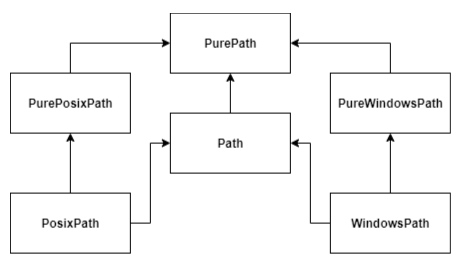

# Chapter 8 ファイル操作

この賞では，Python プログラムでファイルを操作する方法について紹介します．  
とても多くの変数や関数が出てきますが，ファイル操作にどれも必要なものばかりです．  
一度に覚えようとせず，まずは軽く目を通しておいて必要になったときにそういやこんなこと簡単にできる関数なかったっけ？と引っかかるようにしておくと良いと思います．  


# ファイルパス

ファイルパス (file path) はファイルが存在する場所を表す文字列です．  
ファイルパスには絶対パスと相対パスの 2 種類があります．  
絶対パスはディレクトリの階層のうち最上層を基準としたファイルの場所のことで，相対パスはカレントディレクトリ (current directory : 今いるディレクトリ) を基準としたファイルの場所のことをいいます．  

以降，例として以下のディレクトリ構成を想定します．  
`chapter8/workspaces` 内の `init_dirs_pathlib.py` または `init_dirs_ospath.py` を実行すると，workspaces 以下に次のような dir1 ディレクトリが作成されます．  
Python 3.6 以上を使っている方は `init_dir1_pathlib.py`，Python 3.6 未満 3.0 以上の方は `init_dir1_ospath.py` を使用してください．  
なお，`init_dir1_pathlib.py`，`init_dir1_ospath.py` を実行すれば何度でも以下のようなディレクトリを作ることができます．  
途中で失敗したときなどもう一度最初からやり直したくなった場合は再度実行してください．  
実行すると自動的に dir1 を削除し，もう一度 dir1 を作り直します．  
(正直 `init_dir1_ospath.py` だけでいいんですが，`init_dir1_pathlib.py` が pathlib モジュールを使ったコードの例として参考になるかもと思い実装しました)  

```
workspaces
└── dir1
    ├── dir1_1
    │   ├── example.py
    │   ├── file1_1_1.txt
    │   └── file1_1_2.json
    ├── dir1_2
    │   ├── file1_2_1.md
    │   ├── file1_2_2.tar.gz
    │   ├── file1_2_3.txt
    │   └── requirements.txt
    ├── file1_1.html
    ├── file1_2.json
    ├── file1_3.txt
    └── file1_4.txt
```

カレントディレクトリを dir1_1 とすると，file1_1_1.txt，file1_1.html，file1_2_1.md の絶対パスと相対パスは次のようになります．  
パスは Linux や MacOS では `/` (スラッシュ)，Windows では `\` (バックスラッシュ) か `¥` (円マーク) で区切ります．  
本稿の説明では `/` で区切ることにしますが，Python のプログラムでファイルパスを扱う場合は Python のメソッドが自動的に解決してくれます．  
`.` (ピリオド x 1) はカレントディレクトリを表し，`..` (ピリオド x 2) は親ディレクトリ (parent directory) を表します．  

|ファイル|絶対パス|相対パス|
|:---:|:---:|:---:|
|file1_1_1.txt|`/workspaces/dir1/dir1_1/file1_1_1.txt`|`./file1_1_1.txt` or `file1_1_1.txt`|
|file1_1.html|`/workspaces/dir1/file1_1.html`|`../file1_1.html`|
|file1_2_1.md|`/workspaces/dir1/dir1_2/file1_2_1.md`|`../dir1_2/file1_2_1.md`|

ファイルパスに関係するモジュールは os.path モジュールと pathlib モジュールの 2 つがあります．  
pathlib モジュールは Python 3.6 から新しく追加されたモジュールで，よりファイルパスを操作しやすいように実装されました．  
一応後方互換も考慮されていて，os.path モジュールのメソッドの引数に pathlib モジュールのオブジェクトを与えることもできます．  
os.path モジュールは現在でも多くのプログラムで使われているので，既存のプログラムを触ったり複数人での開発を行ったりする方は os.path モジュールの使い方を覚えておく必要があります．  
一方，個人だけで完結するプログラムを書く方は pathlib モジュールだけ読んでもらって，必要になったら os.path モジュールを読むのがいいと思います．  


# Path

pathlib モジュールは Python 3.4 で新しく追加されたファイルパスを操作するためのプログラム群です．  
os.path モジュールではファイルパスを文字列で扱っていましたが，pathlib モジュールではファイルパスを pathlib.Path クラスのオブジェクトとして扱います．  
公式で os.path モジュールよりファイルパスを操作しやすいとしてすすめられているので，今後はこちらが主流になると思われます．  
ただ，多くのプログラムはまだ `os.path`モジュールを使っているので．既存のコードに触れたり複数人での開発を行う方は `os.path` モジュールの使い方も覚えておいたほうが良いです．  

次のディレクトリ構造を用いて説明していきます．  

```
workspaces
└── dir1
    ├── dir1_1
    │   ├── example.py
    │   ├── file1_1_1.txt
    │   └── file1_1_2.json
    ├── dir1_2
    │   ├── file1_2_1.md
    │   ├── file1_2_2.tar.gz
    │   ├── file1_2_3.txt
    │   └── requirements.txt
    ├── file1_1.html
    ├── file1_2.json
    ├── file1_3.txt
    └── file1_4.txt
```


## インスタンス化 (instantiate)

Path オブジェクトはファイルパスの文字列で初期化します．  
ファイルパスには相対パスと絶対パスの両方が使えます．  
ファイルパスの区切り文字は `/` を使うと OS ごとに自動的に解決したファイルパスにしてくれます．  

Path オブジェクトを組込み関数 str に与えるとファイルパスの文字列が得られます．  

Linux や Mac の場合は自動的に Path クラスを継承した PosixPath クラスのオブジェクトが作られます．    

```python
from pathlib import Path


file1_1_rel_path = Path("../file1_1.html")
print(file1_1_rel_path)         # ../file1_1.html
print(type(file1_1_rel_path))   # <class 'pathlib.PosixPath'>
print(str(file1_1_rel_path))    # ../file1_1.html

file1_2_1_rel_path = Path("../dir1_2/file1_2_1.md")
print(file1_2_1_rel_path)       # ../dir1_2/file1_2_1.md
print(str(file1_2_1_rel_path))  # ../dir1_2/file1_2_1.md
```

Windows の場合は自動的に Path クラスを継承した WindowsPath クラスのオブジェクトが作られます．  
ファイルパスの区切り文字がちゃんと `\` になってます．  

```python
from pathlib import Path


file1_1_rel_path = Path("../file1_1.html")
print(file1_1_rel_path)         # ..\file1_1.html
print(type(file1_1_rel_path))   # <class 'pathlib.WindowsPath'>
print(str(file1_1_rel_path))    # ..\file1_1.html

file1_2_1_rel_path = Path("../dir1_2/file1_2_1.md")
print(file1_2_1_rel_path)       # ..\dir1_2\file1_2_1.md
print(str(file1_2_1_rel_path))  # ..\dir1_2\file1_2_1.md
```

Path クラスのクラス図はこんな感じです (公式 doc https://docs.python.org/3/library/pathlib.html )．  



上のコードの場合，**相対パスの基準は実行されたプログラムの場所ではなくプログラムを実行した場所** になります．  
したがって，上のコードを example.py として dir1_1 から実行したときは `../file1_1.html` は `dir1/file1_1.html`，`../dir1_2/file1_2_1.md` は `dir1/dir1_2/file1_2_1.md` となり正しいファイルパスですが，dir1 で example.py を実行したときは `../file1_1.html` は `workspaces/file1_1.html`，`../dir1_2/file1_2_1.md` は `workspaces/dir1_2/file1_2_1.md` となり正しいファイルパスになりません．  
これを防ぐため，pathlib モジュールで相対パスを使うときは後述する `__file__` を使って相対パスの基準を実行されたプログラムの場所にするのが望ましいです． 


## `/` 演算子

Path オブジェクトは `/` 演算子で連結することができます．  
オペランドは Path オブジェクトと str オブジェクトのどちらでも OK です．  
`os.path.join()` の機能にあたります．  

```python
from pathlib import Path


dir1_path = Path("..")

file1_1_rel_path = dir1_path / "file1_1.html"
print(file1_1_rel_path)     # ../file1_1.html

file1_2_1_rel_path = dir1_path / Path("dir1_2") / Path("file1_2_1.md")
print(file1_2_1_rel_path)   # ../dir1_2/file1_2_1.md
```


## Path.resolve()

絶対パスを取得したいときは resolve メソッドを使います．  
返り値は Path オブジェクトになります．  

```python
from pathlib import Path


file1_1_rel_path = Path("../file1_1.html")
print(type(file1_1_rel_path.resolve()))  # <class 'pathlib.PosixPath'>
print(file1_1_rel_path.resolve())        # /workspaces/dir1/file1_1.html

file1_2_1_rel_path = Path("../dir1_2/file1_2_1.md")
print(file1_2_1_rel_path.resolve())      # /workspaces/dir1/dir1_2/file1_2_1.md
```


## PurePath.parts

`parts` はファイルパスの区切り文字で分割したすべての要素をタプルとして保持しています．  

```python
from pathlib import Path


file1_1_abs_path = Path("../file1_1.html").resolve()
print(file1_1_abs_path.parts)
# ('/', 'workspaces', 'dir1', 'dir1_1', 'file1_1.html')

file1_2_1_abs_path = Path("../dir1_2/file1_2_1.md").resolve()
print(file1_2_1_abs_path.parts)
# ('/', 'workspaces', 'dir1', 'dir1_1', 'dir1_2', 'file1_2_1.md')
```


## PurePath.parents

`parents` はファイルパスから最上層までのすべてのディレクトリを保持しています．  

```python
from pathlib import Path


file1_1_abs_path = Path("../file1_1.html").resolve()
file1_1_parents = file1_1_abs_path.parents
print(repr(file1_1_parents))    # <PosixPath.parents>
print(len(file1_1_parents))     # 3
print(file1_1_parents[0])       # /workspaces/dir1
print(file1_1_parents[1])       # /workspaces
print(file1_1_parents[2])       # /

file1_2_1_abs_path = Path("../dir1_2/file1_2_1.md").resolve()
file1_2_1_parents = file1_2_1_abs_path.parents
print(file1_2_1_parents)        # <PosixPath.parents>
print(len(file1_2_1_parents))   # 4
print(file1_2_1_parents[0])     # /workspaces/dir1/dir1_2
print(file1_2_1_parents[1])     # /workspaces/dir1
print(file1_2_1_parents[2])     # /workspaces
print(file1_2_1_parents[3])     # /
```


## PurePath.parent

`parent` はファイルパスの指すファイルあるいはディレクトリのあるディレクトリのパスを保持しています．  


## PurePath.name

`name` はファイルパスの最後の区切り文字以降，つまりディレクトリ名あるいはファイル名を保持しています．  

```python
from pathlib import Path


file1_1_abs_path = Path("../file1_1.html").resolve()
print(file1_1_abs_path.parent)  # /workspaces/dir1
print(file1_1_abs_path.name)    # file1_1.html

file1_2_1_abs_path = Path("../dir1_2/file1_2_1.md").resolve()
print(file1_2_1_abs_path.parent)    # /workspaces/dir1/dir1_2
print(file1_2_1_abs_path.name)      # file1_2_1.md
```


## Path.exists()

ファイルパスの指すファイルあるいはディレクトリが存在する場合は `True`，そうでない場合は `False` を返すメソッドです．  

```python
from pathlib import Path


file1_1_abs_path = Path("../file1_1.html").resolve()
print(file1_1_abs_path)             # /workspaces/dir1/file1_1.html
print(file1_1_abs_path.exists())    # True

dir1_1_abs_path = Path(".").resolve()
print(dir1_1_abs_path)              # /workspaces/dir1/dir1_1
print(dir1_1_abs_path.exists())     # True

imaginary_file_abs_path = Path("../imaginary_file.cpp").resolve()
print(imaginary_file_abs_path)           # /workspaces/dir1/imaginary_file.cpp
print(imaginary_file_abs_path.exists())  # False
```


## Path.is_file()

ファイルパスの指すファイルが存在する場合は `True`，存在しない，あるいはディレクトリの場合は `False` を返すメソッドです．  


## Path.is_dir()

ファイルパスの指すディレクトリが存在する場合は `True`，存在しない，あるいはファイルの場合は `False` を返すメソッドです．  

```python
from pathlib import Path


file1_1_abs_path = Path("../file1_1.html")
print(file1_1_abs_path.is_file())   # True
print(file1_1_abs_path.is_dir())    # False

dir1_1_abs_path = Path(".")
print(dir1_1_abs_path.is_file())    # False
print(dir1_1_abs_path.is_dir())     # True

imaginary_file_abs_path = Path("../imaginary_file.cpp")
print(imaginary_file_abs_path.is_file())    # False
print(imaginary_file_abs_path.is_dir())     # False
```


## __file__

`__file__` はファイルの場所を保持するモジュール属性です．  
プログラム中で `__file__` を使用することでプログラムのファイルパスを取得することができます．  
ファイルパスはプログラムを実行した位置からの相対パスになります．  

```
workspaces
└── dir1
    ├── dir1_1
    │   ├── example.py
    │   ├── file1_1_1.txt
    │   └── file1_1_2.json
    ├── dir1_2
    │   ├── file1_2_1.md
    │   ├── file1_2_2.tar.gz
    │   ├── file1_2_3.txt
    │   └── requirements.txt
    ├── file1_1.html
    ├── file1_2.json
    ├── file1_3.txt
    └── file1_4.txt
```

次のコードを example.py に書いて，いろいろな場所から実行してみます．  

```python
print(__file__)
```

dir1_1 から実行すると次のようになります．  

```
$ python example.py
example.py
```

dir1 から実行すると次のようになります．  

```
$ python dir1_1/example.py
dir1_1/example.py
```

dir1_2 から実行すると次のようになります．  

```
$ python ../dir1_1/example.py
../dir1_1/example.py
```

相対パスを使った場合，プログラムを実行する場所によって相対パスの解釈が変わってしまいファイルパスが正しくなるおそれがあることを説明しました．  
`Path.is_file()`，`Path.is_dir()` を使ってそれを確かめてみましょう．  

次のコードを example.py に書いていろいろな場所から実行してみます．  

```python
from pathlib import Path


file1_1_rel_path = Path("../file1_1.html")
print(file_1)

file1_2_1_rel_path = Path("../dir1_2/file1_2_1.md")
print(file1_2_1_rel_path)
```

dir1_1 から実行した場合は次のようになります．  

```
$ python example.py
True
True
```

dir1 から実行すると次のようになります．  

```
$ python dir1/example.py
False
False
```

dir1_2 から実行すると次のようになります．  

```
$ python ../dir1_1/example.py
False
False
```

このように，相対パスの基準が実行した場所になっているので正しくファイルパスが解釈されていません．  

相対パスを使うときは次のコードのように `__file__` を基準にしてどこから実行しても正しいファイルパスになるようにします．  
次のコードでは，`Path(__file__).parent` は dir1_1 を指します．

```python
from pathlib import Path


file1_1_rel_path = Path(__file__).parent / "../file1_1.html"
print(file1_1_rel_path)

file1_2_1_rel_path = Path(__file__).parent / "../dir1_2/file1_2_1.md"
print(file1_2_1_rel_path)
```

dir1_1 から実行した場合は次のようになります．  

```
$ python example.py
True
True
```

dir1 から実行した場合です．  

```
$ python dir1_1/example.py
True
True
```

dir1_2 から実行した場合です．  

```
$ python ../dir1_1/example.py
True
True
```


## PurePath.suffix

`suffix` はファイルパスが指すファイルの拡張子を保持しています．  
`XXX.tar.gz` のように拡張子が複数のピリオドを含む場合は `path.suffixes` を使うようにします．  

```python
from pathlib import Path


file1_1_abs_path = (Path(__file__) / "../file1_1.html").resolve()
print(file1_1_abs_path.suffix)      # .html

file1_2_2_abs_path = (Path(__file__) / "../dir1_2/file1_2_2.tar.gz").resolve()
print(file1_2_2_abs_path.suffix)    # .gz
```


## PurePath.suffixes

`suffixes` はファイル名の最初のピリオド以降を list として返します．  
複数のピリオドが含まれる拡張子をもつファイルパスから拡張子を取り出したいときに便利です．  

```python
from pathlib import Path


file1_1_abs_path = (Path(__file__) / "../file1_1.html").resolve()
print(file1_1_abs_path.suffixes)    # ['.html']

file1_2_2_abs_path = (Path(__file__) / "../dir1_2/file1_2_2.tar.gz").resolve()
print(file1_2_2_abs_path.suffixes)  # ['.tar', '.gz'
```


## PurePath.stem

`stem` は拡張子を除いたファイル名を保持しています．  
最後のピリオド以降を除去するみたいで，複数のピリオドが含まれる拡張子をもつファイル名の場合は上手くいかないですね...  
その場合は `str.split(".")` で対処します．  

```python
from pathlib import Path


file1_1_abs_path = (Path(__file__) / "../file1_1.html").resolve()
print(file1_1_abs_path.stem)    # file1_1

file1_2_2_abs_path = (Path(__file__) / "../dir1_2/file1_2_2.tar.gz").resolve()
print(file1_2_2_abs_path.stem)                      # file1_2_2.tar
print(str(file1_2_2_abs_path.stem).split(".")[0])   # file1_2_2
```


## Path.joinpath()

ファイルパスを連結するには `/` 演算子が使えますが，joinpath メソッドでも行うことができます．  
連結されたファイルパスを持つ Path オブジェクトを返します．  

```python
from pathlib import Path


workspaces_path = Path("workspaces")
file1_1_path = workspaces_path.joinpath("dir1", "file1_1.html")
print(file1_1_path)     # workspaces/dir1/file1_1.html


file1_2_1_path = workspaces_path.joinpath(Path("dir1"), Path("dir1_2"), Path("file1_2_1.md"))
print(file1_2_1_path)   # workspaces/dir1/dir1_2/file1_2_1.md
```


## Path.with_name()

ファイルパスのファイル名を引数で指定したファイル名に変更した新しい Path オブジェクトを返すメソッドです．  
Path オブジェクトを返すだけで，このメソッドで実際のファイル名が変更されるわけではありません．  

次の例では，`/workspaces/dir1/file1_2.json` の Path オブジェクトから `/workspaces/dir1/data1_2.json` の Path オブジェクトを作っています．  

```python
from pathlib import Path


dir1_abs_path = (Path(__file__) / "..").resolve()
data1_2_abs_path = dir1_abs_path.joinpath("file1_2.json").with_name("data1_2.json")
print(data1_2_abs_path)    # /workspaces/dir1/data1_2.json
```


## Path.with_suffix()

ファイルパスのファイル名の拡張子を，引数で指定した拡張に変更した新しい Path オブジェクトを返すメソッドです．  
このメソッドでは実際のファイル名の拡張子は変更されません．  

次の例では，`/workspaces/dir1/file1_2.json` の Path オブジェクトから `/workspaces/dir1/file1_2.hjson` の Path オブジェクトを作っています．  

```python
from pathlib import Path


dir1_abs_path = (Path(__file__) / "..").resolve()
file1_2_abs_path = dir1_abs_path.joinpath("file1_2.json").with_suffix(".hjson")
print(file1_2_abs_path)  # /workspaces/dir1/file1_2.hjson
```


## Path.iterdir()

引数に与えたファイルパスのディレクトリ直下のすべてのディレクトリとファイルの Path オブジェクトを生成する generator オブジェクトを返します．  

ディレクトリ構造を再掲します．  

```
workspaces
└── dir1
    ├── dir1_1
    │   ├── example.py
    │   ├── file1_1_1.txt
    │   └── file1_1_2.json
    ├── dir1_2
    │   ├── file1_2_1.md
    │   ├── file1_2_2.tar.gz
    │   ├── file1_2_3.txt
    │   └── requirements.txt
    ├── file1_1.html
    ├── file1_2.json
    ├── file1_3.txt
    └── file1_4.txt
```

次の例では，dir1 内のすべてのディレクトリとファイルを取得しています．  

```python
from pathlib import Path
from pprint import pprint


dir1_rel_path = (Path(__file__).parent / "..").resolve()
pprint(list(dir1_abs_path.iterdir()))

"""
[PosixPath('/workspaces/dir1/dir1_1'),
 PosixPath('/workspaces/dir1/dir1_2'),
 PosixPath('/workspaces/dir1/file1_1.html'),
 PosixPath('/workspaces/dir1/file1_2.json'),
 PosixPath('/workspaces/dir1/file1_3.txt'),
 PosixPath('/workspaces/dir1/file1_4.txt')]
"""
```


## Path.mkdir()

Path.mkdir メソッドを使うと新しいディレクトリを作ることができます．  
この例では，dir1 直下に dir1_3 を作っています．  

```python
from pathlib import Path


dir1_3_rel_path = Path(__file__).parent / "../dir1_3"
dir1_3_rel_path.mkdir()
```

```
// 実行前

workspaces
└── dir1
    ├── dir1_1
    │   ├── example.py
    │   ├── file1_1_1.txt
    │   └── file1_1_2.json
    ├── dir1_2
    │   ├── file1_2_1.md
    │   ├── file1_2_2.tar.gz
    │   ├── file1_2_3.txt
    │   └── requirements.txt
    ├── file1_1.html
    ├── file1_2.json
    ├── file1_3.txt
    └── file1_4.txt
```

```
// 実行後

workspaces
└── dir1
    ├── dir1_1
    │   ├── example.py
    │   ├── file1_1_1.txt
    │   └── file1_1_2.json
    ├── dir1_2
    │   ├── file1_2_1.md
    │   ├── file1_2_2.tar.gz
    │   ├── file1_2_3.txt
    │   └── requirements.txt
    ├── dir1_3  <- New !!
    ├── file1_1.html
    ├── file1_2.json
    ├── file1_3.txt
    └── file1_4.txt
```

引数の `parents` を `True` にすると多層ディレクトリを一度に作ることもできます．  

```python
from pathlib import Path


dir1_4_1_rel_path = Path(__file__).parent / "../dir1_4/dir1_4_1"
dir1_4_1_rel_path.mkdir(parents=True)
```

```
// 実行前

workspaces
└── dir1
    ├── dir1_1
    │   ├── example.py
    │   ├── file1_1_1.txt
    │   └── file1_1_2.json
    ├── dir1_2
    │   ├── file1_2_1.md
    │   ├── file1_2_2.tar.gz
    │   ├── file1_2_3.txt
    │   └── requirements.txt
    ├── dir1_3
    ├── file1_1.html
    ├── file1_2.json
    ├── file1_3.txt
    └── file1_4.txt
```

```
// 実行後

workspaces
└── dir1
    ├── dir1_1
    │   ├── example.py
    │   ├── file1_1_1.txt
    │   └── file1_1_2.json
    ├── dir1_2
    │   ├── file1_2_1.md
    │   ├── file1_2_2.tar.gz
    │   ├── file1_2_3.txt
    │   └── requirements.txt
    ├── dir1_3
    ├── dir1_4  <- New !!
    │   └── dir1_4_1  <- New !!
    ├── file1_1.html
    ├── file1_2.json
    ├── file1_3.txt
    └── file1_4.txt
```

すでにファイルやディレクトリが存在するファイルパスで実行した場合は `FileExistsError` になります．  
引数 `exist_ok` を `True` にすると，ファイルやディレクトリがすでに存在した場合何もしないという動作になりエラーも送出されなくなります．  

```python
from pathlib import Path


dir1_4_1_rel_path = Path(__file__).parent / "../dir1_4/dir1_4_1"
dir1_4_1_rel_path.mkdir(parents=True, exist_ok=True)
```


## Path.unlink()

引数で与えられたファイルパスの指すファイル，あるいはシンボリックリンクを削除するメソッドです．  
ディレクトリの場合は `IsADirectoryError` が，ファイルが存在しない場合は通常 `FileNotFoundError` が送出されます．  

`os.remove()` にあたるメソッドになります．  

次の例では，`dir1/dir1_1/file1_1_2.json` を削除しています．  

```python
from pathlib import Path


file1_1_2_rel_path = Path(__file__).parent / "../dir1_1/file1_1_2.json"
file1_1_2_rel_path.unlink()
```

```
// 実行前

workspaces
└── dir1
    ├── dir1_1
    │   ├── example.py
    │   ├── file1_1_1.txt
    │   └── file1_1_2.json
    ├── dir1_2
    │   ├── file1_2_1.md
    │   ├── file1_2_2.tar.gz
    │   ├── file1_2_3.txt
    │   └── requirements.txt
    ├── dir1_3
    ├── dir1_4
    │   └── dir1_4_1
    ├── file1_1.html
    ├── file1_2.json
    ├── file1_3.txt
    └── file1_4.txt
```

```
// 実行後

workspaces
└── dir1
    ├── dir1_1
    │   ├── example.py
    │   └── file1_1_1.txt
    ├── dir1_2
    │   ├── file1_2_1.md
    │   ├── file1_2_2.tar.gz
    │   ├── file1_2_3.txt
    │   └── requirements.txt
    ├── dir1_3
    ├── dir1_4
    │   └── dir1_4_1
    ├── file1_1.html
    ├── file1_2.json
    ├── file1_3.txt
    └── file1_4.txt
```

Python 3.8 からは引数 missing_ok (デフォルトは `False`) が追加され，`missing_ok=True` とするとファイルが存在しない場合でも `FileNotFoundError` が送出されなくなります．  

```python
from pathlib import Path


file1_1_2_rel_path = Path(__file__).parent / "../dir1_1/file1_1_2.json"
file1_1_2_rel_path.unlink(missing_ok=True)
```


## Path.rmdir()

指定されたファイルパスのディレクトリを削除するメソッドです．  
ファイルパスに何も存在しなかった場合は `FileNotFoundError` が，ディレクトリではなくファイルが存在した場合は `NotADirectoryError` が送出されます．  
また，ディレクトリが空でない場合は `OSError` が送出されます．  
空でないディレクトリを削除するには後述する shutil.rmtree メソッドを使います．  

次のコードでは `dir1/dir1_3` を削除しています．  

```python
from pathlib import Path


dir1_3_rel_path = Path(__file__).parent / "../dir1_3"
if dir1_3_rel_path.is_dir():
    dir1_3_rel_path.rmdir()
```

```
// 実行前

workspaces
└── dir1
    ├── dir1_1
    │   ├── example.py
    │   └── file1_1_1.txt
    ├── dir1_2
    │   ├── file1_2_1.md
    │   ├── file1_2_2.tar.gz
    │   ├── file1_2_3.txt
    │   └── requirements.txt
    ├── dir1_3
    ├── dir1_4
    │   └── dir1_4_1
    ├── file1_1.html
    ├── file1_2.json
    ├── file1_3.txt
    └── file1_4.txt
```

```
// 実行後

workspaces
└── dir1
    ├── dir1_1
    │   ├── example.py
    │   └── file1_1_1.txt
    ├── dir1_2
    │   ├── file1_2_1.md
    │   ├── file1_2_2.tar.gz
    │   ├── file1_2_3.txt
    │   └── requirements.txt
    ├── dir1_4
    │   └── dir1_4_1
    ├── file1_1.html
    ├── file1_2.json
    ├── file1_3.txt
    └── file1_4.txt
```


## Path.rename()

ファイルやディレクトリのパスを変更するメソッドです．  
`os.rename()` に対応しています．  

Windows だと dst にすでにファイルが存在している場合は `FileExistsError` が送出されます．  
Linux や MacOS ではユーザにパーミッションがあれば上書きされます．  

次の例では，`dir1/file1_1.html` を `dir1/dir1_1/file1_1_2.html` に変更しています．  

```python
from pathlib import Path


dir1_rel_path = Path(__file__).parent / ".."
(dir1_rel_path / "file1_1.html").rename(dir1_rel_path / "dir1_1/file1_1_2.html")
```

```
// 実行前

workspaces
└── dir1
    ├── dir1_1
    │   ├── example.py
    │   └── file1_1_1.txt
    ├── dir1_2
    │   ├── file1_2_1.md
    │   ├── file1_2_2.tar.gz
    │   ├── file1_2_3.txt
    │   └── requirements.txt
    ├── file1_1.html
    ├── file1_2.json
    ├── file1_3.txt
    └── file1_4.txt
```

```
// 実行後 

workspaces
└── dir1
    ├── dir1_1
    │   ├── example.py
    │   ├── file1_1_1.txt
    │   └── file1_1_2.html
    ├── dir1_2
    │   ├── file1_2_1.md
    │   ├── file1_2_2.tar.gz
    │   ├── file1_2_3.txt
    │   └── requirements.txt
    ├── file1_2.json
    ├── file1_3.txt
    └── file1_4.txt
```


## Path.match()

match メソッドは，ファイルパスが引数で与えられたパスのパターンに合致している場合 `True`，そうでない場合 `False` を返します．  
glob.glob() と同じように，特殊文字として `*`，`?`，`[0-9]`, `[a-z]`，`[A-Z]` が使えます．  
`*` は任意の文字列に，`?` は任意の 1 文字に合致します．  
また，`[0-9]` は数字 1 文字，`[a-z]` はアルファベットの小文字 1 文字，`[A-Z]` はアルファベットの大文字 1 文字に当てはまります．  

拡張子は，Windows の場合は大文字と小文字が区別されませんが，Linux や Mac OS では区別されます．  

```python
from pathlib import Path


file1_2_rel_path = Path(__file__).parent / "../file1_2.json"
print(file1_2_rel_path.match("*.csv"))             # True
print(file1_2_rel_path.match("*[0-9]_[0-9].csv"))  # True
print(file1_2_rel_path.match("*.CSV"))             # Windows だと True，それ以外だと False
```


## Path.glob()

Path.glob メソッドは glob.glob メソッドにあたる機能を持ったメソッドです．  
自身のファイルパス以下にある，引数で与えられたファイルパスのパターンに合致するファイルパスをすべて生成する generator オブジェクトを返します．  

glob.glob メソッドと同様，特殊文字 `*`，`?`，`[]` が使えます．
`*` には 1 文字以上の任意の文字列，`?` には任意の 1 文字を表します．  
また，`[a-z]` はアルファベットの小文字 1 文字，`[A-Z]` はアルファベットの大文字 1 文字，`[0-9]` は数字 1 文字に当てはまります．  

次のようなディレクトリ構造で，プログラムを example.py で実行することにします．  

```
workspaces
└── dir1
    ├── dir1_1
    │   ├── example.py
    │   ├── file1_1_1.txt
    │   └── file1_1_2.html
    ├── dir1_2
    │   ├── file1_2_1.md
    │   ├── file1_2_2.tar.gz
    │   ├── file1_2_3.txt
    │   └── requirements.txt
    ├── file1_2.json
    ├── file1_3.txt
    └── file1_4.txt
```

dir1 直下の拡張子が `.txt` であるファイル名を指すファイルパスは次のように収集できます．  

```python
from pathlib import Path
from pprint import pprint


dir1_path = (Path(__file__).parent / "..").resolve()
files = sorted(dir1_path.glob("*.txt"))
pprint(files)
"""
[PosixPath('/workspaces/dir1/file1_3.txt'),
 PosixPath('/workspaces/dir1/file1_4.txt')]
"""
```

dir1_1 直下と dir1_2 直下の `*.txt` ファイルのパスをすべて取得するには，パターンを `dir1/*/*.txt` として dir1 直下のすべてのディレクトリに合致するようにします．  

```python
from pathlib import Path
from pprint import pprint


dir1_path = (Path(__file__).parent / "..").resolve()
files = sorted(dir1_path.glob("*/*.txt"))
pprint(files)
"""
[PosixPath('/workspaces/dir1/dir1_1/file1_1_1.txt'),
 PosixPath('/workspaces/dir1/dir1_2/file1_2_3.txt'),
 PosixPath('/workspaces/dir1/dir1_2/requirements.txt')]
"""
```

dir1 以下のすべての `*.txt` ファイルのパスを取得するには，recursive (再帰的) を表すワイルドカード `**` を使ってパターンを `**/*/*.txt` とします．  

```python
from pathlib import Path
from pprint import pprint


dir1_path = (Path(__file__).parent / "..").resolve()
files = sorted(dir1_path.glob("**/*.txt"))
pprint(files)

"""
[PosixPath('/workspaces/dir1/dir1_1/file1_1_1.txt'),
 PosixPath('/workspaces/dir1/dir1_2/file1_2_3.txt'),
 PosixPath('/workspaces/dir1/dir1_2/requirements.txt'),
 PosixPath('/workspaces/dir1/file1_3.txt'),
 PosixPath('/workspaces/dir1/file1_4.txt')]
"""
```

(後回し : ファイル I/O の項目のあとに読んでください)  

## Path.open()

Path オブジェクトにも組込み関数 open と同等の機能をもつメソッド Path.open があります．  
使い方は open 関数とほとんど同じです．  

次のようなディレクトリとファイルがあることして，`/workspace/dir1/dir1_1/example.py` から `/workspace/dir1/dir1_2/requirements.txt` を読み出すことを考えます．  

```
workspaces
└── dir1
    ├── dir1_1
    │   ├── example.py
    │   ├── file1_1_1.txt
    │   └── file1_1_2.json
    ├── dir1_2
    │   ├── file1_2_1.md
    │   ├── file1_2_2.tar.gz
    │   ├── file1_2_3.txt
    │   └── requirements.txt
    ├── file1_1.html
    ├── file1_2.json
    ├── file1_3.txt
    └── file1_4.txt
```

requirements.txt の中身はこのようになっています．  

```
autopep8==1.5.4
flake8==3.8.3
mccabe==0.6.1
pycodestyle==2.6.0
pyflakes==2.2.0
toml==0.10.1

```

Path.open メソッドを使って requirements.txt を開くと次のようになります．  
読み出すときはモードに `r`，書き込むときは `w` を指定します．  
開いたあとは open 関数のときと同じです．  

```python
from pathlib import Path


with Path("../dir1_2/requirements.txt").open("r") as f:
    text = f.read()
"""
// text の文字列
autopep8==1.5.4\nflake8==3.8.3\nmccabe==0.6.1\npycodestyle==2.6.0\npyflakes==2.2.0\ntoml==0.10.1
"""

print(text)
"""
// コンソール出力
autopep8==1.5.4
flake8==3.8.3
mccabe==0.6.1
pycodestyle==2.6.0
pyflakes==2.2.0
toml==0.10.1
"""
```

## Path.read_text()

Path.read_text メソッドは，ファイルを開く -> 読み出す -> ファイルを閉じるといった一連の処理を行ってくれる便利なメソッドです．  
一度にファイルの内容をすべて読み出します．  

```python
from pathlib import Path


text = Path("../dir1_2/requirements.txt").read_text()
"""
// text の文字列
autopep8==1.5.4\nflake8==3.8.3\nmccabe==0.6.1\npycodestyle==2.6.0\npyflakes==2.2.0\ntoml==0.10.1
"""

print(text)
"""
// コンソール出力
autopep8==1.5.4
flake8==3.8.3
mccabe==0.6.1
pycodestyle==2.6.0
pyflakes==2.2.0
toml==0.10.1
"""
```


## Path.write_text()

Path.write_text メソッドは，ファイルを開く -> 書き込む -> ファイルを閉じるといった一連の処理を行ってくれます．  

こちらのディレクトリ構成の dir1_2 に requirements2.txt を作成することを考えます．  

```
workspaces
└── dir1
    ├── dir1_1
    │   ├── example.py
    │   ├── file1_1_1.txt
    │   └── file1_1_2.json
    ├── dir1_2
    │   ├── file1_2_1.md
    │   ├── file1_2_2.tar.gz
    │   ├── file1_2_3.txt
    │   └── requirements.txt
    ├── file1_1.html
    ├── file1_2.json
    ├── file1_3.txt
    └── file1_4.txt
```

list `packages` の内容を requirements2.txt に書き込むには，次のコードを example.py で実行します．  

```python
from pathlib import Path


packages = [
    "autopep8==1.5.4",
    "flake8==3.8.3",
    "mccabe==0.6.1",
    "pycodestyle==2.6.0",
    "pyflakes==2.2.0",
    "toml==0.10.1",
]

lines = "\n".join(packages) + "\n"
Path("../dir1_2/requirements2.txt").write_text(lines)
```

(ここまで後回し)  


# os

os モジュールはオペレーティングシステム (OS) に関する変数や関数の集まりです．  
主に環境変数やファイルパスを扱うときに使います．  

環境変数 (environment variable) とは OS 上で動作するプログラム (プロセス) が共有で使用する設定のことです．  
プログラムを実行可能にするためプログラムのパスを設定したりします．  


## os.path

os.path モジュールはファイルパスに関連するプログラムを集めたものです．  
順に使い方を見ていきましょう．  


### os.path.join()

ファイルパスの区切り文字を自動的に解決してパスを連結するメソッドです．  
連結したパスを str オブジェクトで返します．  

file1.html と file2_1.md のパスを `os.path.join()` メソッドで作ると Linux や MacOS では次のようになります．  
コードはファイル example.py として実行するものとします．  

```python
import os


file1_1_rel_path = os.path.join("..", "file1_1.html")
print(file1_1_rel_path)   # ../file1_1.html

file1_2_1_rel_path = os.path.join("..", "dir1_2", "file1_2_1.md")
print(file1_2_1_rel_path)  # ../dir1_2/file1_2_1.md
```

Windows ではこんな感じです．  

```python
import os


file1_1_rel_path = os.path.join("..", "file1_1.html")
print(file1_1_rel_path)   # ..\file1_1.html

file1_2_1_rel_path = os.path.join("..", "dir1_2", "file1_2_1.md")
print(file1_2_1_rel_path)  # ..\dir1_2\file1_2_1.md
```


pathlib のときと同様，相対パスを使うときは実行時にファイルパスがずれてしまわないか気を付ける必要があります．  
os.path モジュールでは，相対パスではなく絶対パスと `__file__` を使うのが良いです．  


### os.path.abspath()

相対パスから絶対パスを取得するには `os.path.abspath()` メソッドを使います．  

```python
import os


file1_1_rel_path = os.path.join("..", "file1_1.html")
print(file1_1_rel_path)     # ../file1_1.html

file1_2_1_rel_path = os.path.join("..", "dir1_2", "file1_2_1.md")
print(file1_2_1_rel_path)     # ../dir1_2/file1_2_1.md

print(os.path.abspath(file1_1_rel_path))      # /workspaces/dir1/file1_1.html
print(os.path.abspath(file1_2_1_rel_path))    # /workspaces/dir1/dir1_2/file1_2_1.md
```

`os.path.abspath(__file__)` でプログラムの絶対パスを取得できます．  

```python
import os


example_path = os.path.abspath(__file__)
print(example_path)  # /workspaces/dir1/dir1_1/example.py
```


### os.path.dirname()

ファイルパスの末尾のディレクトリ名 (最後の区切り文字の手前) を返すメソッドです．  
ファイルパスから，そのファイルのあるディレクトリ名を取得するときに使います．  


### os.path.basename()

ファイルパスの末尾 (最後の区切り文字以降) を返すメソッドです．  
ファイルパスからディレクトリ名やファイル名だけを取り出すときに使います．  
`<ファイルパス> == os.path.join(os.path.dirname(<ファイルパス>), os.path.basename(<ファイルパス>))` になります．  

`os.path.dirname(os.path.abspath(__file__))` でプログラムのあるディレクトリの絶対パスを取得することができます．  
相対パスではなくこのように取得したファイルパスを基本的に使うようにしましょう．  
相対パスと `__file__` を組み合わせない (組み合わせられない) 理由は，`os.path.dirname(__file__)` で親ディレクトリが取得できないからです

`..` は os.path モジュールでは `os.path.dirname()` を使います．  

```python
import os


print(os.path.dirname(__file__))    # 何も表示されない

dir1_1_abs_path = os.path.dirname(os.path.abspath(__file__))  # /workspaces/dir1/dir1_1
dir1_abs_path = os.path.dirname(dir1_1_abs_path)  # /workspaces/dir1/

file1_1_abs_path = os.path.abspath(os.path.join(dir1_abs_path, "file1_1.html"))
print(file1_1_abs_path)                       # /workspaces/dir1/file1_1.html
print(os.path.dirname(file1_1_abs_path))      # /workspaces/dir1
print(os.path.basename(file1_1_abs_path))     # file1_1.html

file1_2_1_abs_path = os.path.abspath(os.path.join(dir1_abs_path, "dir1_2", "file1_2_1.md"))
print(file1_2_1_abs_path)                     # /workspaces/dir1/dir1_2/file1_2_1.md
print(os.path.dirname(file1_2_1_abs_path))    # /workspaces/dir1/dir1_2
print(os.path.basename(file1_2_1_abs_path))   # file1_2_1.md
```


### os.path.splitext()

ファイルパスを拡張子 (extension) とそれ以外の部分とで分割するメソッドです．  
split + text ではなく split + ext ですね．  

動作としては単純にファイルパスの最後のピリオド以降とそれより前の部分とで分けているだけなので，`.tar.gz` といった拡張子は `.gz` とそれ以外の部分に分割されてしまうことに注意してください．  
この場合は str オブジェクトの `split(".")` で対処します．  

```python
import os


dir1_abs_path = os.path.dirname(os.path.dirname(os.path.abspath(__file__)))

file1_1_abs_path = os.path.join(dir1_abs_path, "file1_1.html")
print(file1_1_abs_path)   # /workspaces/dir1/file1_1.html
print(os.path.splitext(file1_1_abs_path))  # ('/workspaces/dir1/file1_1', '.html')


file1_2_2_abs_path = os.path.join(dir1_abs_path, "dir1_2", "file1_2_2.tar.gz")
print(file1_2_2_abs_path)  # /workspaces/dir1/dir1_2/file1_2_2.tar.gz
print(os.path.splitext(file1_2_2_abs_path))   # ('/workspaces/dir1/dir1_2/file1_2_2.tar', '.gz')

separated = file1_2_2_abs_path.split(".")
root = ".".join(separated[:-2])
ext = "." + ".".join(separated[-2:])
print((root, ext))  # ('/workspaces/dir1/dir1_2/file1_2_2', '.tar.gz'
```


### os.path.exists()

ファイルパスが示す場所にファイルあるいはディレクトリがちゃんと存在する場合 `True`，存在しない場合 `False` を返すメソッドです．  

```python
import os


dir1_abs_path = os.path.dirname(os.path.dirname(os.path.abspath(__file__)))

file1_1_abs_path = os.path.join(dir1_abs_path, "file1_1.html")
print(file1_1_abs_path)                   # /workspaces/dir1/file1_1.html
print(os.path.exists(file1_1_abs_path))   # True

dir1_1_abs_path = os.path.join(dir1_abs_path, "dir1_1")
print(dir1_1_abs_path)                  # /workspaces/dir1/dir1_1
print(os.path.exists(dir1_1_abs_path))  # True

imaginary_file_abs_path = os.path.join(dir1_abs_path, "imaginary_file.cpp")
print(imaginary_file_abs_path)                  # /workspaces/dir1/imaginary_file.cpp
print(os.path.exists(imaginary_file_abs_path))  # False
```


### os.path.isfile()

ファイルパスが示す場所にファイルが存在する場合 `True`，存在しない場合 `False` を返します．  
ディレクトリの場合も `False` となります．  


### os.path.isdir()

ファイルパスが示す場所にディレクトリが存在する場合 `True`，存在しない場合 `False` を返します．  
ファイルの場合も `False` となります．  

```python
import os


dir1_abs_path = os.path.dirname(os.path.dirname(os.path.abspath(__file__)))

file1_1_abs_path = os.path.join(dir1_abs_path, "file1_1.html")
print(file1_1_abs_path)                   # /workspaces/dir1/file1_1.html
print(os.path.isfile(file1_1_abs_path))   # True
print(os.path.isdir(file1_1_abs_path))    # False

dir1_1_abs_path = os.path.join(dir1_abs_path, "dir1_1")
print(dir1_1_abs_path)                  # /workspaces/dir1/dir1_1
print(os.path.isfile(dir1_1_abs_path))  # False
print(os.path.isdir(dir1_1_abs_path))   # True

imaginary_file_abs_path = os.path.join(dir1_abs_path, "imaginary_file.cpp")
print(imaginary_file_abs_path)                  # /workspaces/dir1/imaginary_file.cpp
print(os.path.isfile(imaginary_file_abs_path))  # False
print(os.path.isdir(imaginary_file_abs_path))   # False
```


## os.scandir()

引数で与えたファイルパスの指すディレクトリ内のすべてのディレクトリとファイルを生成する iterator オブジェクトを返します．  
ディレクトリとファイルは `os.DirEntry` オブジェクトとして扱われます．  

`os.DirEntry` オブジェクトには `name`，`path` といった属性や，`is_dir()`，`is_file()` といったメソッドがあります．  
name はファイル名，path はファイルパスを保持しています．  
is_dir メソッドは `os.DirEntry` オブジェクトがディレクトリの場合 `True`，そうでない場合 `False` を返します．  
また，is_file メソッドは `os.DirEntry` オブジェクトがファイルの場合 `True`，そうでない場合 `False` を返します．  

ディレクトリ構造を再掲します．  

```
workspaces
└── dir1
    ├── dir1_1
    │   ├── example.py
    │   ├── file1_1_1.txt
    │   └── file1_1_2.json
    ├── dir1_2
    │   ├── file1_2_1.md
    │   ├── file1_2_2.tar.gz
    │   ├── file1_2_3.txt
    │   └── requirements.txt
    ├── file1_1.html
    ├── file1_2.json
    ├── file1_3.txt
    └── file1_4.txt
```

次の例では，dir1 内のすべてのディレクトリとファイルを取得しています．  

```python
import os
from pprint import pprint


dir1_abs_path = os.path.abspath("..")
pprint(list(os.scandir(dir1_abs_path)))

"""
[<DirEntry 'dir1_1'>,
 <DirEntry 'dir1_2'>,
 <DirEntry 'file1_1.html'>,
 <DirEntry 'file1_2.json'>,
 <DirEntry 'file1_3.txt'>,
 <DirEntry 'file1_4.txt'>]
"""

for entry in os.scandir(dir1_abs_path):
    print(f"name={entry.name}")
    print(f"path={entry.path}")
    print(f"is_dir()={entry.is_dir()}")
    print(f"is_file()={entry.is_file()}")
    print()
"""
name=dir1_1
path=/workspaces/dir1/dir1_1
is_dir()=True
is_file()=False

name=dir1_2
path=/workspaces/dir1/dir1_2
is_dir()=True
is_file()=False

name=file1_1.html
path=/workspaces/dir1/file1_1.html
is_dir()=False
is_file()=True

name=file1_2.json
path=/workspaces/dir1/file1_2.json
is_dir()=False
is_file()=True

name=file1_3.txt
path=/workspaces/dir1/file1_3.txt
is_dir()=False
is_file()=True

name=file1_4.csv
path=/workspaces/dir1/file1_4.txt
is_dir()=False
is_file()=True
"""
```

個人的には全然使ったことないですね...
ディレクトリ以下のファイルやディレクトリを列挙するときは後ほど紹介する glob.glob メソッドのほうが汎用的でよく使います．  


### os.walk()

引数で与えたファイルパスを起点として，それ以下のすべてのファイル名とディレクトリ名，ディレクトリパスを生成する generator オブジェクトを返します．  

ディレクトリ構造を再掲します．  

```
workspaces
└── dir1
    ├── dir1_1
    │   ├── example.py
    │   ├── file1_1_1.txt
    │   └── file1_1_2.json
    ├── dir1_2
    │   ├── file1_2_1.md
    │   ├── file1_2_2.tar.gz
    │   ├── file1_2_3.txt
    │   └── requirements.txt
    ├── file1_1.html
    ├── file1_2.json
    ├── file1_3.txt
    └── file1_4.txt
```

この例では，dir1 を起点としてすべてのディレクトリパスとディレクトリ名，ファイル名を取得しています．  

```python
import os
from pprint import pprint


dir1_abs_path = os.path.abspath("..")
pprint(list(os.walk(dir1_abs_path)))

"""
[('/workspaces/dir1',
  ['dir1_1', 'dir1_2'],
  ['file1_1.html', 'file1_2.json', 'file1_3.txt', 'file1_4.txt']),
 ('/workspaces/dir1/dir1_1',
  [],
  ['example.py', 'file1_1_1.txt', 'file1_1_2.json']),
 ('/workspaces/dir1/dir1_2', [], ['file1_2_1.md', 'file1_2_2.tar.gz', 'file1_2_3.txt', 'requirements.txt'])]
"""
```

for 文を使うと次のように展開できます．  

```python
import os


for root, dirs, files in os.walk(dir1_abs_path):
    print(f"root={root}")
    print(f"dirs={dirs}")
    print(f"files={files}")
    print()

"""
root=/workspaces/dir1/dir1_1
dirs=[]
files=['example.py', 'file1_1_1.txt', 'file1_1_2.json']

root=/workspaces/dir1/dir1_2
dirs=[]
files=['file1_2_1.md', 'file1_2_2.tar.gz', 'file1_2_3.txt', 'requirements.txt']
"""
```


### os.makedirs()

引数で与えたファイルパスに新しくディレクトリを作るメソッドです．  

```python
import os


dir1_path = os.path.dirname(os.path.dirname(os.path.abspath(__file__)))
dir1_3_path = os.path.join(dir1_path, "dir1_3")
os.makedirs(dir1_3_path)
```

```
// 実行前

workspaces
└── dir1
    ├── dir1_1
    │   ├── example.py
    │   ├── file1_1_1.txt
    │   └── file1_1_2.json
    ├── dir1_2
    │   ├── file1_2_1.md
    │   ├── file1_2_1.tar.gz
    │   ├── file1_2_3.txt
    │   └── requirements.txt
    ├── file1_1.html
    ├── file1_2.json
    ├── file1_3.txt
    └── file1_4.txt
```

```
// 実行後

workspaces
└── dir1
    ├── dir1_1
    │   ├── example.py
    │   ├── file1_1_1.txt
    │   └── file1_1_2.json
    ├── dir1_2
    │   ├── file1_2_1.md
    │   ├── file1_2_2.tar.gz
    │   ├── file1_2_3.txt
    │   └── requirements.txt
    ├── dir1_3  <- New !!
    ├── file1_1.html
    ├── file1_2.json
    ├── file1_3.txt
    └── file1_4.txt
```

多層ディレクトリを一度に作ることもできます．  
今度は dir1 以下に新しく `dir1_4/dir1_4_1` を作ってみます．  

```python
import os

dir1_path = os.path.dirname(os.path.dirname(os.path.abspath(__file__)))
dir1_4_1_path = os.path.join(dir1_path, "dir1_4", "dir1_4_1")
os.makedirs(dir1_4_1_path)
```

```
// 実行前

workspaces
└── dir1
    ├── dir1_1
    │   ├── example.py
    │   ├── file1_1_1.txt
    │   └── file1_1_2.json
    ├── dir1_2
    │   ├── file1_2_1.md
    │   ├── file1_2_2.tar.gz
    │   ├── file1_2_3.txt
    │   └── requirements.txt
    ├── dir1_3
    ├── file1_1.html
    ├── file1_2.json
    ├── file1_3.txt
    └── file1_4.txt
```

```
// 実行後

workspaces
└── dir1
    ├── dir1_1
    │   ├── example.py
    │   ├── file1_1_1.txt
    │   └── file1_1_2.json
    ├── dir1_2
    │   ├── file1_2_1.md
    │   ├── file1_2_2.tar.gz
    │   ├── file1_2_3.txt
    │   └── requirements.txt
    ├── dir1_3
    ├── dir1_4  <- New !!
    │   └── dir1_4_1  <- New !!
    ├── file1_1.html
    ├── file1_2.json
    ├── file1_3.txt
    └── file1_4.txt
```

すでにファイルやディレクトリが存在するファイルパスを指定した場合は `FileExistsError` が送出されます．  
引数 `exist_ok` を `True` にすると，ファイルやディレクトリがすでに存在した場合何もしないという動作になりエラーも送出されなくなります．  

```python
import os

dir1_4_1_path = os.path.join("..", "dir1_4", "dir1_4_1")
os.makedirs(dir1_4_1_path, exist_ok=True)
```


### os.remove()

指定したファイルパスのファイルを削除するメソッドです．  
ディレクトリの場合は `IsADirectoryError` が送出され，ファイルが存在しない場合は `FileNotFoundError` が送出されます．  
使用前に `os.path.isfile()` でファイルが存在するかどうかを確認するのが良いです．  

次の例では，`dir1/dir1_1/file1_1_2.json` を削除しています．  

```python
import os


file1_1_2_path = "file1_1_2.json"
if os.path.isfile(file1_1_2_path):
    os.remove(file1_1_2_path)
```

```
// 実行前

workspaces
└── dir1
    ├── dir1_1
    │   ├── example.py
    │   ├── file1_1_1.txt
    │   └── file1_1_2.json
    ├── dir1_2
    │   ├── file1_2_1.md
    │   ├── file1_2_2.tar.gz
    │   ├── file1_2_3.txt
    │   └── requirements.txttxt
    ├── dir1_3
    ├── dir1_4
    │   └── dir1_4_1
    ├── file1_1.html
    ├── file1_2.json
    ├── file1_3.txt
    └── file1_4.txt
```

```
// 実行後

workspaces
└── dir1
    ├── dir1_1
    │   ├── example.py
    │   └── file1_1_1.txt
    ├── dir1_2
    │   ├── file1_2_1.md
    │   ├── file1_2_2.tar.gz
    │   ├── file1_2_3.txt
    │   └── requirements.txttxt
    ├── dir1_3
    ├── dir1_4
    │   └── dir1_4_1
    ├── file1_1.html
    ├── file1_2.json
    ├── file1_3.txt
    └── file1_4.txt
```


### os.rmdir()

ディレクトリを削除するときに使用するメソッドです．  
引数にはディレクトリのパスを渡します．  
ファイルパスに何も存在しなかった場合は `FileNotFoundError` が，ディレクトリではなくファイルが存在した場合は `NotADirectoryError` が送出されます．  
使用前に `os.path.isdir()` でディレクトリの存在を確認するのをおすすめします．  

また，ディレクトリが空でない場合は `OSError` が送出されます．  
つまり，空のディレクトリしか削除できません．  
空でないディレクトリを削除するには後述する shutil.rmtree メソッドを使います．  

次のコードでは `dir1/dir1_3` を削除しています．  

```python
import os


dir1_path = os.path.dirname(os.path.dirname(os.path.abspath(__file__)))
dir1_3_path = os.path.join(dir1_path, "dir1_3")
if os.path.isdir(dir1_3_path):
    os.rmdir(dir1_3_path)
```

```
// 実行前

workspaces
└── dir1
    ├── dir1_1
    │   ├── example.py
    │   └── file1_1_1.txt
    ├── dir1_2
    │   ├── file1_2_1.md
    │   ├── file1_2_2.tar.gz
    │   ├── file1_2_3.txt
    │   └── requirements.txt
    ├── dir1_3
    ├── dir1_4
    │   └── dir1_4_1
    ├── file1_1.html
    ├── file1_2.json
    ├── file1_3.txt
    └── file1_4.txt
```

```
// 実行後

workspaces
└── dir1
    ├── dir1_1
    │   ├── example.py
    │   └── file1_1_1.txt
    ├── dir1_2
    │   ├── file1_2_1.md
    │   ├── file1_2_2.tar.gz
    │   ├── file1_2_3.txt
    │   └── requirements.txt
    ├── dir1_4
    │   └── dir1_4_1
    ├── file1_1.html
    ├── file1_2.json
    ├── file1_3.txt
    └── file1_4.txt
```


### os.removedirs()

多層ディレクトリを最深のディレクトリから順に削除するメソッドです．  
ファイルパスに何も存在しなかった場合は `FileNotFoundError` が，ディレクトリではなくファイルが存在した場合は `NotADirectoryError` が送出されます．  
最深から順に削除していきますが，途中で空でないディレクトリにあたった場合は `OSError` が送出されてそこで削除をやめます．  
空でないディレクトリを削除するには後述する shutil.rmtree メソッドを使います．  

次の例では，`dir1/dir1_4` と `dir1/dir1_4/dir1_4_1` を削除しています．  

```python
import os


dir1_path = os.path.dirname(os.path.dirname(os.path.abspath(__file__)))
dir1_4_1_path = os.path.join(dir1_path, "dir1_4", "dir1_4_1")
if os.path.isdir(dir1_4_1_path):
    os.removedirs(dir1_4_1_path)
```

```
// 実行前

workspaces
└── dir1
    ├── dir1_1
    │   ├── example.py
    │   └── file1_1_1.txt
    ├── dir1_2
    │   ├── file1_2_1.md
    │   ├── file1_2_2.tar.gz
    │   ├── file1_2_3.txt
    │   └── requirements.txt
    ├── dir1_4
    │   └── dir1_4_1
    ├── file1_1.html
    ├── file1_2.json
    ├── file1_3.txt
    └── file1_4.txt
```

```
// 実行後

workspaces
└── dir1
    ├── dir1_1
    │   ├── example.py
    │   └── file1_1_1.txt
    ├── dir1_2
    │   ├── file1_2_1.md
    │   ├── file1_2_2.tar.gz
    │   ├── file1_2_3.txt
    │   └── requirements.txt
    ├── file1_1.html
    ├── file1_2.json
    ├── file1_3.txt
    └── file1_4.txt
```


### os.rename()

ファイルやディレクトリのパスを変更するメソッドです．  
`os.rename(src, dst)` のように使用します (src; source: ソース，dst; destination: 目的地)．  

Windows だと dst にすでにファイルが存在している場合は `FileExistsError` が送出されますが，Linux や MacOS だと上書きされます．  

次の例では，`dir1/file1_1.html` を `dir1/dir1_1/file1_1_2.html` に変更しています．  

```python
import os


dir1_path = os.path.dirname(os.path.dirname(os.path.abspath(__file__)))
src = os.path.join(dir1_path, "file1_1.html")
dst = "file1_1_2.html"
os.rename(src, dst)
```

```
// 実行前

workspaces
└── dir1
    ├── dir1_1
    │   ├── example.py
    │   └── file1_1_1.txt
    ├── dir1_2
    │   ├── file1_2_1.md
    │   ├── file1_2_2.tar.gz
    │   ├── file1_2_3.txt
    │   └── requirements.txt
    ├── file1_1.html
    ├── file1_2.json
    ├── file1_3.txt
    └── file1_4.txt
```

```
// 実行後 

workspaces
└── dir1
    ├── dir1_1
    │   ├── example.py
    │   ├── file1_1_1.txt
    │   └── file1_1_2.html
    ├── dir1_2
    │   ├── file1_2_1.md
    │   ├── file1_2_2.tar.gz
    │   ├── file1_2_3.txt
    │   └── requirements.txt
    ├── file1_2.json
    ├── file1_3.txt
    └── file1_4.txt
```

(Extra)  

## 環境変数

環境変数を Python のプログラムの中で参照するには os モジュールの environ オブジェクトを使います．  
dict に似たオブジェクトで，環境変数名を key，設定値を value に見立てて扱うことができます．  

次のコードでは `os.environ` ですべての環境変数を取得しています．  
実行環境は Docker コンテナ内です．  

```python
import os

print(os.environ)

"""
environ({
    'SHELL': '/bin/bash',
    'COLORTERM': 'truecolor', 
    'TERM_PROGRAM_VERSION': '1.49.0-insider', 
    'HOSTNAME': 'a0a39f87b797', 
    'PYTHON_VERSION': '3.8.5', 
...
})
"""
```

Windows だとこんな感じです．  

```python
import os

print(os.environ)

"""
environ({
    'ALLUSERSPROFILE': 'C:\\ProgramData', 
    'APPDATA': 'C:\\Users\\dee1b\\AppData\\Roaming', 
    'ASL.LOG': 'Destination=file', 
    'COMMONPROGRAMFILES': 'C:\\Program Files\\Common Files', 
    'COMMONPROGRAMFILES(X86)': 'C:\\Program Files (x86)\\Common Files',
    ...
})
"""
```

特定の環境変数にアクセスする場合は `os.environ[<環境変数名>]` のようにします．  
下のコードでは環境変数 `PATH` の設定値を取得しています．  
PATH はプログラムを実行するためプログラムがある場所を保持する環境変数です．  

```python
import os


path = os.environ["PATH"]
print(path)
# /root/.vscode-server-insiders/bin/e4256dd1a02339bb1d56647ecd9134bf38bc7c03/bin:/usr/local/bin:/usr/local/sbin:/usr/local/bin:/usr/sbin:/usr/bin:/sbin:/bin:/usr/local/py-utils/bin:/root/.local/bin
```

環境変数を設定する場合，例えば `PATH` の末尾に新しく `/workspaces/.poetry/bin` というプログラムのパスを追加する場合は次のようにします．  
`os.pathsep` は `PATH` 内のパスの区切り文字です．  
Linux や MacOS では `:`，Windows では `;` になるので `os.pathsep` を使って自動的に解決してもらうようにします．  

```python
import os
from pathlib import Path


print(os.environ["PATH"])
# /root/.vscode-server-insiders/bin/e4256dd1a02339bb1d56647ecd9134bf38bc7c03/bin:/usr/local/bin:/usr/local/sbin:/usr/local/bin:/usr/sbin:/usr/bin:/sbin:/bin:/usr/local/py-utils/bin:/root/.local/bin

path = Path("/workspaces/.poetry/bin")
os.environ["PATH"] += os.pathsep + str(path)
print(os.environ["PATH"])
# /root/.vscode-server-insiders/bin/e4256dd1a02339bb1d56647ecd9134bf38bc7c03/bin:/usr/local/bin:/usr/local/sbin:/usr/local/bin:/usr/sbin:/usr/bin:/sbin:/bin:/usr/local/py-utils/bin:/root/.local/bin:/workspaces/.poetry/bin
```

(ここまで Extra)  

# glob.glob()

glob モジュールの glob メソッドは，引数に与えられたファイルパスのパターンに合致するファイルを走査して list にしてそのファイルパスを返すメソッドです．  
ファイルパスのパターンには特殊文字が使えます．  
`*` には 1 文字以上の任意の文字列，`?` には任意の 1 文字が当てはまります．  
また，`[a-z]` はアルファベットの小文字 1 文字，`[A-Z]` はアルファベットの大文字 1 文字，`[0-9]` は数字 1 文字を表します．  
`*` は正規表現の機能と若干異なることに注意しましょう．  

ディレクトリ構成は以下のようになっていると想定します．  
プログラムは example.py で実行します．  

```
workspaces
└── dir1
    ├── dir1_1
    │   ├── example.py
    │   ├── file1_1_1.txt
    │   └── file1_1_2.html
    ├── dir1_2
    │   ├── file1_2_1.md
    │   ├── file1_2_2.tar.gz
    │   ├── file1_2_3.txt
    │   └── requirements.txt
    ├── file1_2.json
    ├── file1_3.txt
    └── file1_4.txt
```

dir1 直下にある，拡張子が `.txt` のファイルのパスをすべて取得するには，パターンが `dir1/*.txt` になるように引数を指定して glob.glob メソッドを使います．  

```python
import glob
import os


dir1_path = os.path.dirname(os.path.dirname(os.path.abspath(__file__)))
files = glob.glob(os.path.join(dir1_path, "*.txt"))
print(files)
# ['/workspaces/dir1/file1_3.txt', '/workspaces/dir1/file1_4.txt']
```

dir1_1 直下と dir1_2 直下の `.txt` ファイルのパスをすべて取得したい場合は，パターンを `dir1/*/*.txt` として dir1 直下のすべてのディレクトリが当てはまるようにします．  

```python
from pprint import pprint
import glob
import os


dir1_path = os.path.dirname(os.path.dirname(os.path.abspath(__file__)))
files = glob.glob(os.path.join(dir1_path, "*", "*.txt"))
pprint(files)
"""
['/workspaces/bbb/workspaces/dir1/dir1_1/file1_1_1.txt',
 '/workspaces/bbb/workspaces/dir1/dir1_2/file1_2_3.txt',
 '/workspaces/bbb/workspaces/dir1/dir1_2/file1_2_4.txt']
"""
```

dir1 以下のすべての `.txt` ファイルのパスを取得する場合は，`recursive=True` としてワイルドカード `**` を使います．  

```python
from pprint import pprint
import glob
import os


dir1_path = os.path.dirname(os.path.dirname(os.path.abspath(__file__)))
files = glob.glob(os.path.join(dir1_path, "**", "*.txt"), recursive=True)
pprint(files)
"""
['/workspaces/bbb/workspaces/dir1/file1_3.txt',
 '/workspaces/bbb/workspaces/dir1/file1_4.txt',
 '/workspaces/bbb/workspaces/dir1/dir1_1/file1_1_1.txt',
 '/workspaces/bbb/workspaces/dir1/dir1_2/file1_2_3.txt',
 '/workspaces/bbb/workspaces/dir1/dir1_2/file1_2_4.txt']
"""
```


# shutil

shutil モジュールもファイル操作をするためのモジュールです．  
Linux には Shell というコマンドでコンピュータを操作するためのツールが備わっていて，それをもとにしたモジュールなので sh + util で shutil といいます．  

ファイルパスは os.path モジュールで作った文字列と pathlib モジュールの Path オブジェクトのどちらもだいたい使うことができますが，メソッドによっては Path オブジェクトのままで使えないものもあるので，Path オブジェクトを使う場合は文字列に直すのが無難です．  
Path オブジェクトからファイルパスの文字列を作るには組込み関数 str を使って `str(<Path オブジェクト>)` とします．  

## ファイルコピー

shutil にはファイルをコピーするためのメソッドが 4 種類あります．  
違いは次のとおりです．  

メタデータとは，ファイルの作成日や更新日のことをいいます．  
パーミッションはファイル操作の権限，バッファは一度にコピーするデータサイズのことです．  

基本的には copy メソッドか copy2 メソッドを使います．  
両者の違いはメタデータもコピーするかしないかの違いのみで，使い方は同じです．  

|メソッド|メタデータもコピー|パーミッションもコピー|バッファが使える|dst にディレクトリが指定できる|
|:---:|:---:|:---:|:---:|
|copyfileobj|x|x|o|x|
|copyfile|x|x|x|x|
|copy|x|o|x|o|
|copy2|o|o|x|o|

### copy メソッド / copy2 メソッド

次のディレクトリ構成で，`dir1_2/requirements.txt` を `dir1_1/requirements_copy.txt` としてコピーすることを考えます．  
プログラムは example.py で実行します．  

```python
from pathlib import Path
import shutil

src = Path(__file__).parent / "../dir1_2/requirements.txt"
dst = Path("requirements_copy.txt")

shutil.copy(str(src), str(dst))
```

```
// 実行前

workspaces
└── dir1
    ├── dir1_1
    │   ├── example.py
    │   ├── file1_1_1.txt
    │   └── file1_1_2.html
    ├── dir1_2
    │   ├── file1_2_1.md
    │   ├── file1_2_2.tar.gz
    │   ├── file1_2_3.txt
    │   └── requirements.txt
    ├── file1_2.json
    ├── file1_3.txt
    └── file1_4.txt
```

shutil.copy メソッドを使うと次のようになります．  

```
// 実行後

workspaces
└── dir1
    ├── dir1_1
    │   ├── example.py
    │   ├── file1_1_1.txt
    │   ├── file1_1_2.html
    │   └── requirements_copy.txt   <- New !!
    ├── dir1_2
    │   ├── file1_2_1.md
    │   ├── file1_2_2.tar.gz
    │   ├── file1_2_3.txt
    │   └── requirements.txt
    ├── file1_2.json
    ├── file1_3.txt
    └── file1_4.txt
```

dst にはディレクトリも指定できます．  
ファイル名を変えずにコピーときに使えます．  

```python
from pathlib import Path
import shutil

src = Path(__file__).parent / "../dir1_2/requirements.txt"
dst = Path(__file__).parent

shutil.copy(str(src), str(dst))
```

```
// 実行前

workspaces
└── dir1
    ├── dir1_1
    │   ├── example.py
    │   ├── file1_1_1.txt
    │   ├── file1_1_2.html
    │   └── requirements_copy.txt
    ├── dir1_2
    │   ├── file1_2_1.md
    │   ├── file1_2_2.tar.gz
    │   ├── file1_2_3.txt
    │   └── requirements.txt
    ├── file1_2.json
    ├── file1_3.txt
    └── file1_4.txt
```

```
// 実行後

workspaces
└── dir1
    ├── dir1_1
    │   ├── example.py
    │   ├── file1_1_1.txt
    │   ├── file1_1_2.html
    │   ├── requirements.txt    <- New !!
    │   └── requirements_copy.txt
    ├── dir1_2
    │   ├── file1_2_1.md
    │   ├── file1_2_2.tar.gz
    │   ├── file1_2_3.txt
    │   └── requirements.txt
    ├── file1_2.json
    ├── file1_3.txt
    └── file1_4.txt
```


### shutil.copytree()

copytree メソッドはディレクトリをその中身といっしょに丸ごとコピーできるメソッドです．  

次のコードは `/workspaces/dir1` を中身ごと `/workspaces/dir2` にコピーします．  
`/workspaces/dir1/dir1_1/example.py` で実行します．  

```python
from pathlib import Path
import shutil


src = Path(__file__).parent / "../dir1_2"
dst = Path(__file__).parent / "../dir1_3"
shutil.copytree(str(src), str(dst))
```

```
// 実行前

workspaces
└── dir1
    ├── dir1_1
    │   ├── example.py
    │   ├── file1_1_1.txt
    │   ├── file1_1_2.html
    │   ├── requirements.txt
    │   └── requirements_copy.txt
    ├── dir1_2
    │   ├── file1_2_1.md
    │   ├── file1_2_2.tar.gz
    │   ├── file1_2_3.txt
    │   └── requirements.txt
    ├── file1_2.json
    ├── file1_3.txt
    └── file1_4.txt
```

```
// 実行後

workspaces
├── dir1_1
│   ├── example.py
│   ├── file1_1_1.txt
│   ├── file1_1_2.html
│   ├── requirements.txt
│   └── requirements_copy.txt
├── dir1_2
│   ├── file1_2_1.md
│   ├── file1_2_2.tar.gz
│   ├── file1_2_3.txt
│   └── requirements.txt
├── dir1_3  <- New !!
│   ├── file1_2_1.md
│   ├── file1_2_2.tar.gz
│   ├── file1_2_3.txt
│   └── requirements.txt
├── file1_2.json
├── file1_3.txt
└── file1_4.txt
```

## shutil.rmtree()

ディレクトリを中身ごと削除するメソッドです．  
引数で指定したパス以下が丸ごと削除できます．  
便利ですがホントにきれいさっぱりなくなるので使う際は十分注意しましょう．  

次のコードは，`/workspaces/dir2` 以下を削除します．  

```python
from pathlib import Path
import shutil


shutil.rmtree(str(Path("../../dir2")))
```

```
// 実行前

workspaces
├── dir1_1
│   ├── example.py
│   ├── file1_1_1.txt
│   ├── file1_1_2.html
│   ├── requirements.txt
│   └── requirements_copy.txt
├── dir1_2
│   ├── file1_2_1.md
│   ├── file1_2_2.tar.gz
│   ├── file1_2_3.txt
│   └── requirements.txt
├── dir1_3
│   ├── file1_2_1.md
│   ├── file1_2_2.tar.gz
│   ├── file1_2_3.txt
│   └── requirements.txt
├── file1_2.json
├── file1_3.txt
└── file1_4.txt
```

```
// 実行後

workspaces
└── dir1
    ├── dir1_1
    │   ├── example.py
    │   ├── file1_1_1.txt
    │   ├── file1_1_2.html
    │   ├── requirements.txt
    │   └── requirements_copy.txt
    ├── dir1_2
    │   ├── file1_2_1.md
    │   ├── file1_2_2.tar.gz
    │   ├── file1_2_3.txt
    │   └── requirements.txt
    ├── file1_2.json
    ├── file1_3.txt
    └── file1_4.txt
```

## shutil.move

shutil モジュールにもファイルパスを変更してファイルを移動させるメソッド move があります．  
機能は Linux コマンドの mv と同じです．  
dst のファイルパスをファイル名まで含めるとそのファイル名にリネームしてファイルを移動させます．  
dst のファイルパスがディレクトリまでの場合は，同じファイル名でそのディレクトリ内に移動させます．  

次の例では，`/workspaces/dir1/file1_3.txt` を `/workspaces/dir1/dir1_1/file1_1_3.txt` としてリネームを伴いながら移動させています．  

```python
from pathlib import Path
import shutil


src = Path(__file__).parent / "../file1_3.txt"
dst = Path("file1_1_3.txt")
shutil.move(str(src), str(dst))
```

```
// 実行前

workspaces
└── dir1
    ├── dir1_1
    │   ├── example.py
    │   ├── file1_1_1.txt
    │   ├── file1_1_2.html
    │   ├── requirements.txt
    │   └── requirements_copy.txt
    ├── dir1_2
    │   ├── file1_2_1.md
    │   ├── file1_2_2.tar.gz
    │   ├── file1_2_3.txt
    │   └── requirements.txt
    ├── file1_2.json
    ├── file1_3.txt
    └── file1_4.txt
```

```
// 実行後

workspaces
└── dir1
    ├── dir1_1
    │   ├── example.py
    │   ├── file1_1_1.txt
    │   ├── file1_1_2.html
    │   ├── file1_1_3.txt  <- New !!
    │   ├── requirements.txt
    │   └── requirements_copy.txt
    ├── dir1_2
    │   ├── file1_2_1.md
    │   ├── file1_2_2.tar.gz
    │   └── requirements.txt
    ├── file1_2.json
    └── file1_4.txt
```

次の例では，`/workspaces/dir1/dir1_1/file1_1_3.txt` をファイル名を変えずに `/workspaces/dir1` 直下に移動させています．  

```python
from pathlib import Path
import shutil


src = Path(__file__).parent / "file1_1_3.txt"
dst = Path(__file__).parent.parent
shutil.move(str(src), str(dst))
```

```
// 実行前

workspaces
└── dir1
    ├── dir1_1
    │   ├── example.py
    │   ├── file1_1_1.txt
    │   ├── file1_1_2.html
    │   ├── file1_1_3.txt
    │   ├── requirements.txt
    │   └── requirements_copy.txt
    ├── dir1_2
    │   ├── file1_2_1.md
    │   ├── file1_2_2.tar.gz
    │   └── requirements.txt
    └── file1_2.json
```

```
// 実行後

workspaces
└── dir1
    ├── dir1_1
    │   ├── example.py
    │   ├── file1_1_1.txt
    │   ├── file1_1_2.html
    │   ├── requirements.txt
    │   └── requirements_copy.txt
    ├── dir1_2
    │   ├── file1_2_1.md
    │   ├── file1_2_2.tar.gz
    │   └── requirements.txt
    ├── file1_1_3.txt   <- New !!
    └── file1_2.json
```


# ファイル I/O (Input / Output)

プログラム中でファイルの読み書きができるようになると，自動化できる作業の幅が大きく広がります．  
Python プログラムでファイルの読み書きを行う方法を見ていきましょう．  

ファイルの読み書きは，ファイルを開く -> ファイルを読み出す or ファイルに書き込む -> ファイルを閉じる といった流れで行われます．  
ファイルを開くため組込み関数 open が用意されているほか，ファイルにアクセスして操作するため io モジュールがあります．  
また，Path オブジェクトにはファイルの読み書きができる open メソッド，read_text メソッド，write_text メソッドを持っています．  
Path オブジェクトでのファイル I/O については Path オブジェクトの open メソッド，read_text メソッド，write_text メソッドを参照してください．  


## 組込み関数 open

ファイルを開くための関数です．  
引数にはファイルパスとモードをとり，ファイルを操作するための file オブジェクトを返します．  
ファイルパスには文字列と Path オブジェクトが使えます．  
モードにはファイル操作の種類を文字列で指定します．  

|mode|説明|
|:---:|:---:|
|r|読出し (read)|
|rb|バイナリで読み出し (read bytes)|
|w|書き込み (write)．既存のファイルが存在する場合は上書きする|
|wb|バイナリで書き込み (write bytes)．既存のファイルが存在する場合は上書きする|
|a|書き込み．既存のファイルが存在する場合は末尾に追加する (append)|
|ab|バイナリで書き込み．既存のファイルが存在する場合は末尾に追加する|
|x|ファイルを作るだけ|


## ファイルの読み出し

open 関数にファイルパスとモード "r" を与えてファイルを開き，返ってきたファイルオブジェクトを使ってファイルの読み出しを行います．  

次のようなディレクトリとファイルがあることを仮定して，`/workspace/dir1/dir1_1/example.py` から `/workspace/dir1/dir1_2/requirements.txt` を読み出すことを考えます．  

```
workspaces
└── dir1
    ├── dir1_1
    │   ├── example.py
    │   ├── file1_1_1.txt
    │   ├── file1_1_2.html
    │   ├── requirements.txt
    │   └── requirements_copy.txt
    ├── dir1_2
    │   ├── file1_2_1.md
    │   ├── file1_2_2.tar.gz
    │   └── requirements.txt
    ├── file1_1_3.txt
    └── file1_2.json
```

requirements.txt は Python のパッケージとバージョンを列挙したテキストファイルです．  
パッケージとはプログラムファイルやプログラムの設定ファイルのひとかたまりのことをいいます．  
中身は例えばこんな感じにしておきます．  

```
autopep8==1.5.4
flake8==3.8.3
mccabe==0.6.1
pycodestyle==2.6.0
pyflakes==2.2.0
toml==0.10.1

```

example.py から requirements.txt を読み出すには次のようにします．  
open 関数には requirements.txt のファイルパスとモード `r` を渡して，変数 `f` で file オブジェクトを受け取ります．  
その file オブジェクトの read メソッドを使ってファイルの内容をすべて読み出しています．  
最後に close メソッドを使ってファイルを閉じます．  

これがファイルの読み出しの一連の流れです．  

```python
from pathlib import Path


src = Path(__file__).parent / "../dir1_2/requirements.txt"
f = open(src, "r")
text = f.read()
f.close()
"""
// text の文字列
autopep8==1.5.4\nflake8==3.8.3\nmccabe==0.6.1\npycodestyle==2.6.0\npyflakes==2.2.0\ntoml==0.10.1
"""

print(text)
"""
// コンソール出力
autopep8==1.5.4
flake8==3.8.3
mccabe==0.6.1
pycodestyle==2.6.0
pyflakes==2.2.0
toml==0.10.1
"""
```


### with 文

ファイルの読み書きはよく使われるので，ファイルを開いてから閉じるまでの構文 with 文 (with statement) が用意されています．  
書式は `with expression as variable` です．  

上のコードを with 文を使って書くと次のようになります．  

with ブロックに入ると，まず open 関数によって file オブジェクトが返されます．  
次に `as f` で file オブジェクトを変数 f として受け取ります．  
最後に，with ブロックを抜けると自動的に `f.close()` が呼び出されてファイルをクローズします．  

```python
from pathlib import Path


src = Path(__file__).parent / "../dir1_2/requirements.txt"
with open(src, "r") as f:
    text = f.read()

print(text)
```

減ったのは `f.close` だけでむしろタイプ量が増えて見た目もわかりづらくなってしまいますが，with 文を使うとファイルが自動的にクローズされるので `f.close()` を忘れる心配がなくなります．  
ファイル操作をするときは一般に with 文を使います．  

(Extra)  

with 文はファイル I/O 専用の構文ではなく，ブロックの前後で特定の処理を必ず行いたいときのための構文になります．  

with 文の一般的な働きは，オブジェクトの持つ `__enter__` メソッドと `__exit__` メソッドを呼び出すことです．  
`__enter__` メソッド，`__exit__` メソッドを持つオブジェクトのことを context manager オブジェクトと呼びます．  

with ブロックに入ると，context manager オブジェクトの `__enter__` メソッドが呼び出され，その返り値が `as variable` の variable に代入されます．  
そしてブロックを出ていくとき `__exit__` メソッドが呼び出されます．  

file オブジェクトは context manager オブジェクトの 1 つです．  
`__enter__` メソッドでは file オブジェクト自身を返します．  
そのため，`as variable` の variable には file オブジェクト自身が代入されます．  
また，`__exit__` メソッドでは file オブジェクト自身の close メソッドが呼び出されるようになっています．  
これにより，with ブロックを抜けるとき `__exit__` メソッドが呼び出されて自動的にファイルが閉じらるというわけです．  

役に立たない例ですが，実際に context manager オブジェクトを実装して使ってみるとこんな感じになります．  

```python
class Worker:
    def __enter__(self):
        print("おはようございます！")
        return self

    def __exit__(self, exc_type, exc_value, traceback):
        print("おつかれさまでした！")


with Worker() as w:
    print("めっちゃ働く")

"""
おはようございます！
めっちゃ働く
おつかれさまでした！
"""
```

また，context manager オブジェクトは generator 関数と contextlib モジュールのデコレータ `contextmanager` を使って実装することもできます．  
yield までの処理が `__enter__()` の内容に，yield で生成される値が `__enter__()` の返り値に，yield 以降の処理が `__exit__()` に相当します．  

```python
import contextlib


class Worker():
    def work():
        print("めっちゃ働く！")


@contextlib.contextmanager
def worker():
    print("おはようございます！")
    yield Worker()
    print("おつかれさまでした！")


with worker() as w:
    w.work()

"""
おはようございます！
めっちゃ働く！
おつかれさまでした！
"""
```

(ここまで Extra)  


ファイルを読みだすためのメソッドには次のようなものがあります．  

|メソッド|説明|
|:---:|:---:|
|read()|ファイルの内容すべてを文字列として読み出す|
|readlines()|ファイルの内容すべてを読み出し，1 行 を 1 要素として list にする|


### read メソッド

先ほど見たとおり，ファイルの内容すべてを文字列として一度に読み出すメソッドです．  

```python
from pathlib import Path


src = Path(__file__).parent / "../dir1_2/requirements.txt"
with open(src, "r") as f:
    text = f.read()
```

### readlines()

ファイルの内容を文字列として読み出し，1 行を 1 要素の list にして返すメソッドです．  
ファイル内の改行コード `\n` を除去しないので，各要素の末尾に `\n` が残っていることに注意してください．  
`\n` を取り除きたい場合は各要素に str.strip メソッドを使います．  

```python
from pathlib import Path


src = Path(__file__).parent / "../dir1_2/requirements.txt"
with open(src, "r") as f:
    lines = f.readlines()

print(lines)
# ['autopep8==1.5.4\n', 'flake8==3.8.3\n', 'mccabe==0.6.1\n', 'pycodestyle==2.6.0\n', 'pyflakes==2.2.0\n', 'toml==0.10.1']

for i, line in enumerate(lines):
    lines[i] = line.strip()
print(lines)
# ['autopep8==1.5.4', 'flake8==3.8.3', 'mccabe==0.6.1', 'pycodestyle==2.6.0', 'pyflakes==2.2.0', 'toml==0.10.1']
```


### file オブジェクト

file オブジェクトはファイルの内容を 1 行ずつ逐次的に読み出す iterator オブジェクトです．  
したがって，for 文を使ってすべてのファイルの内容を 1 行ずつ読み出すことができます．  
1 行ずつ何かしらの処理を行いたい場合に便利です．  

```python
from pathlib import Path


lines = []
src = Path(__file__).parent / "../dir1_2/requirements.txt"
with open(src, "r") as f:
    for line in f:
        lines.append(line)

print(lines)
# ['autopep8==1.5.4\n', 'flake8==3.8.3\n', 'mccabe==0.6.1\n', 'pycodestyle==2.6.0\n', 'pyflakes==2.2.0\n', 'toml==0.10.1']
```

readlines メソッドを紹介しましたが，`\n` が気になる場合はこちらの方法を使ったほうが若干手間が少ないです．  

```python
from pathlib import Path


lines = []
src = Path(__file__).parent / "../dir1_2/requirements.txt"
with open(src, "r") as f:
    for line in f:
        lines.append(line.strip())
    # (Extra) lines = [line.strip() for line in f]

print(lines)
# ['autopep8==1.5.4', 'flake8==3.8.3', 'mccabe==0.6.1', 'pycodestyle==2.6.0', 'pyflakes==2.2.0', 'toml==0.10.1']
```

## ファイルの書き込み

ファイルへの書き込みには file オブジェクトの write メソッドか writelines メソッドを使います．  
ファイルを開く際は open 関数のモードを `w` か `a` にします．  
`w` は新規作成か上書き，`a` は既存のファイルが存在するとき末尾に追加します．  

ディレクトリ構成はこんな感じを想定します． 

```
workspaces
└── dir1
    ├── dir1_1
    │   ├── example.py
    │   ├── file1_1_1.txt
    │   ├── file1_1_2.html
    │   ├── requirements.txt
    │   └── requirements_copy.txt
    ├── dir1_2
    │   ├── file1_2_1.md
    │   ├── file1_2_2.tar.gz
    │   └── requirements.txt
    ├── file1_1_3.txt
    └── file1_2.json
```


### モード `w`

example.py を使って dir1_2 に新しく requirements2.txt を作成してみます．  
requirements2.txt の内容は requirements.txt と同じにします．  

Python のパッケージとそのバージョンが list `packages` に格納されているとして，各要素の末尾に `\n` を加えて requiremetns2.txt に書き込みます．  
open 関数をモード `w` で呼び出して新規作成しています．  

```python
from pathlib import Path


packages = [
    "autopep8==1.5.4",
    "flake8==3.8.3",
    "mccabe==0.6.1",
    "pycodestyle==2.6.0",
    "pyflakes==2.2.0",
    "toml==0.10.1",
]

dst = Path(__file__).parent / "../dir1_2/requirements2.txt"
with open(dst, "w") as f:
    for package in packages:
        f.write(package + "\n")
```

### モード `a`

open 関数にモード `a` を指定して，requiremetns2.txt の末尾にパッケージとバージョンを追加してみます．  
追加するパッケージは list `additional_packages` にあるものです．  

```python
from pathlib import Path


additional_packages = [
    "asgiref==3.2.10",
    "Django==3.1.1",
    "pytz==2020.1",
    "sqlparse==0.3.1",
]

dst = Path(__file__).parent / "../dir1_2/requirements2.txt"
with open(dst, "a") as f:
    for package in additional_packages:
        f.write(package + "\n")
```

requirements2.txt の中身は次のようになります．  

```
autopep8==1.5.4
flake8==3.8.3
mccabe==0.6.1
pycodestyle==2.6.0
pyflakes==2.2.0
toml==0.10.1
asgiref==3.2.10
Django==3.1.1
pytz==2020.1
sqlparse==0.3.1

```

書込み用のメソッドには次のようなものがあります．  

|メソッド|説明|
|:---:|:---:|
|write()|文字列をファイルに書き込む|
|writelines()|文字列の list からファイルに書き込む|

### write()

先ほど使用したとおりです．  
コードを再掲します．  

```python
from pathlib import Path


packages = [
    "autopep8==1.5.4",
    "flake8==3.8.3",
    "mccabe==0.6.1",
    "pycodestyle==2.6.0",
    "pyflakes==2.2.0",
    "toml==0.10.1",
]

dst = Path(__file__).parent / "../dir1_2/requirements2.txt"
with open(dst, "w") as f:
    for package in packages:
        f.write(package + "\n")
```


### writelines()

文字列の list からファイルに書き込みます．  
(write メソッドもですが) writelines メソッドは自動的に改行しないので，list の各要素で改行したい場合は list の各要素の末尾に `\n` がある必要があります．  

```python
from pathlib import Path


packages = [
    "autopep8==1.5.4\n",
    "flake8==3.8.3\n",
    "mccabe==0.6.1\n",
    "pycodestyle==2.6.0\n",
    "pyflakes==2.2.0\n",
    "toml==0.10.1\n",
]

dst = Path(__file__).parent / "../dir1_2/requirements3.txt"
with open(dst, "w") as f:
    f.writelines(packages)
```


# JSON

JSON (JavaScript Object Notation : JavaScript オブジェクト記法) はテキストデータフォーマットの 1 つです．  
拡張子は `.json` になります．  
CSV が区切り文字で文字列を区切るという書き方を統一したテキストファイルであるように，JSON もテキストの書き方を JavaScript のオブジェクトの書き方に合わせたテキストファイルです．  
データ構造を表すのに便利で，プログラミングの分野で設定ファイルとして，あるいはほかのプログラムにデータを渡したり，逆にもらったりする際データを格納するためにとてもよく使われています．  

見た目はこんな感じです．  
例としてある期間中に発生したセキュリティアラートのデータを JSON 形式で書いています．  

```json
{
    "data": [
        {
            "no": 1,
            "datetime": "2020-08-15 20:10:43",
            "category": "Execution",
            "severity": "Middle"
        },
        {
            "no": 2,
            "datetime": "2020-08-16 09:11:41",
            "category": "Persistence",
            "severity": "Low"
        },
        {
            "no": 3,
            "datetime": "2020-08-16 10:27:30",
            "category": "Persistence",
            "severity": "Low"
        }
    ]
}
```

JSON ファイルは書き方を JavaScript のオブジェクトの記法に合わせたただのテキストファイルなので，メモ帳か何かで上のテキストをコピペして拡張子を `.txt` ではなく `.json` として保存すれば JSON ファイルになります．  

このデータ構造は JavaScript のオブジェクトを記述したものですが，Python の dict と同様の構造をしているので dict で読み替えてもらっても OK です．  
`data` という key があり，その value は `"no": 1` から `"no": 6` のアラートデータを格納した list です．  
各データには `no`，`datetime`，`category`，`severity` といった key とその value が格納されています．  

JSON と Python の dict は同じような構造をしているので，Python には JSON ファイルを dict として読み出したり，dict を JSON ファイルとして書き込んだりするメソッドをもつ `json` モジュールが用意されています．  
json モジュールの jSON ファイルの読み書き用メソッドには次のようなものがあります．  

|メソッド|説明|
|:---:|:---:|
|load|JSON ファイルを dict として読み出す|
|loads|JSON 文字列 (str) から dict を作る (loads の s は str の s)|
|dump|dict を JSON ファイルとして書き込む|
|dumps|dict から JSON 文字列 (str) を作る|

## json.load()

file1_2.json の内容が先ほどの JSON テキストであるとし，example.py でプログラムを実行して file1_2.json の内容を読み出すことにします．  

```
workspaces
└── dir1
    ├── dir1_1
    │   ├── example.py
    │   ├── file1_1_1.txt
    │   ├── file1_1_2.html
    │   ├── requirements.txt
    │   └── requirements_copy.txt
    ├── dir1_2
    │   ├── file1_2_1.md
    │   ├── file1_2_2.tar.gz
    │   └── requirements.txt
    ├── file1_1_3.txt
    └── file1_2.json
```

JSON ファイルを dict として読み出すには json.load メソッドを使います．  

```python
from pathlib import Path
from pprint import pprint
import json


src = Path(__file__).parent / "../file1_2.json"
with open(src, "r") as f:
    obj = json.load(f)

print(type(obj))    # <class 'dict'>
pprint(obj)
"""
{'data': [{'category': 'Execution',
           'datetime': '2020-08-15 20:10:43',
           'no': 1,
           'severity': 'Middle'},
          {'category': 'Persistence',
           'datetime': '2020-08-16 09:11:41',
           'no': 2,
           'severity': 'Low'},
          {'category': 'Persistence',
           'datetime': '2020-08-16 10:27:30',
           'no': 3,
           'severity': 'Low'}]}
"""
```


## json.loads()

文字列が JSON の記法に則っているときは，json.loads メソッドで dict を作ることができます．  
loads の s は str の s です．  

```python
from pprint import pprint
import json


obj_str = '{"data": [{"no": 1, "datetime": "2020-08-15 20:10:43", "category": "Execution", "severity": "Middle"}, {"no": 2, "datetime": "2020-08-16 09:11:41", "category": "Persistence", "severity": "Low"}, {"no": 3, "datetime": "2020-08-16 10:27:30", "category": "Persistence", "severity": "Low"}]}'
obj = json.loads(obj_str)
print(type(obj))    # <class 'dict'>
pprint(obj)
"""
{'data': [{'category': 'Execution',
           'datetime': '2020-08-15 20:10:43',
           'no': 1,
           'severity': 'Middle'},
          {'category': 'Persistence',
           'datetime': '2020-08-16 09:11:41',
           'no': 2,
           'severity': 'Low'},
          {'category': 'Persistence',
           'datetime': '2020-08-16 10:27:30',
           'no': 3,
           'severity': 'Low'}]}
"""
```

## json.dump()

dict を JSON ファイルとして保存するには json.dump メソッドを使います．  

こちらのディレクトリ構成で，example.py を使って dir1_1 直下に新しく file1_1_3.json を作ります．  

```
workspaces
└── dir1
    ├── dir1_1
    │   ├── example.py
    │   ├── file1_1_1.txt
    │   ├── file1_1_2.html
    │   ├── requirements.txt
    │   └── requirements_copy.txt
    ├── dir1_2
    │   ├── file1_2_1.md
    │   ├── file1_2_2.tar.gz
    │   └── requirements.txt
    ├── file1_1_3.txt
    └── file1_2.json
```

dict `obj` を json.dump メソッドを使って file1_1_3.json に保存しています．  

```python
from pathlib import Path
import json


obj = {
    "data": [
        {
            "no": 1,
            "datetime": "2020-08-15 20:10:43",
            "category": "Execution",
            "severity": "Middle"
        },
        {
            "no": 2,
            "datetime": "2020-08-16 09:11:41",
            "category": "Persistence",
            "severity": "Low"
        },
        {
            "no": 3,
            "datetime": "2020-08-16 10:27:30",
            "category": "Persistence",
            "severity": "Low"
        },
    ]
}


with open(Path("file1_1_3.json"), "w") as f:
    json.dump(obj, f)
```

key `data` を省いて list を json ファイルにすることもできます．  

```python
from pathlib import Path
import json


obj = {
    "data": [
        {
            "no": 1,
            "datetime": "2020-08-15 20:10:43",
            "category": "Execution",
            "severity": "Middle"
        },
        {
            "no": 2,
            "datetime": "2020-08-16 09:11:41",
            "category": "Persistence",
            "severity": "Low"
        },
        {
            "no": 3,
            "datetime": "2020-08-16 10:27:30",
            "category": "Persistence",
            "severity": "Low"
        },
    ]
}


dst = Path(__file__).parent / "file1_1_3.json"
with open(dst, "w") as f:
    json.dump(obj["data"], f)
```

file1_1_3.json の中身は次のようになります．  

```json
[
    {
        "no": 1,
        "datetime": "2020-08-15 20:10:43",
        "category": "Execution",
        "severity": "Middle"
    },
    {
        "no": 2,
        "datetime": "2020-08-16 09:11:41",
        "category": "Persistence",
        "severity": "Low"
    },
    {
        "no": 3,
        "datetime": "2020-08-16 10:27:30",
        "category": "Persistence",
        "severity": "Low"
    }
]
```

日本語を含む場合は引数に `ensure_ascii=False` を指定します．  
また，引数 indent で任意のインデントの文字数を指定できます．  
次の例ではインデントを半角 2 文字分として `dir1_1/file1_1_4.json` に保存しています．  

```python
from pathlib import Path
import json


obj = {
    "data": [
        {
            "date": "2020-08-15",
            "weather": "晴れ",
            "temperature": "35",
        },
        {
            "date": "2020-08-16",
            "weather": "曇り",
            "temperature": "33",
        },
        {
            "date": "2020-08-17",
            "weather": "雨",
            "temperature": "31",
        },
    ]
}

dst = Path(__file__).parent / "file1_1_4.json"
with open(dst, "w") as f:
    json.dump(obj, f, ensure_ascii=False, indent=2)
```

```json
{
  "data": [
    {
      "date": "2020-08-15",
      "weather": "晴れ",
      "temperature": "35"
    },
    {
      "date": "2020-08-16",
      "weather": "曇り",
      "temperature": "33"
    },
    {
      "date": "2020-08-17",
      "weather": "雨",
      "temperature": "31"
    }
  ]
}
```

## json.dumps()

json.dumps メソッドを使うと，dict から json 文字列を作ることができます．  
dumps の s は str の s です．  

```python
import json


obj = {
    "data": [
        {
            "no": 1,
            "datetime": "2020-08-15 20:10:43",
            "category": "Execution",
            "severity": "Middle"
        },
        {
            "no": 2,
            "datetime": "2020-08-16 09:11:41",
            "category": "Persistence",
            "severity": "Low"
        },
        {
            "no": 3,
            "datetime": "2020-08-16 10:27:30",
            "category": "Persistence",
            "severity": "Low"
        },
    ]
}


obj_str = json.dumps(obj)
print(obj_str)
# {"data": [{"no": 1, "datetime": "2020-08-15 20:10:43", "category": "Execution", "severity": "Middle"}, {"no": 2, "datetime": "2020-08-16 09:11:41", "category": "Persistence", "severity": "Low"}, {"no": 3, "datetime": "2020-08-16 10:27:30", "category": "Persistence", "severity": "Low"}]}
```


# 練習問題

Python 3.6 以上を使用している方は `chapter8/workspaces/init_dir2_pathlib.py`，Python 3.6 未満 3.0 以上の方は `chapter8/workspaces/init_dir2_ospath.py` を使って練習問題用のディレクトリを作成してください．  
実行すると workspaces 内に dir2 ディレクトリが作成されます．  
`init_dir2_pathlib.py` と `init_dir2_ospath.py` は実行すると dir2 があれば削除して新しく作るようになっているので，失敗したときなどやり直したくなったときは再度実行してください．  

練習問題で実装するプログラムはすべて `dir2/dir2_1` 直下から実行するものとします．  
例えば，`dir2/dir2_1/example.py` で実行するイメージです．  

## Q 1

dir2_1 以下にある拡張子が `.txt` であるファイルの絶対パスを文字列としてすべて格納した list `txts` を作って標準出力に出力してください．  
絶対パスは実行環境によって異なりますが，期待される出力例は次のとおりです．  

```
['/workspaces/dir2/dir2_1/file2_1_1.txt',
 '/workspaces/dir2/dir2_1/dir2_1_1/file2_1_1_01.txt',
 '/workspaces/dir2/dir2_1/dir2_1_1/file2_1_1_02.txt',
 '/workspaces/dir2/dir2_1/dir2_1_1/file2_1_1_03.txt',
 '/workspaces/dir2/dir2_1/dir2_1_2/file2_1_2_02.txt']
```


## Q 2

`dir2/dir2_2/requirements.txt` を読み出して dict `packages` に格納し，標準出力に出力してください．  
期待される出力は次のとおりです．  

```
{'autopep8': '1.5.4',
 'flake8': '3.8.3',
 'mccabe': '0.6.1',
 'pycodestyle': '2.6.0',
 'pyflakes': '2.2.0',
 'toml': '0.10.1'}
```


## Q 3

`dir2_2/file2_2_1.json` には商品とその価格が書かれています．  
また，`dir2_2/file2_2_2.txt` には商品名が列挙されています．  
file2_2_1.json と file2_2_2.txt を読み出して，file2_2_2.txt に書かれた商品の合計金額を標準出力に出力してください．  

期待される出力は次のようになります．  

```
18200
```


## Q 4

`dir2/dir2_2_1` 内のテキストファイルには data01.png から data30.png までの画像ファイル名が列挙されています．  
dir2_2_1 内のすべてのテキストファイルを読み出して画像ファイル名を list `images` に格納して標準出力に出力してください．  
また，images はファイル名の昇順 (data01.png, data02.png, ..., data30.png) に並んでいるようにしてください．  

期待される出力は次のとおりです．  

```
['image01.png',
 'image02.png',
 'image03.png',
 'image04.png',
 'image05.png',
 'image06.png',
 'image07.png',
 'image08.png',
 'image09.png',
 'image10.png',
 'image11.png',
 'image12.png',
 'image13.png',
 'image14.png',
 'image15.png',
 'image16.png',
 'image17.png',
 'image18.png',
 'image19.png',
 'image20.png',
 'image21.png',
 'image22.png',
 'image23.png',
 'image24.png',
 'image25.png',
 'image26.png',
 'image27.png',
 'image28.png',
 'image29.png',
 'image30.png']
```


## Q 5

dict `packages` に Python のパッケージとそのバージョンが格納されています．  

```python
packages = {
    "autopep8": "1.5.4",
    "flake8": "3.8.3",
    "mccabe": "0.6.1",
    "pycodestyle": "2.6.0",
    "pyflakes": "2.2.0",
    "toml": "0.10.1",
}
```

packages から requirements.txt を dir2_1 直下に作成してください．  

requirements.txt の内容は次のとおりです．  
ファイル末尾は 1 行空けるようにしてください．  

```
autopep8==1.5.4
flake8==3.8.3
mccabe==0.6.1
pycodestyle==2.6.0
pyflakes==2.2.0
toml==0.10.1

```


## Q 6

Weather クラスは属性として日付を表す datetime，天気を表す weather，最高気温を表す max_temp，最低気温を表す min_temp を持ちます．  
次のように Weather クラスのインスタンスが list `weathers` に格納されています．  

```python
class Weather:
    def __init__(self, date, weather, max_temp, min_temp):
        self.date = date
        self.weather = weather
        self.max_temp = max_temp
        self.min_temp = min_temp


weathers = [
    Weather("2020-08-02", "sunny", 31.5, 22.6),
    Weather("2020-08-03", "sunny", 32.3, 22.3),
    Weather("2020-08-04", "sunny", 33.1, 24.5),
    Weather("2020-08-05", "sunny", 34.2, 25.7),
    Weather("2020-08-06", "sunny", 33.1, 25.5),
    Weather("2020-08-07", "cloudy", 35.4, 26),
    Weather("2020-08-08", "cloudy", 32.3, 26),
]
```

weathers の各要素から属性 datetime，weather，max_temp，min_temp を key，その値を value とする dict をつくって list に格納し，json ファイル `dir2/file2_3.json` として保存してください．  
なお，すべてのインスタンス属性は `<インスタンス>.__dict__` で dict として取得することができます．  
例えば次のような感じです．  

```python
class Weather:
    def __init__(self, date, weather, max_temp, min_temp):
        self.date = date
        self.weather = weather
        self.max_temp = max_temp
        self.min_temp = min_temp


weathers = [
    Weather("2020-08-02", "sunny", 31.5, 22.6),
    Weather("2020-08-03", "sunny", 32.3, 22.3),
    Weather("2020-08-04", "sunny", 33.1, 24.5),
    Weather("2020-08-05", "sunny", 34.2, 25.7),
    Weather("2020-08-06", "sunny", 33.1, 25.5),
    Weather("2020-08-07", "cloudy", 35.4, 26),
    Weather("2020-08-08", "cloudy", 32.3, 26),
]

print(weathers[0].__dict__)
# {'date': '2020-08-02', 'weather': 'sunny', 'max_temp': 31.5, 'min_temp': 22.6}
```

file2_3.json の中身は次のようになります．  

```json
[
    {
        "date": "2020-08-02",
        "weather": "sunny",
        "max_temp": 31.5,
        "min_temp": 22.6
    },
    {
        "date": "2020-08-03",
        "weather": "sunny",
        "max_temp": 32.3,
        "min_temp": 22.3
    },
    {
        "date": "2020-08-04",
        "weather": "sunny",
        "max_temp": 33.1,
        "min_temp": 24.5
    },
    {
        "date": "2020-08-05",
        "weather": "sunny",
        "max_temp": 34.2,
        "min_temp": 25.7
    },
    {
        "date": "2020-08-06",
        "weather": "sunny",
        "max_temp": 33.1,
        "min_temp": 25.5
    },
    {
        "date": "2020-08-07",
        "weather": "cloudy",
        "max_temp": 35.4,
        "min_temp": 26
    },
    {
        "date": "2020-08-08",
        "weather": "cloudy",
        "max_temp": 32.3,
        "min_temp": 26
    }
]
```

## Q 7

`dir2/dir2_3/dir2_3_1` を `dir2/dir2_3/dir2_3_2` として中身ごとコピーしてください

実行前後の dir2_3 は次のようになります．  

```
// 実行前

dir2_3
└── dir2_3_1
    ├── dir2_3_1_1
    │   ├── file2_3_1_1_01.txt
    │   ├── file2_3_1_1_02.txt
    │   ├── file2_3_1_1_03.txt
    │   ├── file2_3_1_1_04.txt
    │   └── file2_3_1_1_05.txt
    ├── dir2_3_1_2
    │   ├── file2_3_1_2_01.txt
    │   ├── file2_3_1_2_02.txt
    │   ├── file2_3_1_2_03.txt
    │   ├── file2_3_1_2_04.txt
    │   └── file2_3_1_2_05.txt
    └── dir2_3_1_3
        ├── file2_3_1_3_01.txt
        ├── file2_3_1_3_02.txt
        ├── file2_3_1_3_03.txt
        ├── file2_3_1_3_04.txt
        └── file2_3_1_3_05.txt
```

```
// 実行後

dir2_3
├── dir2_3_1
│   ├── dir2_3_1_1
│   │   ├── file2_3_1_1_01.txt
│   │   ├── file2_3_1_1_02.txt
│   │   ├── file2_3_1_1_03.txt
│   │   ├── file2_3_1_1_04.txt
│   │   └── file2_3_1_1_05.txt
│   ├── dir2_3_1_2
│   │   ├── file2_3_1_2_01.txt
│   │   ├── file2_3_1_2_02.txt
│   │   ├── file2_3_1_2_03.txt
│   │   ├── file2_3_1_2_04.txt
│   │   └── file2_3_1_2_05.txt
│   └── dir2_3_1_3
│       ├── file2_3_1_3_01.txt
│       ├── file2_3_1_3_02.txt
│       ├── file2_3_1_3_03.txt
│       ├── file2_3_1_3_04.txt
│       └── file2_3_1_3_05.txt
└── dir2_3_2
    ├── dir2_3_1_1
    │   ├── file2_3_1_1_01.txt
    │   ├── file2_3_1_1_02.txt
    │   ├── file2_3_1_1_03.txt
    │   ├── file2_3_1_1_04.txt
    │   └── file2_3_1_1_05.txt
    ├── dir2_3_1_2
    │   ├── file2_3_1_2_01.txt
    │   ├── file2_3_1_2_02.txt
    │   ├── file2_3_1_2_03.txt
    │   ├── file2_3_1_2_04.txt
    │   └── file2_3_1_2_05.txt
    └── dir2_3_1_3
        ├── file2_3_1_3_01.txt
        ├── file2_3_1_3_02.txt
        ├── file2_3_1_3_03.txt
        ├── file2_3_1_3_04.txt
        └── file2_3_1_3_05.txt
```

## Q 8

`dir2/dir2_4` 内のファイル名をそれぞれ data01.png，data02.png，data03.png，...，data10.png にリネームしてください．  

実行前後の dir1_4 以下は次のようになります．  

```
// 実行前

dir2_5
├── data_2_4_01.png
├── data_2_4_02.png
├── data_2_4_07.png
├── data_2_4_08.png
├── data_2_4_13.png
├── data_2_4_15.png
├── data_2_4_17.png
├── data_2_4_27.png
├── data_2_4_28.png
└── data_2_4_30.png
```

```
// 実行後

dir2_4
├── data01.png
├── data02.png
├── data03.png
├── data04.png
├── data05.png
├── data06.png
├── data07.png
├── data08.png
└── data09.png
```


## Q 9

`dir2/dir2_5/work/wanted.txt` には，work ディレクトリにコピーしてほしいファイルのファイルパスが列挙されています．  
ファイルパスは dir2_5 以降が書かれています．  
wanted.txt を読み出してファイルを work ディレクトリにコピーしてください．  

実行後の work ディレクトリ以下は次のようになります．  

```
work
├── data_2_5_1_01.png
├── data_2_5_1_04.png
├── data_2_5_1_07.png
├── data_2_5_2_05.png
├── data_2_5_3_09.png
├── data_2_5_3_10.png
├── data_2_5_4_02.png
├── data_2_5_4_03.png
├── data_2_5_5_06.png
├── data_2_5_5_10.png
└── wanted.txt
```


## Q 10

`dir2/dir2_4/work/dist.json` には，work ディレクトリから dir2_4_1，dir2_4_2，dir2_4_3 直下にコピーしてほしいファイル名とコピー先のディレクトリ名が書かれています．  
dist.json を読み出してファイルを work ディレクトリからコピー先として指定されたディレクトリにコピーしてください．  

実行後の dir2_4 以下は次のようになります．  

```
dir2_4
├── dir2_4_1
│   ├── data01.png
│   ├── data06.png
│   ├── data07.png
│   └── data09.png
├── dir2_4_2
│   ├── data03.png
│   ├── data04.png
│   └── data08.png
├── dir2_4_3
│   ├── data02.png
│   ├── data05.png
│   └── data10.png
└── work
    ├── data01.png
    ├── data02.png
    ├── data03.png
    ├── data04.png
    ├── data05.png
    ├── data06.png
    ├── data07.png
    ├── data08.png
    ├── data09.png
    ├── data10.png
    └── dist.json
```


