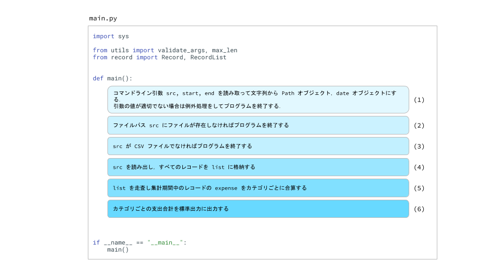

# Chapter 9 システム / 例外処理 / モジュール

この章では，システムに関するモジュールを導入したあと，実装を通して複数の Python ファイルを用いたプログラムの作り方を学んでいきます．  


# sys

sys モジュールは Python の実行に関わる変数や関数がそろったモジュールです．  
ここで紹介する以外に多くの変数や関数がありますが，使うのにプログラムの実行に関わる専門的な知識が必要になります．  

## sys.argv

これまでプログラムの実行は `$ python example.py` のようにプログラム名だけを指定して実行してきました．  
プログラムを実行するとき，`$ python example.py 7 2` のように引数を渡して実行することができます．  
7 や 2 のようにプログラム実行時に渡す引数のことを **コマンドライン引数** といいます．  
Python プログラムを実行するアプリケーションである Python インタプリタから見ると，example.py もコマンドライン引数です  

sys.argv はコマンドライン引数を保持する list です．  
次のコードを example.py として `python example.py 7 2` と実行してみます．  

`sys.argv[0]` にはプログラム名が入っていて，プログラム名のあとに与えたコマンドライン引数が `sys.argv[1:]` に入っています．  
引数は str オブジェクトとして格納されます．  

```python
import sys


print(sys.argv)       # ['example.py', '7', '2']
print(type(sys.argv)) # <class 'list'>
print(sys.argv[0])    # example.py
print(sys.argv[1])    # 7
print(sys.argv[2])    # 2
```

次のコードは Chapter 5 で実装した，異なる n 個の中から k 個を選び出す組合せの総数を計算する comb 関数です．  

```python
def comb(n, k):
    a = n
    for i in range(n - 1, n - k, -1):
        a *= i

    b = k
    for i in range(k - 1, 0, -1):
        b *= i

    return a // b
```

この関数の引数 n, k をプログラムの実行時に指定できるようにすると次のようになります．  
`$ python example.py 7 2` と実行すると `21` と出力されます．  
コマンドライン引数は sys.argv には str オブジェクトとして格納されることに注意しましょう．  

```python
import sys


def comb(n, k):
    a = n
    for i in range(n - 1, n - k, -1):
        a *= i

    b = k
    for i in range(k - 1, 0, -1):
        b *= i

    return a // b


n = int(sys.argv[1])
k = int(sys.argv[2])
res = comb(n, k)
print(res)    # 21
```


# sys.exit()

sys.exit メソッドはプログラムを終了させるメソッドです．  

次のプログラムはコマンドライン引数で与えられたファイルパスの指す json ファイルを読み出して処理をするプログラムです．  
例えば，order_history.json には注文した商品の商品名 item_name と単価 unit_price のリストが書かれているとして，その合計金額を計算します．  

```json
[
    {
        "item_name": "アルゴリズムイントロダクション 第3版 総合版",
        "unit_price": 13860
    },
    {
        "item_name": "マウス",
        "unit_price": 3800
    },
    {
        "item_name": "モニター",
        "unit_price": 21700
    },
    {
        "item_name": "数値計算の常識",
        "unit_price": 2750
    },
    {
        "item_name": "プログラミングコンテストチャレンジブック [第2版]",
        "unit_price": 3608
    }
]
```

ファイルパスに json ファイルが存在しない場合は後続の処理ができないので，ファイルがないとわかった時点でプログラムを終了するようにします．  
使う感覚としては関数の途中で使う return 文みたいな感じです．  

コードを example.py として `python example.py workspaces/order_history.json` のように実行します．  
`workspaces/order_history.json` があれば unit_price の合計 total_price を出力し，なければ `File not found; workspaces/order_history.json` と出力して終了します．  

```python
from pathlib import Path
import sys
import json


src = Path(sys.argv[1])
if not src.is_file():
    print(f"File not found; {src}")
    sys.exit()

with open(src, "r") as f:
    items = json.load(f)

total_price = 0
for item in items:
    total_price += item.unit_price

print(total_price)
```


# time

time モジュールは時間に関係する関数を集めたモジュールです．  


## time.time()

コンピュータの時刻はエポックと呼ばれる時刻を始点にして計測されています．  
エポックはプラットフォームごとに異なりますが， Unix や POSIX では UTC 時間で 1970-01-01 00:00:00 で，time.time() はこの時刻からの経過秒数を float で返します．  
単位は `秒 (sec)` です．  
Unix が使用している 1970-01-01 00:00:00 から現在までの経過時間を **Unix タイム** といいます．  

```python
import time


print(time.time())  # 1600256880.6692705
```


## time.time_ns()

time_ns メソッドは time メソッドと同じ機能ですが単位 `ナノ秒 (ns)` で秒数を返します．  
ナノは `10^(-9)` で，`1 [ns] * 1'000'000'000 = 1 [sec]` あるいは `1 [ns] = 1 [sec] / 1'000'000'000` です．  

```python
import time


print(time.time())      # 1600261885.259381
print(time.time_ns())   # 1600261885259427400
```

time メソッドや time_ns メソッドを使うと，プログラムの実行時間を簡単に計測することができます．  

次のコードはフィボナッチ数列の n 番目の数を再帰関数を使って計算します．  
40 番目の数を計算するのに約 22 秒かかっていることがわかります．  

```python
import time


def fibonacci(n):
    if n <= 2:
        return 1
    return fibonacci(n - 1) + fibonacci(n - 2)


start = time.time()
res = fibonacci(40)
end = time.time()
print(f"res={res}, duration={end - start}[sec]")
# res=102334155, duration=22.09285068511963[sec]
```

次のコードは，前のコードと同じように再帰関数を使っていますが，一度計算した結果を配列に格納し，再度計算する際は配列に格納した数を返して同じ計算が行われないように改善を施してあります．  
こちらのコードだと約 2 秒で 40 番目の数を計算できています．  

```python
import time


arr = [0] * 1_000_000


def fibonacci(n):
    if n <= 2:
        return 1
    if arr[n] > 0:
        return arr[n]
    arr[n] = fibonacci(n - 1) + fibonacci(n - 2)
    return arr[n]


start = time.time()
res = fibonacci(40)
end = time.time()
print(f"res={res}, duration={end - start}[sec]")
# res=102334155, duration=2.1219253540039062e-05[sec]
```


## time.sleep()

引数で指定された秒数の間プログラムの処理を停止します．  
次のコードはコマンドライン引数で与えられた分数経過したら `"Let's eat !"` と出力するタイマーになります．  


```python
import time
import sys


minute = int(sys.argv[1]) * 60
print("Wait...")
time.sleep(minute)
print("Let's eat !")
```


# datetime

datetime モジュールは日時を扱うためのモジュールです．  
これまで `"2020-08-30"` など str オブジェクトで代用してきましたが，一般には datetime オブジェクト，あるいは date オブジェクトを使います．  


## date オブジェクト

datetime.date オブジェクトは日付を保持するオブジェクトです．  


### date()

date メソッドで year，month, day を与えてインスタンスを作ることができます．  
引数の値の範囲は `1 <= month <= 12`，`1 <= day <= <その年のその月の最終日>` となっています．  

```python
from datetime import date


d = date(1996, 2, 27)
print(d)  # 1996-02-27
```

保持している year，month，day は次のように取得できます．  

```python
from datetime import date


d = date(1996, 2, 27)
print(d)  # 1996-02-27

print(d.year)   # 1996
print(d.month)  # 2
print(d.day)    # 27
```


### date.today()

today メソッドで現在時刻から date インスタンスを作ることができます．  

```python
from datetime import date


d = date.today()
print(d)  # 2020-09-12
```


### date.fromisoformat()

日付の書式にはいろいろありますが，ISO で決められている `YYYY-MM-DD` という書式を使って日付を書くと例えば `1996-02-27` のようになります．  
fromisoformat メソッドに引数としてこの書式で書かれた日付の文字列を渡すと date オブジェクト作ることができます．  

```python
from datetime import date


d = date.fromisoformat("1996-02-27")
print(d)    # 1996-02-27
```

`1996-2-27` のように 0 を省略することはできないみたいです．  
`<数字 4 文字>-<数字 2 文字>-<数字 2 文字>` となるようにしましょう．  

```python
from datetime import date


d = date.fromisoformat("1996-02-27")
"""
Traceback (most recent call last):
  File "example.py", line 4, in <module>
    d = date.fromisoformat("1996-2-27")
ValueError: Invalid isoformat string: '1996-2-27'
"""
```


### date.fromtimestamp()

エポックからの経過秒数から date オブジェクトを作るメソッドです．  

```python
from datetime import date


ts = 825379200.0
d = date.fromtimestamp(ts)
print(d)    # 1996-02-27
```


### date.replace()

インスタンスの保持する日付を変更することはできません．  

```python
from datetime import date


d = date(1996, 2, 27)
d.year = 1999

"""
Traceback (most recent call last):
  File "example.py", line 5, in <module>
    d.year = 1999
AttributeError: attribute 'year' of 'datetime.date' objects is not writable
"""
```

そのかわり replace メソッドを使って属性 year，month，day を変更した新しいインスタンスを作ります．  
引数には year，month，day が指定できます．  
省略するとその属性は変更されません．  

```python
from datetime import date


d1 = date(1996, 2, 27)
print(d1)   # 1996-02-27

d2 = d1.replace(year=1999)
print(d1)   # 1996-02-27
print(d2)   # 1999-02-27

d3 = d2.replace(month=11, day=21)
print(d1)   # 1996-02-27
print(d2)   # 1999-02-27
print(d3)   # 1999-11-21
```


# date.weekday()

保持している日付の曜日を返します．  
月曜日を 0，日曜日を 6 として 0 から 6 の整数が返ります．  

```python
from datetime import date


weekdays = ["月", "火", "水", "木", "金", "土", "日"]


d = date(1996, 2, 27)

wd = d.weekday()
print(f"{wd} ({weekdays[wd]})")  # 1 (火)
```


## datetime オブジェクト

date オブジェクトが日付のみを保持するオブジェクトだったのに対して，datetime オブジェクトは日付と時刻を保持します．  


### datetime()

datetime メソッドに引数 year，month，day，hour，minute，second，microsecond を与えることで datetime オブジェクトのインスタンスを作ることができます．  
year，month，day は必須ですが，hour，minute，second，microsecond はデフォルト値 0 のデフォルト引数なので省略可能です．  

```python
from datetime import datetime


dt1 = datetime(1996, 2, 27, 13, 14, 39, 600)
print(dt1)   # 1996-02-27 13:14:39.000600

dt2 = datetime(1996, 2, 27)
print(dt2)   # 1996-02-27 00:00:00
```

属性の値は次のように取得できます．  

```python
from datetime import datetime


dt1 = datetime(1996, 2, 27, 13, 14, 39, 600)
print(dt1)   # 1996-02-27 13:14:39.000600

print(dt1.year)         # 1996
print(dt1.month)        # 2
print(dt1.day)          # 27
print(dt1.hour)         # 13
print(dt1.minute)       # 14
print(dt1.second)       # 39
print(dt1.microsecond)  # 600
```

日付を文字列としてほしいときは組込み関数 str にかけます．  

```python
from datetime import datetime


dt = datetime(1996, 2, 27, 13, 14, 39, 600)
dt_str = str(dt)
print(dt_str)  # 1996-02-27 13:14:39.000600
```


### datetime.now()

now メソッドを使うと現在時刻 (ローカル) から datetime インスタンスを作ることができます．  
例えば，コンピュータの時刻の設定を JST (日本標準時) にしてあるときは日本時間の現在時刻を保持したインスタンスを作ります．  

```python
from datetime import datetime


dt = datetime.now()
print(dt)   # 2020-09-12 00:59:48.232180
```

(後回し : timedelta の項目を読んだあと)

タイムゾーンを考慮するときは datetime.timezone オブジェクトを作ってそれを渡します．  
timezone オブジェクトは `timezone(<timedelta オブジェクト>, <つけたいタイムゾーンの名前>)` で作ることができます．  

いま，コンピュータの時刻設定が UTC (世界標準時) になっているとすると，それを JTS に直すには UTC の時刻に 9 時間足す必要があります．  
次の例では UTC に + 9 時間して JST を表す timezone オブジェクトを作り，それを datetime.now メソッドの引数に渡すことで現在時刻を日本時間で取得しています．  

```python
from datetime import datetime, timezone, timedelta

dt_utc = datetime.now()
print(dt_utc)   # 2020-09-12 01:15:08.498187

JST = timezone(timedelta(hours=9), "JST")
dt_jst = datetime.now(tz=JST)
print(dt_jst)   # 2020-09-12 10:15:08.498240+09:00
```

(ここまで後回し)


### datetime.utcnow()

UTC (世界標準時) での現在時刻を保持した datetime オブジェクトを作ります．  
次の例ではコンピュータの時刻が JST で設定されているときの datetime.now メソッドと datetime.utcnow メソッドを比較しています．  

```python
from datetime import datetime


dt = datetime.now()
print(dt)   # 2020-09-12 14:17:12.534703 (JST)

dt = datetime.utcnow()
print(dt)   # 2020-09-12 05:17:12.534703 (UTF)
```


### datetime.fromisoformat()

`YYYY-MM-DD[*HH[:MM[:SS[.fff[fff]]]][+HH:MM[:SS[.ffffff]]]]` の書式に沿った日付の文字列から datetime インスタンスを作るメソッドです．  

```python
from datetime import datetime


dt1 = datetime.fromisoformat("1996-02-27 13:14:39.000600")
print(dt1)  # 1996-02-27 13:14:39.000600

dt2 = datetime.fromisoformat("1996-02-27 13:14:39")
print(dt2)  # 1996-02-27 13:14:39

dt3 = datetime.fromisoformat("1996-02-27")
print(dt3)  # 1996-02-27 00:00:00

dt4 = datetime.fromisoformat("1996-02-27T13:14:39+09:00")
print(dt4)  # 1996-02-27 13:14:39+09:00
```


### datetime.fromtimestamp()

エポックからの経過秒数から datetime インスタンスを作るメソッドです．  

```python
from datetime import datetime


ts = 825379200.0
dt = datetime.fromtimestamp(ts)
print(dt)    # 1996-02-27 00:00:00
```


### datetime.replace()

保持している属性 year，month，day，hour，minute，second，microsecond を変更した新しい datetime オブジェクトを作ります．  
もとのオブジェクトは変化しないことに気をつけてください．  

```python
from datetime import datetime


dt1 = datetime(1996, 2, 27, 13, 14, 39, 600)

dt2 = dt1.replace(month=11)
print(dt1)  # 1996-02-27 13:14:39.000600
print(dt2)  # 1996-11-27 13:14:39.000600

dt3 = dt2.replace(year=1999, hour=1)
print(dt2)  # 1996-11-27 13:14:39.000600
print(dt3)  # 1999-11-27 01:14:39.000600

dt4 = dt3.replace(day=27, microsecond=123456)
print(dt3)  # 1999-11-27 01:14:39.000600
print(dt4)  # 1999-11-27 01:14:39.123456
```


### datetime.weekday()

```python
from datetime import datetime


weekdays = ["月", "火", "水", "木", "金", "土", "日"]


dt = datetime(1996, 2, 27, 13, 14, 39)

wd = dt.weekday()
print(f"{wd} ({weekdays[wd]})")  # 1 (火)
```


### datetime.strftime()

datetime オブジェクトから，日付を表す文字列を引数で与えた書式に沿って作るメソッドです．  
書式には特殊文字 (指示語 : ディレクティブ : directive) が使えます．  
主要なものは表のとおりです (公式 doc ( https://docs.python.org/3/library/datetime.html ) より引用)  

|ディレクティブ|意味|
|:---:|:---:|
|`%Y`|西暦 (4 桁)|
|`%y`|西暦 (下 2 桁)|
|`%m`|月|
|`%d`|日にち|
|`%H`|時 (24 h)|
|`%I`|時 (12 h)|
|`%M`|分|
|`%S`|秒|
|`%B`|月名|
|`%b`|月名 (短縮形)|
|`%A`|曜日名|
|`%a`|曜日名 (短縮形)|

```python
from datetime import datetime


dt = datetime(1996, 2, 27, 13, 14, 39, 600)
dt_str1 = str(dt)
print(dt_str1)  # 1996-02-27 13:14:39.000600

dt_str2 = dt.strftime("%Y/%m/%d (%a) %H:%M:%S")
print(dt_str2)  # 1996/02/27 (Tue) 13:14:39

dt_str3 = dt.strftime("%H:%M:%S %a %d %B %Y")
print(dt_str3)  # 13:14:39 Tue 27 February 1996
```


### datetime.strptime()

文字列から datetime オブジェクトを作るメソッドです．  
文字列といっしょに，文字列がどんな書式で日付を表しているかを引数として渡します．  

```python
from datetime import datetime


dt_str1 = "1996/02/07 (Tue) 13:14:39"
dt1 = datetime.strptime(dt_str1, "%Y/%m/%d (%a) %H:%M:%S")
print(type(dt1))    # <class 'datetime.datetime'>
print(dt1)          # 1996-02-07 13:14:39

dt_str2 = "13:14:39 Tue 27 February 1996"
dt2 = datetime.strptime(dt_str2, "%H:%M:%S %a %d %B %Y")
print(type(dt2))    # <class 'datetime.datetime'>
print(dt2)          # 1996-02-07 13:14:39
```


### datetime.date()

datetime オブジェクトから同じ日付を持った date オブジェクトを作ります．  

```python
from datetime import date, datetime


dt = datetime(1996, 2, 27, 13, 14, 39, 600)
d = datetime.date(dt)
print(type(d))  # <class 'datetime.date'>
print(d)        # 1996-02-27
```


## 比較

date オブジェクトどうしおよび datetime オブジェクトどうしは比較演算子 `<`，`<=`，`>`，`>=`，`==`，`!=` を適用して比較することができます．  
大小関係は早いほうが小さく，遅いほうが大きいと判定されます．  
これにより，どちらの日付あるいは日時が先かを簡単に判断することができます．  

```python
from datetime import date, datetime


d1 = date(1996, 2, 27)
d2 = date(1999, 11, 21)

print(d1 < d2)  # True
print(d1 <= d2) # True
print(d1 >= d2) # False
print(d1 >= d2) # False
print(d1 == d2) # False
print(d1 != d2) # True

d3 = date(1996, 2, 27)

print(d1 < d3)  # False
print(d1 <= d3) # True
print(d1 > d3)  # False
print(d1 >= d3) # True
print(d1 == d3) # True
print(d1 != d3) # False

dt1 = datetime(1996, 2, 27)
dt2 = datetime(1996, 2, 27, 13, 14, 39, 600)

print(dt1 < dt2)  # True
print(dt1 <= dt2) # True
print(dt1 >= dt2) # False
print(dt1 >= dt2) # False
print(dt1 == dt2) # False
print(dt1 != dt2) # True
```


# timedelta

timedelta オブジェクトは日時の差を保持するオブジェクトです．  
date オブジェクトや datetime オブジェクトの加減算の結果は timedelta オブジェクトになります．  
`+`，`-` の符号付きで扱うことができます．  

```python
from datetime import date, datetime


d1 = date(1996, 2, 27)
d2 = date(1999, 11, 21)

td1_1 = d1 - d2
print(type(td1_1))  # <class 'datetime.timedelta'>
print(td1_1)        # -1363 days, 0:00:00

td1_2 = d2 - d1
print(td1_2)        # 1363 days, 0:00:00


dt1 = datetime(1996, 2, 27, 13, 14, 39, 600)
dt2 = datetime(1999, 11, 21, 1, 59, 31, 382145)

td2_1 = dt1 - dt2
print(td2_1)        # -1363 days, 11:15:07.618455

td2_2 = dt2 - dt1
print(td2_2)        # 1362 days, 12:44:52.381545
```


## timedelta()

timedelta メソッドに引数 weeks，days，hours，minutes，seconds，microseconds，milliseconds を指定して任意の時刻差を保持する timedelta オブジェクトを作ることができます．  

date オブジェクトあるいは datetime オブジェクトとの加減算により n 日後や x 時間前の日時を保持した新しい date / datetime オブジェクトを作ることができます．  
引数には負数も指定できるので，n 日前や x 時間前も計算することができます．  

```python
from datetime import date, datetime, timedelta

d1 = date(1996, 2, 27)
td1 = timedelta(weeks=1)

d2 = d1 + td1
print(d2)   # 1996-03-05

d3 = d1 - td1
print(d3)   # 1996-02-20

dt1 = datetime(1996, 2, 27, 13, 14, 39, 600)
td2 = timedelta(days=-3, hours=-8, minutes=30)

dt2 = dt1 + td2
print(dt2)  # 1996-02-24 05:44:39.000600
```


# 例外処理

これまで，ゼロ割をしたときの ZeroDivisionError，list の要素数以上の数のインデックスにアクセスしようとしたときの IndexError，関数の定義に合わない値が引数として渡されたときの ValueError など，さまざまな例外を見てきました．  

これまでは Chapter 5 で実装した comb 関数のように例外を送出するだけで，送出したあとのことは考えてきませんでした．  

```python
def comb(n, k):
    if n <= 0 or k < 0:
        raise ValueError("n and k must be n > 0 and k >= 0")

    if k == 0:
        return 1

    a = n
    for i in range(n - 1, n - k, -1):
        a *= i

    b = k
    for i in range(k - 1, 0, -1):
        b *= i

    return a // b
```

例外が起こるとプログラムがそこで停止します．  
これまでのコードはどれも短かったのですが，一般に実装するプログラムはもっと長かったり常駐してずっと実行されるようなプログラムだったりして，例外が起こったあとにも処理が続きます．  
そこで，実行中に例外が起きたとき突然停止しないよう適切な例外処理をする必要があります．  

例外処理には try-except 文を使います．  
例外が起こる可能性のある部分のコードを try 文で，例外が起こったときの処理を except 文に書きます．  
try 文で囲まれたブロックで例外が起こった場合，try 文の残りの処理はスキップされてすぐに except 文以下が実行されます．  

次のコードは，dict `cases` に格納されている n, k のペアについて comb 関数を使って組合せの総数を求め，その結果を dict `res` に格納します．  
comb 関数を使ったときに例外 ValueError が起きたときは dict `exce` に例外が起きたケース名を格納するようにしています．  
`case3`, `case5` で例外が起こっていますが，try-except 文を使って例外処理を行うことでプログラムを停止せず cases のすべてのペアについて組合せの総数を計算することができています．  

```python
def comb(n, k):
    if n <= 0 or k < 0:
        raise ValueError("n and k must be n > 0 and k >= 0")

    if k == 0:
        return 1

    a = n
    for i in range(n - 1, n - k, -1):
        a *= i

    b = k
    for i in range(k - 1, 0, -1):
        b *= i

    return a // b


cases = {
    "case1": (7, 2),
    "case2": (3, 1),
    "case3": (-3, 7),
    "case4": (10, 5),
    "case5": (11, -2),
    "case6": (4, 2)
}

res = {}
exce = []
for k, v in cases.items():
    try:
        res[k] = comb(*v)
    except:
        exce.append(k)

print(f"res={res}")      # res={'case1': 21, 'case2': 3, 'case4': 252, 'case6': 6}
print(f"exce={exce}")    # exce=['case3', 'case5']
```

excpet 文のみを書く場合は，except 文の処理の対象はすべての例外クラスになります．  
一方，except 文に具体的な例外のクラスを書くことで，処理する例外を指定することができます．  
次のコードでは，例外処理をする対象として ValueError を指定しています．  
この例では comb 関数が ValueError しか送出しないのでありがたみが薄いですが，複数の例外クラスの例外が起こる可能性があり例外クラスごとに例外処理が異なるとき，except 文の横に例外のクラスを書くことで例外処理を例外クラスごとに分けることができます．  
また，例外クラスを書くことで具体的にどんな例外が起こるかをわかりやすくなることもあり，一般に対象の例外クラスを書くことがすすめられています．  

しかし，はじめのうちはどんな例外が起こるかを調べるのは難しいと思うので，まずは機能を書くことに集中し，余裕が出てきたら例外処理を凝り始めるのがいいと思います．  

```python
def comb(n, k):
    if n <= 0 or k < 0:
        raise ValueError("n and k must be n > 0 and k >= 0")

    if k == 0:
        return 1

    a = n
    for i in range(n - 1, n - k, -1):
        a *= i

    b = k
    for i in range(k - 1, 0, -1):
        b *= i

    return a // b


cases = {
    "case1": (7, 2),
    "case2": (3, 1),
    "case3": (-3, 7),
    "case4": (10, 5),
    "case5": (11, -2),
    "case6": (4, 2)
}

res = {}
exce = []
for k, v in cases.items():
    try:
        res[k] = comb(*v)
    except ValueError:
        exce.append(k)

print(f"res={res}")      # res={'case1': 21, 'case2': 3, 'case4': 252, 'case6': 6}
print(f"exce={exce}")    # exce=['case3', 'case5']
```

例外オブジェクトは `except <例外> as <変数>` で変数に代入することができます．  
また，例外のもつメッセージは `str(<例外>)` で取得できます．  
次のコードでは，exce に例外が起きたケース名とエラーメッセージを格納するようにして，なぜそのケースが計算できなかったかがわかるようにしています．  

```python
def comb(n, k):
    if n <= 0 or k < 0:
        raise ValueError("n and k must be n > 0 and k >= 0")

    if k == 0:
        return 1

    a = n
    for i in range(n - 1, n - k, -1):
        a *= i

    b = k
    for i in range(k - 1, 0, -1):
        b *= i

    return a // b


cases = {
    "case1": (7, 2),
    "case2": (3, 1),
    "case3": (-3, 7),
    "case4": (10, 5),
    "case5": (11, -2),
    "case6": (4, 2)
}

res = {}
exce = {}
for k, v in cases.items():
    try:
        res[k] = comb(*v)
    except ValueError as e:
        exce[k] = str(e)

print(f"res={res}")      # res={'case1': 21, 'case2': 3, 'case4': 252, 'case6': 6}
print(f"exce={exce}")
# exce={'case3': 'n and k must be n > 0 and k >= 0', 'case5': 'n and k must be n > 0 and k >= 0'}
```


次の例では，Path.rmdir メソッドを使って指定されたファイルパスのディレクトリを削除しようとしています．  
ファイルパスにファイルあるいはディレクトリが存在しなかった場合は `FileNotFoundErro` が，ディレクトリでなくファイルだった場合は `NotADirectoryError` が，ディレクトリが空でない場合は `OSError` が送出されます．  
それぞれの例外が起きたとき，ディレクトリを削除できなかった理由を標準出力で出力してプログラムのユーザに伝えるようにしています．  
(`if dir_path.is_dir():` を設けると `FileNotFoundError` と `NotADirectoryError` は起きないのであんまいい例ではないです...)  

```python
dir_path = Path("dir_path")
try:
    dir_path.rmdir()
except FileNotFoundError as fnerr:
    print(fnerr)
except NotADirectoryError as naderr:
    print(naderr)
except OSError as oserr:
    print(oserr)
```


# モジュール

これまで `from` と `import` を使っていろいろなモジュールをインポートしてきました．  
プログラムを複数のパーツに分けると，各パーツをほかのプログラムで使い回すことができたり，1 つのファイルに押し込めるよりも管理がしやすくなったりします．  

ここではツールの実装の実践もかねて，複数の Python ファイルを作成し，それらを組み合わせて 1 つのプログラムを実装する方法を実際にツールを作りながらみていきます．  

実装するのは，家計簿をつけた CSV ファイルを読み出して総額を支出カテゴリごとに計算するコマンドラインツール `amuletcoin` です．  
コマンドライン引数で集計期間が設定できるようにします．  
amuletcoin のコンテンツとして amuletcoin 以下に次のプログラムを実装していきます．  

|プログラム|説明|
|:---:|:---:|
|main.py|ツールの実行部分|
|record.py|家計簿の 1 行の内容を保持する Record クラスを実装|
|utils.py|ツール内で使う便利関数 (ユーティリティ関数) を実装|

実装済みのプログラムは `chapter9/amuletcoin_org` にあります．  

CSV ファイルの例として `chapter9/amuletcoin/accounts/account.csv` を用意しています (`chapter9/amuletcoin/accounts/mkaccount.py` で作りました)．  
このファイルには 2020-01-01 から 2022-12-31 までの 3 年分の家計簿がつけられています．  
先頭の 5 行は次のようになっています．  
date，category，expense をカンマで区切っています．  
以降，1 行ごとの date, category，expense をレコードと呼びます．  

|row|date|category|expense|
|:---:|:---:|:---:|:---:|
|1|2020-01-01|food|600|
|2|2020-01-02|food|5000|
|3|2020-01-02|socializing|200|
|4|2020-01-02|socializing|4000|
|5|2020-01-03|transport|6000|

カテゴリは可変ですが，account.csv には次の支出カテゴリが設定されています．  

|category|意味|
|:---:|:---:|
|food|食費|
|utility|光熱費|
|transport|交通費|
|hobby|趣味 / 娯楽費|
|socializing|交際費|
|daily_miscellaneous|日用雑貨費|

実行ファイルは main.py です．  
main.py にはコマンドライン引数 src，start，end を用意します．  
なお，end と duration の 2 つが指定された場合，end と start + duration のうち日付が新しいほうを集計期間のおわりとします．  
また，start を省略した場合は集計期間のはじめをレコードの最も古い日付とし，end を省略した場合は集計期間のおわりをレコードの最も新しい日付とします．  

|コマンドライン引数|説明|
|:---:|:---:|
|src|必須．読み出す CSV ファイルのファイルパス|
|start|オプション．`-s` で指定．集計期間のはじめの日付．ISO フォーマット|
|end|オプション．`-e` で指定．集計期間のおわりの日付．ISO フォーマット|

使い方は以下のような感じです．  

accounts.csv を読み出して，2020-01-01 から 2020-12-31 の支出カテゴリごとの総額を計算するには次のように実行します．  
すると，計算結果がコンソール上に出力されます．  
`total` は全カテゴリでの総額です．  

```
$ python main.py accounts/account.csv -s 2020-01-01 -e 2020-12-31
total               | 2801600
food                |  780300
socializing         |  643100
transport           |  392200
utility             |  287200
daily_miscellaneous |  286900
hobby               |  411900
```

start を省略した場合は集計期間のはじめが最も古いレコードの日付になります．  
accounts.csv の最も古いレコードの日付は 2020-01-01 なので，次のように実行すると 2020-01-01 から 2020-12-31 までの支出カテゴリごとの総額を計算します．  

```
$ python main.py accounts/account.csv -e 2020-12-31
total               | 2801600
food                |  780300
socializing         |  643100
transport           |  392200
utility             |  287200
daily_miscellaneous |  286900
hobby               |  411900
```

end を省略した場合は集計期間のおわりが最も新しいレコードの日付になります．  
accounts.csv の最も新しいレコードの日付は 2022-12-28 なので，次の例では 2020-01-01 から 2022-12-28 までの支出カテゴリごとの総額を計算しています．  

```
$ python main.py accounts/account.csv -s 2022-01-01
total               | 8230700
food                | 1830400
socializing         | 2122100
transport           | 1110200
utility             | 1039900
daily_miscellaneous |  758700
hobby               | 1369400
```

それでは実装していきましょう．  
amuletcoin の構成は，main.py がツールの主要実行部分で，main.py に utils の関数と record のクラスをインポートして使用するようにします．  

main.py の処理フローは次のとおりです．  




`if __name__ == "__main__"` について説明します (中途半端ですが...)．  
モジュール属性 `__name__` はプログラムがどのモジュールで実行されているかを保持しています．  
Python プログラムにはプログラムが実行される (= 読み取られる) 2 つのシチュエーションがあります．  
1 つは `python main.py` のように直接実行される (スクリプトとして実行されるという) ときで，もう 1 つはほかのプログラムにインポートされるときです．  
スクリプトとして実行されるとき，そのプログラムの `__name__` は `"__main__"` になります．  
一方，ほかのプログラムにインポートされるときはプログラム名になります．  
例えば，utils.py をインポートしている main.py を `python main.py` で実行したとき，main.py の `__name__` は `"__main__"` になり，utils.py の `__name__` は `"utils"` になります．  
つまり `if __name__ == "__main__"` は，インポートされたときは実行せず，プログラムが直接実行されたときだけ実行する処理を書くために使います．  
main.py でいうと，main.py が直接実行されたときだけ main 関数が実行されることになります．  
逆に，`if __name__ == "__main__"` と main 関数を設けず処理をべた書きしたとすると，main.py がほかのプログラムにインポートされたときコマンドライン引数を読み取るところから支出合計を出力するところまでの処理が不必要に走ってしまいます．  
ここまで説明しておいてなんですが，今回は main.py をインポートするプログラムがいないしそもそも直接実行するために main.py を作っているのでべた書きでもそんなに問題ないです...  
コードのテストやモジュールとしての実行など，ちょっと説明が長くなってしまうところで `if __name__ == "__main__"` の恩恵があるので，ひとまずは複数ファイルを使うプログラムの実装では基本 `if __name__ == "__main__"` を設けるのがいいんだなーと覚えておいてください．  


## (1) コマンドライン引数のバリデーション

コマンドライン引数 src，start，end を読み取り，先に見た方法でツールを実行できるようバリデーションを行います．  
バリデーションは main.py が煩雑になるのを防ぐため，関数としてメイン処理フローから分けるようにしたいです．  
そこで，utils.py にバリデーションを行う関数 validate_args を実装し，main.py にインポートして使うようにします．  
目標は次のようにバリデートされた src，start，end が main.py で得られるようにすることです．  
`sys.argv[0]` はプログラム名 `"main.py"` なので，validate_args には 1 番目以降を渡します．  

```python
# main.py
import sys

from utils import validate_args


def main():
    src, start, end = validate_args(sys.argv[1:])


if __name__ == "__main__":
    main()

```

それでは utils.py の実装に着手します．  
まず，オプション start，end を定義するため Enum クラス `Option` を実装します．  
Enum で定義するとどのようなオプションが使えるのかわかりやすいです．  

```python
# utils.py
from enum import Enum


class Option(Enum):
    START = "-s"
    END = "-e"
```

続いて validate_args 関数を実装します．  
validate_args 関数は，コマンドライン引数を引数にとり，CSV ファイルのファイルパス src，集計期間のはじめの日付 start，おわりの日付 end を返すようにします．  
src は Path オブジェクト，start と end は date オブジェクトとします．  

実引数は list `sys.argv[1:]` が来る想定です．  
仮引数を args とすると，`args[0]` に src，`args[1:]` に -s，-e，-d に続いてそれぞれ日付を表す文字列あるいは日数を表す文字列が入っています．  

`src = Path(args[0])` で src にファイルパスを保持する Path オブジェクトを代入します．  

ここで，コマンドライン引数の start，end の仕様を確認します．  
- start，end，duration は ISO フォーマットで与えられ，それぞれ省略可能  
- start を省略した場合 start は最も古いレコードの日付に，end を省略した場合 end は最も新しいレコードの日付になる  

この仕様を満たすロジックを実装しましょう．  

```python
# utils.py
from datetime import date, timedelta
from pathlib import Path
from enum import Enum


class Option(Enum):
    START = "-s"
    END = "-e"
    DURATION = "-d"


def validate_args(args):
    src = Path(args[0])

    start = None
    end = None

    options = args[1:]
    for i in range(0, len(options), 2):
        if options[i] == Option.START.value:
            start = date.fromisoformat(options[i + 1])
        elif options[i] == Option.END.value:
            end = date.fromisoformat(options[i + 1])

    return src, start, end
```

main.py の処理フローのとおり，この時点では CSV ファイルを読み出していないので start と end が省略されたとき，最も古いあるいは最も新しいレコードの日付を得ることができません．  
そこで省略されたことがあとにわかるように start と end には予め `None` を代入しておきます．  
start と end が与えられた場合，start と end には date オブジェクトが代入されているようにします．  

オプションであるコマンドライン引数のみを扱うのに `args` のままでは少し不便なので `options = args[1:]` でオプション部分のみの list を作ります．  

-s と start，-e と end はそれぞれひと続きで options に格納されていてるので，options を 0 番目から `step = 2` で走査します．  
省略される可能性を考慮し，`range()` の end には `len(options)` を指定します．  
`options[i]` が -s，-e であるかを Enum クラス `Option` で定義した member の value のどれかに一致するかで確認していきます．  
`Option.START.value (-s)` あるいは `Option.END.value (-e)` に一致した場合，options の次の要素に日付を表す文字列が格納されているので，それから date オブジェクトを作って start あるいは end に代入します．  
日付は ISO フォーマットなので `date.fromisoformat` メソッドを使います．  

最後に src，start，end を返します．  


main.py に戻りましょう．  
デバッグ用に一時的に print 文を書いて，ちゃんと仕様どおりコマンドライン引数が使えるか次の入力について出力を確かめてみましょう．  

```python
# main.py
import sys

from utils import validate_args


def main():
    src, start, end = validate_args(sys.argv[1:])
    print(f"src={src}")
    print(f"start={start}")
    print(f"end={end}")


if __name__ == "__main__":
    main()

```

|入力|出力|
|:---:|:---:|
|`python accounts/account.csv -s 2020-01-01 -e 2022-12-31`|`src=accounts/account.csv`<br>`start=2020-01-01`<br>`end=2022-12-31`|
|`python accounts/account.csv -e 2022-12-31`|`src=accounts/account.csv`<br>`start=None`<br>`end=2022-12-31`|
|`python accounts/account.csv -s 2020-01-01`|`src=accounts/account.csv`<br>`start=2020-01-01`<br>`end=None`|
|`python accounts/account.csv -s 2020/01/01 -e 2022/12/31`|`ValueError`|

最後の入力のように，日付が ISO フォーマットでない場合 ValueError が送出されます．  
正しい入力を促すよう例外処理を実装します．  
そのあとの処理をすることができないので，return 文ですぐに main 関数を終了してプログラムを終了するようにします．  

```python
# main.py
import sys

from utils import validate_args


def main():
    try:
        src, start, end = validate_args(sys.argv[1:])
    except ValueError:
        print(
            "Error: Invalid Arguments: please run this program like "
            + f"'python {__file__} accounts/account.csv -s 2020-08-24 -e 2020-09-01'"
        )
        return


if __name__ == "__main__":
    main()

```

## (2) ファイルの存在確認

引数で与えられたファイルパス src にファイルが存在しない場合あるいは src がディレクトリである場合，後続の処理を行うことができないのですぐに返すようにします．  
Path.is_file メソッドで判断します．  

```python
# main.py
import sys

from utils import validate_args


def main():
    try:
        src, start, end = validate_args(sys.argv[1:])
    except ValueError:
        print(
            "Error: Invalid Arguments: please run this program like "
            + f"'python {__file__} accounts/account.csv -s 2020-08-24 -e 2020-09-01'"
        )
        return

    if not src.is_file():
        print(f"Error: '{src}' does not exist or is a directory.")
        return


if __name__ == "__main__":
    main()

```


## (3) CSV ファイルであるか確認

src が CSV ファイルであるかを PurePath.suffix メソッドで確認します．  
CSV ファイルでない場合すぐに返します．  

```python
# main.py
import sys

from utils import validate_args


def main():
    try:
        src, start, end = validate_args(sys.argv[1:])
    except ValueError:
        print(
            "Error: Invalid Arguments: please run this program like "
            + f"'python {__file__} accounts/account.csv -s 2020-08-24 -e 2020-09-01'"
        )
        return

    if not src.is_file():
        print(f"Error: '{src}' does not exist or is a directory.")
        return

    if src.suffix != ".csv":
        print("Error: Invalid Extension: Only CSV file is available.")
        return


if __name__ == "__main__":
    main()

```


## (4) CSV ファイルの読み出し

CSV ファイルからレコードを読み出して list に格納します．  
レコードの情報 date，category，expense を保持する Record クラスと，Record クラスのオブジェクトを格納するための list `RecordList` を record.py に実装しましょう．  

Record クラス，RecordList クラスは次のようになります．  
RecordList は UserList を継承して作ります．  

```python
# record.py

from collections import UserList
import datetime


class Record:
    def __init__(self, date, category, expense):
        self.date = datetime.date.fromisoformat(date)
        self.category = category
        self.expense = int(expense)

    def __repr__(self):
        return f"Record(date={self.date}, category={self.category}, expense={self.expense})"


class RecordList(UserList):
    def __init__(self, data):
        self.data = data

```

Record クラス，RecordList クラスを main.py でインポートして，CSV ファイルから読み出したレコードを Record オブジェクトにして RecordList `records` に格納していきます．  
`line.strip()` で改行コードを除去し，`split(",")` によってカンマで分割しています．  
そのあと `*` で引数にアンパックして Record オブジェクトを作っています．  

```python
# main.py
import sys

from utils import validate_args
from record import Record, RecordList


def main():
    try:
        src, start, end = validate_args(sys.argv[1:])
    except ValueError:
        print(
            "Error: Invalid Arguments: please run this program like "
            + f"'python {__file__} accounts/account.csv -s 2020-08-24 -e 2020-09-01'"
        )
        return

    if not src.is_file():
        print(f"Error: '{src}' does not exist or is a directory.")
        return

    if src.suffix != ".csv":
        print("Error: Invalid Extension: Only CSV file is available.")
        return

    records = RecordList([])
    with open(src, "r") as f:
        for line in f:
            records.append(Record(*line.strip().split(",")))


if __name__ == "__main__":
    main()

```


## (5) 集計期間中の支出合計を計算

RecordList `records` を走査し，date 属性が集計期間に当てはまる Record オブジェクトの expense をカテゴリごとに合算して返す関数を実装します．  
この関数は Record を格納する list にのみ適用可能なので，RecordList のメソッドとして実装することにします．  

メソッド名を category_total として，集計期間中の支出合計を計算するロジックを実装しましょう．  

引数は start と end とし，デフォルト値は `None` とします．  
(デフォルト引数にする必要はないんですが，デフォルト値を `None` とすることで start と end が `None` を取りうることを明示できます)  
まず，合計を計算する前に集計期間のはじめの日付と集計期間のおわりの日付を決定します．  
start あるいは end が `None` のときは start と end が省略されたときなので，最も古い日付のレコードあるいは最も新しい日付のレコードを RecordList オブジェクトの要素の中から探します．  
RecordList は UserList を継承しているので，`self.sort()` で list オブジェクトと同じように要素をソートすることができます．  
key を Record.date としてソートすると，0 番目の要素の date が最も古い日付，最後尾 (= -1 番目) の要素の date が最も新しい日付になります．  

start と end を決定したら，要素をすべて走査して支出合計を計算します．  
カテゴリごとの支出合計を格納するための dict `category_total` を用意し，集計期間に当てはまる Record オブジェクトが見つかるたび key を Record.category として Record.expense を value に加算します．  
はじめて見つかったカテゴリのため `category_total.get(record.category, 0)` で category_total にまだそのカテゴリが key としてない場合 0 を取得するようにします．  

最後に dict `category_total` を返します．  

```python
# record.py
from collections import UserList
import datetime


class Record:
    def __init__(self, date, category, expense):
        self.date = datetime.date.fromisoformat(date)
        self.category = category
        self.expense = int(expense)

    def __repr__(self):
        return f"Record(date={self.date}, category={self.category}, expense={self.expense})"


class RecordList(UserList):
    def __init__(self, data):
        self.data = data

    def category_total(self, start=None, end=None):
        self.sort(key=lambda x: x.date)
        if start is None:
            start = self[0].date
        if end is None:
            end = self[-1].date

        category_total = {
            "total": 0
        }
        for record in self:
            if start <= record.date <= end:
                category_total[record.category] = record.expense + category_total.get(record.category, 0)
                category_total["total"] += record.expense
        return category_total

```

main.py で実装した category_total メソッドを使い，dict `category_total` を取得します．  

```python
# main.py
import sys

from utils import validate_args
from record import Record, RecordList


def main():
    try:
        src, start, end = validate_args(sys.argv[1:])
    except ValueError:
        print(
            "Error: Invalid Arguments: please run this program like "
            + f"'python {__file__} accounts/account.csv -s 2020-08-24 -e 2020-09-01'"
        )
        return

    if not src.is_file():
        print(f"Error: '{src}' does not exist or is a directory.")
        return

    if src.suffix != ".csv":
        print("Error: Invalid Extension: Only CSV file is available.")
        return

    records = RecordList([])
    with open(src, "r") as f:
        for line in f:
            records.append(Record(*line.strip().split(",")))

    category_total = records.category_total(start, end)


if __name__ == "__main__":
    main()

```


## (6) 支出合計を標準出力に出力

計算したカテゴリごとの支出合計を標準出力に出力します．  
情報だけなら `print(category_total)` や `pprint(category_total)` でいいんですが，せっかくなので整えることにします．  

目標はこんな感じです．  

```
$ python main.py accounts/account.csv -s 2020-01-01 -e 2020-12-31
total               | 2801600
food                |  780300
socializing         |  643100
transport           |  392200
utility             |  287200
daily_miscellaneous |  286900
hobby               |  411900
```

`|` の位置を整えるため，カテゴリ名の文字数がほしいです．  
カテゴリは可変なので，category_total の key から最大の文字数を求める必要があります．  
また，支出額を右揃えにするため category_total の value の最大桁数が必要です．  
これらを計算するための関数 max_len を utils.py に実装しましょう．  

max_len 関数は引数として dict の key すべて，あるいは value すべてをとれるようにします．  
引数 iterable を走査し，最大の文字数を見つけて返します．  

```python
# utils.py
from datetime import date
from pathlib import Path
from enum import Enum


class Option(Enum):
    START = "-s"
    END = "-e"


def validate_args(args):
    src = Path(args[0])

    start = None
    end = None

    options = args[1:]
    for i in range(0, len(options), 2):
        if options[i] == Option.START.value:
            start = date.fromisoformat(options[i + 1])
        elif options[i] == Option.END.value:
            end = date.fromisoformat(options[i + 1])

    return src, start, end


def max_len(iterable):
    max_len = 0
    for i in iterable:
        max_len = max(len(str(i)), max_len)
    return max_len

```

実装した max_len 関数を main.py でインポートし，max_len 関数を使ってカテゴリ名の文字数 c_length と支出額の桁数 e_length を得ます．  
まず，total は一番上に表示したいので最初に出力するようにします．  
`f"{'total':{c_length}s}"` で total を 文字数 c_length で揃えて表示しています．  
支出合計のほうは `{category_total['total']:>{e_length}d}` で文字数 e_length の右揃え (`>`) で表示するようにしています．  
そのあと，category_total の要素のうち key が total でないものすべてを同じように表示します．  

完成！  

```python
import sys

from utils import validate_args, max_len
from record import Record, RecordList


def main():
    try:
        src, start, end = validate_args(sys.argv[1:])
    except ValueError:
        print(
            "Error: Invalid Arguments: please run this program like "
            + f"'python {__file__} accounts/account.csv -s 2020-08-24 -e 2020-09-01'"
        )
        return

    if not src.is_file():
        print(f"Error: '{src}' does not exist or is a directory.")
        return

    if src.suffix != ".csv":
        print("Error: Invalid Extension: Only CSV file is available.")
        return

    records = RecordList([])
    with open(src, "r") as f:
        for line in f:
            records.append(Record(*line.strip().split(",")))

    category_total = records.category_total(start, end)
    c_length = max_len(category_total.keys())
    e_length = max_len(category_total.values())
    print(f"{'total':{c_length}s} | {category_total['total']:>{e_length}d}")
    for category, expense in category_total.items():
        if category != "total":
            print(f"{category:{c_length}s} | {expense:>{e_length}d}")


if __name__ == "__main__":
    main()

```


# 練習問題

## Q

```python
if td < 3:
elif td < 7:
```


## Q

months 

`date(2020, 1, 1) - date(2020, 3, 31)`
`date(2020, 3, 31) = date(2020, 4, 1) - timedelta(days=1)`

<hr>

[Chapter 9 練習問題回答例](Answers9.md)  
[Index](../README.md)
